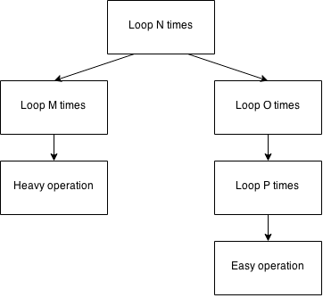

## Java 中 10 个简单优化

有很多关于流行语“[网络扩容（web scale）](http://www.mongodb-is-web-scale.com/)”的炒作，人们通过持续不断地重构应用，以使他们的系统更具“规模化（scale）”。

*但，究竟什么是“扩容（scaling）”呢，而且我们如何确定我们可以做到“扩容（scale）”呢？*

### 扩容（scaling）的不同方面

上面提到的“炒作”大多是跟**负载（scaling load）**有关，即，系统即可以为 1 个用户服务良好也可以为 10 个用户，或 100 个用户，或百万个服务良好。理想状态下，你的系统应该是尽可能“无状态的”，实际保留的几种状态可以在网络中的任何处理单元之间进行转化和转移。当负载是你的主要问题时，潜伏期可能还不会显现，所以如果每个独立的请求需要 50 - 100ms 处理时间，则可能不会出现问题。这通常被称为**缩放（scaling out）**。

扩容另一个完全不同的方面是**性能扩展（scaling performance）**，如，确保一个算法可以在 1 条数据下工作良好，也可以在 10 条，或 100 条，或百万条下工作良好。这种扩展是否可行在[*大 O 符号（Big O Notation）*](http://en.wikipedia.org/wiki/Big_O_notation) 中已被恰当描述。潜伏期是性能扩展的杀手。你想尽一切可能让所有的计算都在一台机器上完成。这也通常被称为**向上扩展（scaling up）**。

如果有像免费的午餐（[或没有](https://en.wikipedia.org/wiki/CAP_theorem)），我们可以无限的结合缩放和扩展操作。不过，现在，我们打算只查看一些非常简单的提高性能的方法。

### 大 O 符号

Java 7 的 [ForkJoinPool](http://docs.oracle.com/javase/8/docs/api/java/util/concurrent/ForkJoinPool.html) 和 Java 8 的 [parallel Stream](http://docs.oracle.com/javase/8/docs/api/java/util/stream/Stream.html) 用来支持平行处理，当你部署你的 Java 程序到多核处理器机器上时，它们非常有用。并行相比在网络中不同的机器间扩容的优势是，你可以完全消除潜在的影响，因为所有的核心都能访问同样的内存。

但是不要被并行带来的好处所迷惑！记住下面两点：

 - 并行吃掉你的核心。这非常有利于批处理，但却是异步服务器（如 HTTP）的噩梦。为什么过去的数年我们都使用单线程的 servlet 模型，这是有很充足的理由的。所以并行只利于性能扩展（scaling up）。
 - 并行对于 *大 O 计数*的算法是无效的。如果你的算法是 `O(n log n)` 的，而且你让那个算法运行在多核上，你仍是得到 `O(n log n / c)` 的算法，`c` 是微不足道的常量。你将只会节省一些时钟时间，但不能降低复杂度。

提升性能最好的方式，当然，还是降低算法复杂度。杀手锏是实现 `O(1)` 或`准-O(1)`，例如，`HashMap` 查找。但这并总是可行的，而且也不方便实现。

如果，你无法降低复杂度，通过找出真正的关键点来调整算法，你仍能获得很多性能提升。假设下面是一个算法的可视化表示：

整体的算法复杂度是 <code>O(N3)</code> 或 `O(N * O * P)`，如果我们打算处理单独的数量级。然而，当分析这段代码时，你会发现一个有趣的场景：

 - 在你的开发工具中，左边的分支（`N -> M -> Heavy operation`）是唯一一个可以在你的分析器中查看到的分支，因为你的开发模板数据的 O 和 P 值很小。
 - 生产环境下，然而，右边的分支（`N -> O -> P -> East` 或叫 *N.O.P.E.*）真的会导致问题。你的开发小组可能已经指出了这个问题，通过使用 [AppDynamics](http://www.appdynamics.com/)，或 [DynaTrance](http://www.dynatrace.com/)，或其它类似软件。

没有实际生产数据的情况下，你可能迅速得出结论（译注：指“heavy operation”是影响性能的关键点），并优化那个“heavy operation”操作。然后，你分发代码到生产环境，但你的修改并没有任何效果。

没有脱离实际情况的优化黄金法则：

 - 一个良好设计的应用将会很易于优化。
 - 过早的优化将无法解决任何性能问题，只会使你的应用更缺乏设计感，反过来使应用更难于优化。

说够了理论。假设你已经发现了会导致问题的分支。生产环境下有可能一个很简单的操作都能导致崩溃，因为它会被许多许多次调用（在 N，O，P 值很大时）。**请在阅读本文的过程中，时刻记住叶子节点所无法避免的 <code>O(N3)</code> 算法中可能存在问题。优化它们对你的扩容不会有什么帮助。延迟对整个算法的艰难改进，直到后面真正需要的时候，会帮助你节省客户的时间。**

下面是 Java 中 10 个很简单的性能优化。

### 1. 使用 StringBuilder

它应该是你 Java 代码中的默认选择。尝试避免 `+` 操作符。当然，你会辩论说，`+` 只是 [`StringBuilder`](http://docs.oracle.com/javase/8/docs/api/java/lang/StringBuilder.html) 的语法糖而已，即：

	String x = "a" + args.length + "b";

会被编译成：

	new java.lang.StringBuilder [16]
	dup
	ldc <String "a"> [18]
	invokespecial java.lang.StringBuilder(java.lang.String) [20]
	aload_0 [args]
	arraylength
	invokevirtual java.lang.StringBuilder.append(int) : java.lang.StringBuilder [23]
	ldc <String "b"> [27]
	invokevirtual java.lang.StringBuilder.append(java.lang.String) : java.lang.StringBuilder [29]
	invokevirtual java.lang.StringBuilder.toString() : java.lang.String [32]
	astore_1 [x]

但是，如果之后，你打算用可选部分修改 String，会发生什么呢？

	String x = "a" + args.length + "b";

	if (args.length == 1)
		x = x + args[0];

你现在将会创建第二个 `StringBuilder`，实际上它是不需要的，而且还会从你的堆中消耗内存，为 GC 增加压力。编写下面的代码作为替代：

	StringBuilder x = new StringBuilder("a");
	x.append(args.length);
	x.append("b");

	if (args.length == 1);
		x.append(args[0]);

##### 另外

上面的例子中，无论你使用显式的 `StringBuilder` 实例，或是依赖 Java 编译器为你创建隐式实例，可能都是完全无关紧要的。但记住，我们现在在 *N.O.P.E. 分支*下。我们浪费在一些愚蠢的事情上（如 GC 或分配 `StringBuilder` 的默认容量）的一个 CPU 时钟，总体算下来，我们其实浪费了 N * O * P 次。

作为优选规则，总是使用 [`StringBuilder`](http://docs.oracle.com/javase/8/docs/api/java/lang/StringBuilder.html) 而非 `+` 操作符。而且，如果可以的话，将 `StringBuilder` 引用在方法间传递，如果你的 String 构建很复杂的话。这正是 [jOOQ](http://www.jooq.org/) 所做的，当生成复杂 SQL 查询的时候。至始至终只保证有一个 `StringBuilder` “承载”你整个 SQL [AST（抽象语法树，Abstract Syntax Tree）](http://en.wikipedia.org/wiki/Abstract_syntax_tree)构建。

大声哭出来吧，如果你仍使用 [`StringBuffer`](http://docs.oracle.com/javase/8/docs/api/java/lang/StringBuffer.html) 对象，用 `StringBuilder` 代替它们。你真的几乎不需要在字符串的创建上保持同步。

### 2. 避免正则表达式

正则表达式是*相对*便宜和方便的。但如果你在 *N.O.P.E 分支*中使用它，那就是你所能做的最糟糕的事情了。如果你非得在计算密集型的代码片段中使用正则表达式，至少缓存 Pattern 引用，而非一直重新编译它：

	static final Pattern HEAVY_REGEX = Pattern.compile("(((X)*Y)*Z)*");

但是，如果你的正则表达式真的很简单（silly），如：

	String[] parts = ipAddress.split("\\.");

那么，你真的可以使用普通字符数组（char[]）或基于下标索引的操作。比如，下面这个完全不可读的循环实现同样的事情：

	int length = ipAddress.length();
	int offset = 0;
	int part = 0;
	for (int i = 0; i < length; i++) {
		if (i == length - 1 ||
			ipAddress.charAt(i + 1) == '.') {
			parts[part] =
				ipAddress.substring(offset, i + 1);
			part++;
			offset = i + 2;
		}
	}

这也展示了，为什么你不应该进行过早优化。相比于 `split()` 方法，上面的代码是难维护的。

挑战：读者中的大牛可能会发现*更快*的算法。

##### 另外

正则表达式是相当有用的，但是代价却也很高。如果你深入 *N.O.P.E 分支*中，你必须避免昂贵正则表达式的花费。注意 JDK String 类中使用正则表达式的多个方法，如 [`String.replaceAll()`](http://docs.oracle.com/javase/8/docs/api/java/lang/String.html#replaceAll-java.lang.String-java.lang.String-)，或 [`String.split()`](http://docs.oracle.com/javase/8/docs/api/java/lang/String.html#split-java.lang.String)。

使用流行的三方库如 [Apache Commons Lang](http://commons.apache.org/proper/commons-lang/) 替代 JDK String 中实现，进行字符串管理。

### 3. 不要使用 iterator()

当前，这个建议并不适用于普通用户场景，只适用于 *N.O.P.E. 分支*中。尽管如此，你仍需考虑它。使用 Java 5 引入的 foreach 循环相当方便。你可以完全忘记循环的内在，而直接这样写：

	for (String value : strings) {
		// Do something useful here
	}

然而，每次你进入这个循环时，如果 strings 变量是 `Iterable`，你将会创建新 `Iterator` 实例。比如，你使用的是 `ArrayList`，循环将会在你的堆（内存）上分配一个有 3 个 `int` 的对象。

	private class Itr implements Iterator<E> {
		int cursor;
		int lastRet = -1;
		int expectedModCount = modCount;
		// ...

而，你可以编写下面等效的循环，只需“浪费”栈（内存）上一个 `int` 值，只是相当小的开销：

	int size = strings.size();
	for (int i = 0; i < size; i++) {
		String value = strings.get(i);
		// Do something useful here
	}

甚至，如果你的 list 都不会改变，你可以操作它的数组版本：

	for (String value : stringArray) {
		// Do something useful here
	}

##### 另外

Iterator，Iterable，和 foreach 循环从易写和易读的角度看非常有效，这也是这个 API 设计的初衷。然而，它们会在堆上为每个迭代创建一些简单实例。如果你运行这个迭代非常非常多次，你可能想避免创建这些没用的实例，并编写基于下标的迭代。

##### 讨论

一些有趣的反对观点（替代 `Iterator` 成基于下标的访问）在[Reddit 上有讨论](http://www.reddit.com/r/java/comments/2uuzv1/top_10_easy_performance_optimisations_in_java/cobzlng)。（**译注：这里的讨论相当精彩，我也认为这条涉嫌过度优化.**）

### 4. 不要调用不必要（的昂贵）方法

一些方法是很重的。*N.O.P.E. 分支*例子中，我们没有这样的方法，但是你可能会有。假设你的 JDBC driver 需要计算 `ResultSet.wasNull()` 值。你自己开发的 SQL 框架代码可能像这样：

	if (type == Integer.class) {
		result = (T) wasNull(rs, 
			Integer.valueOf(rs.getInt(index)));
	}

	// And then...
	static final <T> T wasNull(ResultSet rs, T value) 
		throws SQLException {
		return rs.wasNull() ? null : value;
	}

这里的逻辑是，*每次*从结果集（result set）中得到 `int` 值后，调用 `ResultSet.wasNull()`。但是 [`getInt()`](http://docs.oracle.com/javase/8/docs/api/java/sql/ResultSet.html#getInt-int-) 的 JavaDoc 文档描述是：

 > *返回：数据库字段值；如果原始值是 SQL NULL，那么将返回 0。*

因而，一个简单，但是巨大的性能提升是：

	static final <T extends Number> T wasNull(
		ResultSet rs, T value
	)
	throws SQLException {
		return (value == null || 
			(value.intValue() == 0 && rs.wasNull())) 
			? null : value;
	}

所以，前面的写法是没经过思考的。

##### 另外

不要在“叶节点”算法中调用很重的方法，但是可以缓存调用，或甚至避免调用如果方法允许的话。

### 5. 使用简单类型和栈

上面的例子取自 [jOOQ](http://www.jooq.org/)，它使用了很多泛型，因而必须强制使用 `byte`，`short`，`int`，和 `long` 的包装类 - 至少在 [Java 10 Valhalla 项目 State of the Specialization 规范](http://cr.openjdk.java.net/~briangoetz/valhalla/specialization.html)之前是这样。但是，你代码中可能没有这种约束，所以你应该采取一切措施来取代：

	// Goes to the heap
	Integer i = 817598;

成：

	// Stays on the stack
	int i = 817598;

当你使用数组时情况可能更糟：

	// Three heap objects!
	Integer[] i = { 1337, 424242 };

而下面只有一个堆对象：

	// One heap object.
	int[] i = { 1337, 424242 };

##### 另外

当你深入 *N.O.P.E. 分支*时，你应该非常警惕使用包装类的方式。因为你可能给 GC 带来很多压力，即它需要一直运行来清理你的对象。 

一个特别有用的优化是使用基本类型，并为其创建一个很大的一维数组，及一系列限定变量，来标示你的编码对象在数组中的确切位置。(译注：大概，是指，在数组中保存用到的基本类型变量？无法理解，我直接忽略！)

一个用于基本类型的优秀集合库 [trove4j](http://trove4j.sourceforge.net/)，稍微比你经常使用的 `int[]` 复杂一些，它使用 LGPL 版权。

##### 例外

这个规则有一个例外情况：`boolean` 和 `byte` 只有少量值，这两种类型的所有值可以全被 JDK 缓存起来。你可以编写：

	Boolean a1 = true; // ... syntax sugar for:
	Boolean a2 = Boolean.valueOf(true);

	Byte b1 = (byte) 123; // ... syntax sugar for:
	Byte b2 = Byte.valueOf((byte) 123);

其它整形基本类型的值（数值较小时）也是一样的，包括 `byte`，`short`，`int`，`long`。

你应该让其自动包装，或调用 `TheType.valueOf()`，而不要调用它们的构造器。

 > *永远不要调用包装类的构造器，除非你真的想要它的新实例。*

[这个规则可以使你为同事编写复杂的，愚人节一样的鬼代码](http://blog.jooq.org/2013/10/17/add-some-entropy-to-your-jvm/)。

##### 逃离堆

当然，你也可能想尝试一些逃离堆的库，尽管它们可能是一种决策，而非优化。

关于这个主题，Peter Lawrey 和 Ben Cotton 有一篇有趣的文章：[OpenJDK and HashMap .... Safely Teaching an Old Dog New (Off-Heap!) Tricks](http://www.infoq.com/articles/Open-JDK-and-HashMap-Off-Heap)。(**译注：这里，我瞎翻的，我要哭了。:(**)

### 6. 避免递归

现代函数式编程语言像 Scala 鼓励使用递归，因为它们提供了[优化尾递归算法成迭代](http://stackoverflow.com/questions/33923/what-is-tail-recursion)的方式。如果你的语言支持这种优化，那么可以尽情使用。但是即使这样，算法的稍微改变都将可能使你的递归变为非尾递归的。希望编译器可以检测出来。否则，你将会浪费大量的堆栈帧储存一些可以通过少量本地变量就能实现的东西。

##### 另外

这其实没什么好说的，除了：总是在你的 *N.O.P.E. 分支*中优先选择迭代而非递归。

### 7. 使用 entrySet()

当你遍历 `Map` 时，你需要 key 和 value，你除非有十分充足的理由编写下面的代码：

	for (K key : map.keySet()) {
		V value = map.get(key);
	}

否则，你都应该像下面这样编写：

	for (Entry<K, V> entry : map.entrySet()) {
		K key = entry.getKey();
		V value = entry.getValue();
	}

当你在 *N.O.P.E. 分支*中时，你需要警惕 Map，因为许多 O(1) 的 Map 访问操作，也包含许多其它操作。而且，这些访问也未必是很轻量的。但至少，如果你只能使用 Map，使用 [`entrySet()`](https://docs.oracle.com/javase/8/docs/api/java/util/Map.html#entrySet--) 来遍历它们！`Map.Entry` 实例就在那里，你只需要简单访问它。

##### 另外

总是使用 `entrySet()`，当你在遍历 Map 的时同时需要 key 和 value。

### 8. 使用 EnumSet 或 EnumMap

有一些场景，即 Map 中的可能 key 值都已经提前知道 - 比如，当使用一种配置 Map。如果数量是相当小的，你可以考虑使用 `EnumSet` 或 `EnumMap`，替代常用的 `HashSet` 或 `HashMap`。这很容易理解，通过查看 `EnumMap.put()` 方法：

	private transient Object[] vals;
 
	public V put(K key, V value) {
		// ...
		int index = key.ordinal();
		vals[index] = maskNull(value);
		// ...
	}

这种实现的本质是使用索引值数组而非哈希表。当插入新值时，我们需要做的就是查找 Map entry 得到对应的常量索引值，常量索引值由 Java 编译器负责为每个 enum 类型生成。如果这是一个全局配置 Map（即，只有一个实例），采用 `EnumMap` 相比于 `HashMap` 将会极大地提升访问速度，`HashMap` 可能使用稍微少些堆内存，但是需要在每个 key 上运行 `hashCode()` 和 `equals()` 方法。

##### 另外

`Enum` 和 `EnumMap` 是非常密切的朋友。当你使用类似枚举结构的数据作为 key 时，考虑为那些结构定义枚举类型，并将它们用作 `EnumMap` 的 key。

### 9. 优化你的 hashCode() 和 equals() 方法

如果你无法使用 `EnumMap`，至少优化你的 `hashCode()` 和 `equals()` 方法。一个好的 `hashCode()` 方法是至关重要的，通过为每个实例产生更为清晰的 hash 值，可以阻止更进一步的昂贵 `equals()` 方法调用。（译注：指，直接由 hash 值定位到唯一的桶，尽可能避免散列到相同的桶。）

在每个类层级中，你可能有很简单的对象。让我们看一下 jOOQ 的 [`org.jooq.Table`](http://www.jooq.org/javadoc/latest/org/jooq/Table.html) 实现。

最简单和快速的 `hashCode()` 可能实现是这个：

	// AbstractTable, a common Table base implementation:

	@Override
	public int hashCode() {

		// [#1938] This is a much more efficient hashCode()
		// implementation compared to that of standard
		// QueryParts
		return name.hashCode();
	}

... 这里，`name` 只是数据表名称。我们甚至不用考虑表模式（schema）或其他属性，因为表名在数据库中是唯一的。而且，因为 `name` 是字符串类型，内部已经有一个缓存的 `hashCode()` 值。

注释部分的说明很重要，因为 `AbstractTable` 继承至 `AbstractQueryPart`，它是为 [AST（Abstract Syntax Tree）](https://en.wikipedia.org/wiki/Abstract_syntax_tree)元素提供的一种通用基本实现。普通 AST 元素没有任何属性，所以它无法假设 `hashCode()` 已有任何优化实现。因而，复写方法应该像这样：

	// AbstractQueryPart, a common AST element
	// base implementation:

	@Override
	public int hashCode() {
		// This is a working default implementation. 
		// It should be overridden by concrete subclasses,
		// to improve performance
		return create().renderInlined(this).hashCode();
	}

换句话说，整个 SQL 渲染流程需要触发计算 AST 元素的 hash 值。

至于 `equals()` 方法则更加有趣了：

	// AbstractTable, a common Table base implementation:

	@Override
	public boolean equals(Object that) {
		if (this == that) {
			return true;
		}

		// [#2144] Non-equality can be decided early, 
		// without executing the rather expensive
		// implementation of AbstractQueryPart.equals()
		if (that instanceof AbstractTable) {
			if (StringUtils.equals(name, 
				(((AbstractTable<?>) that).name))) {
					return super.equals(that);
			}

			return false;
		}
		return false;
	}

第一点：**总是**（不只在 *N.O.P.E. 分支*）尽可能早的停止 `equals()` 方法，如果：

 - this == argument（译注：跟自己本身比较）
 - this “不兼容类型”参数

注意，第二点，如果你使用 `instanceof` 检查兼容类型，需要先检查 `argument == null`。我们有一篇关于这个的文章：[10 个巧妙的 Java 编程实践](http://blog.jooq.org/2013/08/20/10-subtle-best-practices-when-coding-java/)。

现在，在前面的场景中，尽可能早的中止比较，也可能在你进行了局部判断后就中止比较。比如，jOOQ 的 `Table.equals()`，判断两个表相等，它们必须有相同的名称，而不管实际的实现类型。比如，下面这两个对象将是相等的：

 - com.example.generated.Tables.MY_TABLE
 - DSL.tableByName("MY_OTHER_TABLE")

如果 `argument` *不能*跟 `this` 相等，而且，我们可以很容易就进行这种检查，我们就应该尽早这么做，并在检查失败时中止方法。如果检查通过，我们可以通过 `super` 的实现进行更昂贵的处理。注意，大多数对象都是不相等的，通过截短方法，我们可以通节省很多 CPU 时间。

 > some objects are more equal than others

在 jOOQ 中，大多数实例是实际的表对象，它们由 jOOQ 源码生成器产生，它们的 `equals()` 方法已经被很好的优化了。许多其他的 table 类型（派生表，标识函数，数组表，连接表，数据透视表，通用表达式表，等）可以保持它们的“简单”实现。

### 10. 考虑 set，而非独立元素

最后一个，这并非只适用于 Java，也同样适用于其它语言。另外，我们不考虑 *N.O.P.E. 分支*，因为这个建议将会使你的算法复杂度从 O(N3) 降到 O(n log n)，或类似复杂度。

不幸的是，许多开发人员考虑简单的本地算法。它们一步一步，一个分支接一个分支，一个循环接一个循环，一个方法接一个方法解决问题。这是当前典型的面向过程编程风格。虽然切换到面向对象编程模型变得越来越容易，但是仍缺少像 SQL 和 R 等类似语言支持的一个特性：

 > 声明式编程。

SQL（[这个 jOOQ 博客]()）中，你可以声明想从数据库中得到的结果，而不必耦合到任何算法。数据库会考虑所有的元数据（如，约束，键，索引，等）来找出最好的算法。

理论上，这是 [SQL 和关系运算](https://en.wikipedia.org/wiki/Relational_calculus)背后的主要关注点。实际上，在过去的几年中，SQL 供应商已经实现了高效地 [CBOs（Cost-Based Optimisrs）](https://www.youtube.com/watch?v=CjY8TCU69TU)，所以 2010 年 SQL 最终释放了它的全部潜力（时间！）。（译注：Get 不了！）

但是，你不必像 SQL 那样思考 set。set / collection / bag / list 在所有语言中都是开箱即用的。使用 set 的优势在于你的算法将会更加简洁。非常容易编写下面的代码：

	SomeSet INTERSECT SomeOtherSet

而非：

	// Pre-Java 8
	Set result = new HashSet();
	for (Object candidate : someSet)
		if (someOtherSet.contains(candidate))
			result.add(candidate);

		// Even Java 8 doesn't really help
		someSet.stream()
			.filter(someOtherSet::contains)
			.collect(Collectors.toSet());

一些人可能争辩说，函数式编程及 Java 8 将使你编写简单、简洁的算法。其实不是这样。你可以将你的 Java 7 循环转成 Java 8 流集合，但你编写的仍是非常相似的算法。编写 SQL 式的表达式则不同。这样...

	SomeSet INTERSECT SomeOtherSet

... 通过实现引擎可以有 1000 种实现方式。如我们今天所学到的，或许在运行 `INTERSECT` 操作之前，自动将这两个 set 转成 `EnumSet` 更加有利。或许，我们可以并行处理这个 `INTERSECT`，而不需要调用低级 `Stream.parallel()` 。

### 结论

这个文章中，我们讨论的是 *N.O.P.E. 分支*中的优化，即，深入到这个高复杂度的算法内部。其它场景下，作为 [jOOQ 开发人员](http://www.jooq.org/)，我们可以优化我们的 SQL 代码生成：

 - 每个查询只由一个 `StringBuilder` 生成。
 - 我们的模板引擎实际解析字符，而非正则表达式。
 - 我们尽可能的使用数组，特别是对 listener 的遍历。
 - 我们需要清楚 JDBC 方法调用，从而减少不必要昂贵方法的调用。
 - 其它...

jOOQ 在“食物链的底部”，因为它是在离开 JVM 进入 DBMS 之前，由客户代码调用的（第二级-）最底层的 API。在“食物链的底部”意味着，jOOQ 中执行的每行代码都可能被调用 *N * O * P* 次，所以我们必须尽可能的优化。

你的逻辑代码不会深入到 *N.O.P.E. 分支*。但是你自己原生的架构逻辑（定制 SQL 框架，定制库，等）则可能会。它们应该按照我们今天看到的规则进行审查。比如，使用 [Java Mission Control](http://blog.jooq.org/2014/02/17/free-java-profiling-with-oracle-java-mission-control/) 或其它分析器。

#### 喜欢这篇文章？

如果你不用现在立即分析应用程序，你可能还会喜欢阅读下面的文章：

 - [10 Subtle Mistakes When Using the Streams API](http://blog.jooq.org/2014/06/13/java-8-friday-10-subtle-mistakes-when-using-the-streams-api/)
 - [10 Things You Didn’t Know About Java](http://blog.jooq.org/2014/11/03/10-things-you-didnt-know-about-java/)
 - [10 Subtle Best Practices when Coding Java](http://blog.jooq.org/2013/08/20/10-subtle-best-practices-when-coding-java/)

### 译者注

 > 1. 对“scale”的翻译，我没有把握。所以，我会在自己的翻译后，附带上它。希望指正。
 > 2. 原文：[Top 10 Easy Performance Optimisations in Java](http://blog.jooq.org/2015/02/05/top-10-easy-performance-optimisations-in-java/)。
 > 3. 感觉是 jOOQ 软文。
 > 4. 再次附上 [Reddit 的讨论](http://www.reddit.com/r/java/comments/2uuzv1/top_10_easy_performance_optimisations_in_java/cobzlng)。
 > 5. 欢迎指出这篇文章（原文或译文）中不当之处。