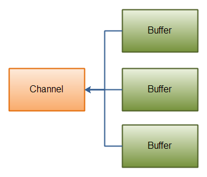
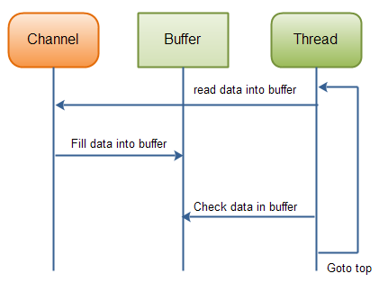
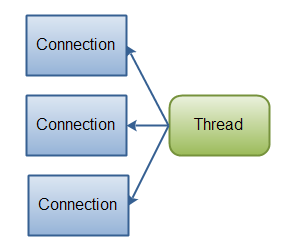
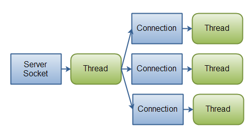

## Java NIO

 1. [Java NIO 教程](#Java-NIO-Tutorial)
 1. [Java NIO 概述](#Java-NIO-Overview)
	- [Channels 和 Buffers](#channels-and-buffers)
	- [Selectors](#selectors)
 1. [Java NIO Channel](#Java-NIO-Channel)
	- [Channel 实现](#channel-implementations)
	- [基本 Channel 示例](#basic-channel-example)
 1. [Java NIO Buffer](#Java-NIO-Buffer)
	- [基本 Buffer 使用](#basicusage)
	- [Buffer 容量，位置和限制](#capacity-position-limit)
		- [容量](#capacity)
		- [位置](#position)
		- [限制](#limit)
	- [Buffer 类型](#buffertypes)
	- [分配 Buffer](#allocating)
	- [写数据到 Buffer 中](#writing)
	- [flip()](#flip)
	- [从 Buffer 读出数据](#reading)
	- [rewind()](#rewind)
	- [clear() 和 compact()](#clear)
	- [mark() 和 reset()](#mark)
	- [equals() 和 compareTo()](#equals-and-compareto)
		- [equals()](#equals)
		- [compareTo()](#compareTo)
 1. [Java NIO Scatter / Gather](#Java-NIO-Scatter-Gather)
	- [Scattering Reads](#scattering-reads)
	- [Gathering Writes](#gathering-writes)
 1. [Java NIO 通道之间数据传送](#Java-NIO-Channel-to-Channel-Transfers)
	- [transferFrom()](#transferfrom)
	- [transferTo()](#transferto)
 1. [Java NIO Selector](#Java-NIO-Selector)
	- [为什么使用 Selector](#why-use-a-selector)
	- [创建 Selector](#creating-a-selector)
	- [向 Selector 注册 Channel](#registering-channels-with-the-selector)
	- [SelectionKey 的](#selectionkey)
		- [兴趣位（Interest Set）](#selector-interest-sets)
		- [状态位（Ready Set）](#selector-ready-set)
		- [Channel + Selector](#channel-selector)
		- [附加对象](#attaching-objects)
	- [通过 Selector 选择 Channel](#selecting-channels-via-a-selector)
		- [selectedKeys()](#selectedkeys)
	- [wakeUp()](#wakeup)
	- [close()](#close)
	- [完整 Selector 示例](#full-selector-example)
 1. [Java NIO FileChannel](#Java-NIO-FileChannel)
	- [打开 FileChannel](#opening-a-filechannel)
	- [从 FileChannel 读数据](#reading-data-from-a-filechannel)
	- [写数据到 FileChannel](#writing-data-to-a-filechannel)
	- [关闭 FileChannel](#closing-a-filechannel)
	- [FileChannel 位置](#filechannel-position)
	- [FileChannel 大小](#filechannel-size)
	- [FileChannel 截断](#filechannel-truncate)
	- [FileChannel 强制刷新](#filechannel-force)
 1. [Java NIO SocketChannel](#Java-NIO-SocketChannel)
	- [打开 SocketChannel](#opening-a-socketchannel)
	- [关闭 SocketChannel](#closing-a-socketchannel)
	- [从 SocketChannel 读](#reading-from-a-socketchannel)
	- [写向 SocketChannel](#writing-to-a-socketchannel)
	- [非阻塞模式](#non-blocking-mode)
		- [connect()](#connect)
		- [write()](#write)
		- [read()](#read)
		- [非阻塞模式和 Selector](#non-blocking-mode-with-selectors)
 1. [Java NIO ServerSocketChannel](#Java-NIO-ServerSocketChannel)
	- [打开 ServerSocketChannel](#opening-a-serversocketchannel)
	- [关闭 ServerSocketChannel](#closing-a-serversocketchannel)
	- [监听连接连入](#listening-for-incoming-connections)
	- [非阻塞模式](#non-blocking-mode)
 1. [Java NIO DatagramChannel](#Java-NIO-DatagramChannel)
	- [打开 DatagramChannel](#opening-a-datagramchannel)
	- [接收数据](#receiving-data)
	- [发送数据](#sending-data)
	- [连接特定地址](#connecting-to-a-specific-address)
 1. [Java NIO Pipe](#Java-NIO-Pipe)
	- [创建管道](#creating-a-pipe)
	- [写向管道](#writing-to-a-pipe)
	- [从管道读](#reading-from-a-pipe)
 1. [Java NIO 对比 IO](#Java-NIO-vs-IO)
	- [Java NIO 和 IO 的主要区别](#main-differences-between-java-nio-and-io)
	- [面向流对比面向 Buffer](#stream-oriented-vs-buffer-oriented)
	- [阻塞对比非阻塞 IO](#blocking-vs-non-blocking)
	- [Selector](#selectors)
	- [NIO 和 IO 如何影响应用设计](#how-nio-and-io-influences-application-design)
		- [API 调用](#the-api-calls)
		- [数据处理](#the-processing-of-data)
	- [总结](#summary)
 1. [Java NIO Path](#Java-NIO-Path)
	- [创建 Path 实例](#creating-a-path-instance)
		- [创建绝对路径](#creating-an-absolute-path)
		- [创建相对路径](#creating-a-relative-path)
	- [Path.normalize()](#path-normalize)
 1. [Java NIO Files](#Java-NIO-Files)
	- [Files.exists()](#files-exists)
	- [Files.createDirectory()](#files-create-directory)
	- [Files.copy()](#files-copy)
		- [覆盖已存在文件](#overwriting-existing-files)
	- [Files.move()](#files-move)
	- [Files.delete()](#files-delete)
	- [Files 类中其他方法](#files-additional-methods)

###  1. Java NIO 教程

Java NIO（New IO）是 Java IO API 的替代方案（Java 1.4 之后），是指传统 [Java IO](http://tutorials.jenkov.com/java-io/index.html) 和 [Java Networking](http://tutorials.jenkov.com/java-networking/index.html) API 的一种替代。Java NIO 相比于传统的 IO API，提供了一种使用 IO 的不同方式。

#### 1.1 Java NIO：Channels 和 Buffers

使用传统 IO API，你实际使用的是字节流和字符流。而 NIO 中，你需要使用通道和缓冲区。数据总是从通道读入到缓冲区，或从缓冲区写向通道。

#### 1.2 Java NIO：非阻塞（Non-blocking）IO

Java NIO 可以使你实现非阻塞的 IO。比如，线程可以向通道请求读入数据到缓冲区。当通道在读数据到缓冲区的时候，那个线程可以执行其他操作。一旦当数据读入到缓冲区中时，线程就可以接着处理它。这同样适用于写数据到通道中。

#### 1.3 Java NIO：Selectors

Java NIO 包含“Selector”的概念。Selector 是一个对象，它可以为多个通道监测特定事件（像：连接开启，数据到达等）。因而，一个简单线程就可以为数据监测多个通道。

###  2. Java NIO 概述

Java NIO 包含如下核心组件：

 - Channel
 - Buffer
 - Selector

Java NIO 当然有很多类和组件，而不止上面的 3 个，但是在我看来， `Channel`，`Buffer` 和 `Selector` 是最核心的 API。剩下的组件，像 `Pipe` 和 `FileLock` 仅仅是为了与这 3 个核心组件协作的工具类。因而，本小节，我将会重点关注于这三个组件。其他的组件会在本教程的其他小节解释到。参见本页顶的索引目录。

####  2.1 Channels 和 Buffers

一般，所有 NIO 中的 IO 都由一个 `Channel` 作为开始。`Channel` 有点类似于流。数据可以从 `Channel` 被读入到 `Buffer`。数据也可以从 `Buffer` 被写入到 `Channel`。这里是关于上述的一个图例：

**Java NIO：Channel 读数据到 Buffer，Buffer 写数据到 Channel。**

有多种 `Channel` 和 `Buffer` 类型。下面是 Java NO 中一组主要的 `Channel` 实现类：

 - FileChannel
 - DatagramChannel
 - SocketChannel
 - ServerSocketChannel

如你所见，这些通道覆盖了 UDP 和 TCP 网络 IO 和文件 IO。

有一些有趣的接口跟这些类一起工作，但是为简单起见，我不会在本节中讲述。它们将会在本教程其他章节涉及到的地方被解释。

下面是 Java NIO 中一组核心 `Buffer` 实现类：

 - ByteBuffer
 - CharBuffer
 - DoubleBuffer
 - FloatBuffer
 - IntBuffer
 - LongBuffer
 - ShortBuffer

这些 `Buffer` 涵盖了你可以通过 IO 发送的基本数据类型：byte，short，int，long，float，double，和 characters。

Java NIO 同样有一个 `MappedByteBuffer`，用于跟内存映射文件相协作。我也不会在本章节讨论这个 `Buffer`。

####  2.2 Selectors

一个 `Selector` 允许一个简单线程处理多个 `Channel`。如果你的应用有多个连接（Channel）处于打开状态，但每个连接只有较低的流量，这将会很有利。

比如，一个聊天服务器。

下面是一个线程使用 `Selector` 处理 3 个 `Channel` 的示意图：

**一个线程使用一个 Selector 处理 3 个 Channel。**

为了使用 `Selector`，你需要注册 `Channel` 到它。然后你调用它的 `select()` 方法。这个方法将会一直阻塞直到某一个已注册的通道的监听事件到来。一旦这个方法返回，线程就可以处理这些事件了。事件类型比如连接到达，接收到数据等。

###  3. Java NIO Channel

Java NIO 通道跟流很相似，但也有一些不同：

 - 你可以同时读和写一个通道。流一般是单一的（只读或只写）。
 - 通道可以被异步读写。
 - 通道总是从缓冲区中读，像缓冲区写。

像上面提到的，你可以从通道读数据到缓冲区，及从缓冲区写数据到通道。这里是一个示意图：

**Java NIO：Channel 读数据到 Buffer，Buffer 写数据到 Channel。**

####  3.1 Channel 实现

下面是 Java NIO 中一些最重要的 Channel 实现类：

 - FileChannel
 - DatagramChannel
 - SocketChannel
 - ServerSocketChannel

`FileChannel` 从文件读或写数据。

`DatagramChannel` 可以通过 UDP 协议从网络读和写数据。

`SocketChannel` 可以通过 TCP 协议从网络读或写数据。

`ServerSocketChannel` 允许你像 web 服务器那样，监听到达的 TCP 连接。并为每一个到达的链接，创建一个 `SocketChannel`。

####  3.2 基本 Channel 示例

下面是一个基本示例，使用 `FileChannel` 读取一些数据到 Buffer：

	RandomAccessFile aFile = new RandomAccessFile("data/nio-data.txt", "rw");
	FileChannel inChannel = aFile.getChannel();

	ByteBuffer buf = ByteBuffer.allocate(48);

	int bytesRead = inChannel.read(buf);
	while (bytesRead != -1) {

		System.out.println("Read " + bytesRead);
		buf.flip();

		while (buf.hasRemaining()) {
			System.out.print((char) buf.get());
		}

		buf.clear();
		bytesRead = inChannel.read(buf);
	}
	aFile.close();

注意 `buf.flip()` 调用。首先，你读数据到缓冲区中。然后，你切换读写模式。然后，读出数据。我将会在下一小节讲解更多关于 `Buffer` 的细节。

###  4. Java NIO Buffer

Java NIO 缓冲区用于跟 NIO 通道交互。如你所知，数据从通道读入缓冲区，从缓冲区写向通道。

一个缓冲区的本质就是一块内存区域，你可以写入数据到其中，并在之后进行重读。这块内存区域被包装成 NIO `Buffer` 对象，`Buffer` 对象提供了一系列方法使得更易于使用内存块工作。

####  4.1 基本 Buffer 使用

使用 `Buffer` 来读和写数据，一般有 4 步：

 1. 写数据到 `Buffer` 中
 2. 调用 `buffer.flip()`
 3. 从 `Buffer` 读出数据
 4. 调用 `buffer.clear()` 或 `buffer.compact()`

当你写数据到 `Buffer` 中时，它会记录你已经写了多少数据。一旦你需要读出数据，就需要通过 `flip()` 来将 `Buffer` 从写模式切换到读模式。读模式下，`Buffer` 可以使你读到所有已写入到其中的数据。

一旦你读完了所有数据，你需要清空 `Buffer`，使它做好准备以被再次写入。你可以通过两种方式实现：调用 `clear()` 或 `compant()`。`clear()` 方法清空整个 `Buffer`。`compact()` 方法仅仅清空你已经读过的数据。所有未读数据将会被移动到 `Buffer` 的开始位置，后续数据将会被写入到 `Buffer` 中未读数据的后面。

下面是一个简单使用 `Buffer` 的示例，包括写，切换，读和清空操作：

	RandomAccessFile aFile = new RandomAccessFile("data/nio-data.txt", "rw");
	FileChannel inChannel = aFile.getChannel();

	ByteBuffer buf = ByteBuffer.allocate(48);

	int bytesRead = inChannel.read(buf);
	while (bytesRead != -1) {

		System.out.println("Read " + bytesRead);
		buf.flip();

		while (buf.hasRemaining()) {
			System.out.print((char) buf.get());
		}

		buf.clear();
		bytesRead = inChannel.read(buf);
	}
	aFile.close();

####  4.2 Buffer 容量，位置和限制

一个 `Buffer` 本质上是一块内存区域，你可以写入数据到其中，并在之后读出。这块内存区域被包装成 NIO `Buffer` 对象，`Buffer` 对象提供了一系列方法使得更易于使用内存块工作。

`Buffer` 有 3 个你需要特别熟悉的属性，这样才能理解 `Buffer` 的工作机制。它们是：

 - 容量（capacity）
 - 位置（position）
 - 限制（limit）

`position` 和 `limit` 的实际含义取决于 `Buffer` 是处于读还是写模式。容量就一种含义，表示 `Buffer` 包装的内存块的大小，跟 `Buffer` 所处模式无关。

下面是容量、位置和限制在写和读模式下的示意图。示意图的解释在下一小节。

**写和读模式下 Buffer 容量，位置和限制。**

#####  4.2.1 容量（capacity）

一个内存块，即一个 `Buffer` 有一个确定的大小，也叫做它的“capacity”。你只能写 `capacity` 长度的 byte，long 或 char 等到 `Buffer` 中。一旦 `Buffer` 满了，在你可以再次向它写入更多数据之前，你需要先置空它（通过读数据，或直接清除）。

#####  4.2.2 位置（position）

当你写入数据到 `Buffer` 中，你会设置一个特定定 `position`。初始化时 `position` 是 0。当一个 byte，long 等已经被写入到 `Buffer` 中，`position` 就会前进到下一个 `Buffer` 中的格子来插入下个数据。`position` 最大可以设置成 `capacity - 1`。（译注：本质就是从 0 开始计数的数组下标。）

当你从 `Buffer` 中读入数据时，你也同样需要根据当前 `position` 来设置新 `position`。当你从写模式切换 `Buffer` 到读模式时，`position` 将被重设成 0。当你从 `Buffer` 读入数据时，也将会变动 `position` 值，即使 `position` 前进到下个被读数据的位置。

#####  4.2.3 限制（limit）

写模式下，一个 `Buffer` 的 `limit` 是你可以写入多少数据到缓冲区中。写模式下，`limit` 是等于 `Buffer` 的 `capacity` 值的。

当切换 `Buffer` 到读模式时，`limit` 表示你可以从缓冲区中读多少数据（译注：原文是 from the data，应该是错误的，data 应该是 buffer）。因而，当切换 `Buffer` 到读模式时，`limit` 值将被设置成写模式下最后写入的数据的 `position` 值。换句话说，你写入多少数据就可以读出多少数据（`limit` 被设置成已写字节（译注：应该是指定类型的数据）的数量，即 `position` 值）。

####  4.3 Buffer 类型

Java NIO 中有以下 **Buffer** 类型：

 - ByteBuffer
 - MappedByteBuffer
 - CharBuffer
 - DoubleBuffer
 - FloatBuffer
 - IntBuffer
 - LongBuffer
 - ShortBuffer

如你所见，这些 `Buffer` 类型用于表示不同的数据类型。换句话说，它们使你可以将缓冲区中的字节作为 char，short，int，long，float 或 double 类型对待。

`MappedByteBuffer` 有点特殊，将会在自己小节中讲解。（译注：本教程中好像**没有**。）

####  4.4 分配 Buffer

为了获得一个 `Buffer` 对象，你必须先分配它。每个 `Buffer` 类都有一个 `allocate()` 方法，来实现分配操作。下面的例子展示对 `ByteBuffer` 的分配，容量为 48 字节：

	ByteBuffer buf = ByteBuffer.allocate(48);

下面的例子分配一个 `CharBuffer`，容量为 1024 个 char：

	CharBuffer buf = CharBuffer.allocate(1024);

####  4.5 写数据到 Buffer 中

你可以通过两种方式写数据到 `Buffer` 中：

 1. 从 `Channel` 写数据到 `Buffer` 中。
 2. 直接通过 `Buffer` 的 `put()` 写数据。

下面的例子展示 `Channel` 如何写数据到 `Buffer` 中：

	int bytesRead = inChannel.read(buf); //read into buffer.

下面的例子是通过 `put()` 方法写数据到 `Buffer` 中：

	buf.put(127);

有很多其他版本的 `put()` 方法，允许你通过多种方式写数据到 `Buffer` 中。比如，在特定的位置写入数据，或写一个字节数组到缓冲区中。具体 `Buffer` 实现类的细节，参见 JavaDoc。

####  4.6 flip()

`flip()` 方法将 `Buffer` 从写模式切换到读模式。调用 `flip()` 会设置 `position` 成 0，并设置 `limit` 为 `position` 值。

换句话说，`position` 现在标记读的位置，`limit` 标记多少字节、字符等被入到 `Buffer` 中，即多少字节、字符等可以被读出。

####  4.7 从 Buffer 读出数据

你可以通过两种方式从 `Buffer` 读出数据：

 1. 从 `Buffer` 读出数据到 `Channel`。
 2. 通过 `get()` 方法，从 `Buffer` 读出数据。

下面的例子展示你如何从 `Buffer` 读出数据到 Channel 中：

	//read from buffer into channel.
	int bytesWritten = inChannel.write(buf);

下面的例子展示了通过 `get()` 方法从 `Buffer` 读出数据：

	byte aByte = buf.get();

还有很多其他版本的 `get()` 方法，允许你从 `Buffer` 中以多种方式读出数据。比如，读取特定位置的数据，从 `Buffer` 读出字节数组。具体 `Buffer` 实现类的细节，参见 JavaDoc。

####  4.7 rewind()

`Buffer.rewind()` 重新设置 `position` 成 0，这样你可以重新读取缓冲区中的所有数据。`limit` 值不会变化，即仍标记可以从 `Buffer` 读出多少元素（字节，字符等）。

####  4.8 clear() 和 compact()

一旦你完成了从 `Buffer` 读出数据，你必须使 `Buffer` 做好再次被写入的准备。这通过调用 `clear()` 或 `compact()` 来实现。

如果你调用 `clear()` 方法，将会设置 `position` 成 0，`limit` 成 `capacity` 值。换句话说，`Buffer` 被清空了。`Buffer` 中的实际数据并没有被清空（译注：指内存块中的位）。这些标记变量仅仅告诉你可以从哪个位置写数据到 `Buffer` 中。

如果 `Buffer` 中还有未被读出的数据，在你调用 `clear()` 之后，这些数据将会被“遗忘”，即你不再知道任何标记变量告诉你什么数据已经读过了，什么数据还没有被读过。

如果 `Buffer` 中仍有未被读出的数据，而且你还想在之后再读，但你需要首先做一些写入操作，则需要调用 `compact()` 方法而非 `clear()`。

`compact()` 复制这些未读数据到 `Buffer` 起始位置。然后，设置 `position` 为最右边的未读元素的索引。`limit` 值设置成 `capacity` 值，就像 `clear()` 方法所做的那样。现在，`Buffer` 已经是可以再次写入的状态了，但你并没有覆盖未读数据。

####  4.9 mark() 和 reset()

你可以通过调用 `Buffer.mark()` 方法，在 `Buffer` 中标记一个给定的 `position`。然后，你可以重设 position 到这个已标记的 position，通过调用 `Buffer.reset()` 方法。下面是一个例子：

	buffer.mark();
	//call buffer.get() a couple of times, e.g. during parsing.
	buffer.reset();  //set position back to mark.

####  4.10 equals() 和 compareTo()

可以通过 `equals()` 和 `compareTo()`，比较两个 `Buffer`。

#####  4.10.1 equals()

两个 `Buffer` 是相等的，如果（译注：同时满足 3 个条件）：

 1. 它们具有相同的类型（字节，字符，整形等）及容量。
 2. 它们的 `Buffer` 中有同等数量的未读出（remaining）字节，字符等。
 3. 未读出的所有字节，字符等是相等的。

如你所见，`equals()` 方法仅仅比较 `Buffer` 的一部分，而非其中的每一个元素。其实，它仅比较 `Buffer` 中的未读元素。

#####  4.10.2 compareTo()

`compareTo()` 方法比较两个 `Buffer` 的剩余元素（字节，字符等），比如，排序例程。一个 `Buffer` “小于”另一个 `Buffer` 如果：

 1. `Buffer` 中第一个元素小于另一个 `Buffer` 中的相应元素。
 2. 所有的元素是相等的，但是第一个 `Buffer` 先于第二个 `Buffer` 读（耗）尽了所有元素（即，第一个 `Buffer` 有较少的元素）。

**（译注：`equals()` 和 `compareTo()` 的表现好像很奇怪。）**

###  5. Java NIO 散和收（Sactter/Gather）

Java NIO 有内建的 scatter / gather 支持。scatter / gather 的概念用于读 / 写 channel。

一个 scattering 用于从通道执行读操作，读数据到一个或多个缓冲区中。因而，通道 scatter 用于从多个通道“分散”数据到多个缓冲区中。

一个 gathering 写向通道是一个写操作来写数据到通道中，可以从一或多个缓冲区中写数据到一个单一的通道。

当你需要用分开使用多种类的数据时，scatter / gather 会是很有用的解决方案。比如，如果一个消息由一个头（header）和正文（body）组成，你可能想将头和正文放在分开的缓冲区中。这样做，可以使你更易于以分离的方式使用头和正文。

####  5.1 分散读（Scattering Reads）

一个“散开读”从一个单一通道中读数据到多个缓冲区中。下面是这个原理的实例图：

**Java NIO：分散读**

这面这个例子展示如何实现一个分散读：

	ByteBuffer header = ByteBuffer.allocate(128);
	ByteBuffer body   = ByteBuffer.allocate(1024);

	ByteBuffer[] bufferArray = { header, body };

	channel.read(buffers);

注意，实例化后的缓冲区先被插入到数组中的，然后数组作为参数传递到 `channel.read()` 方法。然后，`read()` 方法按照数组中缓冲区的顺序，从通道中写数据到数组中的缓冲区实例。一旦一个缓冲区写满了，通道转向下一个，并填满它。

分散读填满一个缓冲区之后才会转向下一个，这意味着动态大小的消息部分并不适合使用分散读。换句话说，如果你有一个头和正文，而且头有固定尺寸（如，128 字节），那么分散度将会相当有效。

####  5.2 收集写（Gathering Writes）

一个“收集写”从多个缓冲区中写数据到一个单一通道中。下面是这个原理的示意图：

**Java NIO：收集写**

下面的代码示例展示如何实现一个收集写：

	ByteBuffer header = ByteBuffer.allocate(128);
	ByteBuffer body   = ByteBuffer.allocate(1024);

	//write data into buffers

	ByteBuffer[] bufferArray = { header, body };

	channel.write(buffers);

缓冲区数组传递到 `write()` 方法，该方法按照数组中缓冲区的顺序将内容写到通道中。仅仅在 `position` 和 `limit` 之间的缓冲区内容才会被写出。因而，如果一个缓冲区的容量为 128 字节，但仅包含 58 字节的实际数据，那么只会有这 58 字节的数据从缓冲区写向通道中。因此，一个收集写在消息大小是动态变化时将会工作的很好，跟分散读相反。

###  6. Java NIO 通道之间数据传送

Java NIO 中，你可以直接将数据从一个通道转到另一个通道中，如果通道中的一个是 `FileChannel` 的话。`FileChannel` 类有一个 `transferTo()` 和一个 `transferFrom()` 方法，来完成数据转送操作。

####  6.1 transferFrom()

`FileChannel.transferFrom()` 方法从一个源通道转送数据到另一个 `FileChannel`。

	RandomAccessFile fromFile = new RandomAccessFile("fromFile.txt", "rw");
	FileChannel      fromChannel = fromFile.getChannel();

	RandomAccessFile toFile = new RandomAccessFile("toFile.txt", "rw");
	FileChannel      toChannel = toFile.getChannel();

	long position = 0;
	long count    = fromChannel.size();

	toChannel.transferFrom(fromChannel, position, count);

`position` 和 `count` 参数，告诉目标（被写入）文件从哪里开始写数据（`position`），及应该转送最大多大（`count`）字节的数据。如果源通道数据量少于 `count` 字节，那么将只转送能够转送的数据量。

另外，一些 `SocketChannel` 实现可能也可以转送数据，这些数据只是 `SocketChannel` 中当前已经在内部缓冲区中的了，即使 `SocketChannel` 中可能后续有很多的数据进来。因而，它可能无法从 `SocketChannel` 转送全部所要求的（`count`）数据到 `FileChannel` 中。

####  6.2 transferto()

`transferTo()` 方法用于从 `FileChannel` 转数据到其它通道。下面是一个简单示例：

	RandomAccessFile fromFile = new RandomAccessFile("fromFile.txt", "rw");
	FileChannel      fromChannel = fromFile.getChannel();
	
	RandomAccessFile toFile = new RandomAccessFile("toFile.txt", "rw");
	FileChannel      toChannel = toFile.getChannel();
	
	long position = 0;
	long count    = fromChannel.size();
	
	fromChannel.transferTo(position, count, toChannel);

注意，这个例子跟前例非常相似。唯一真正的不同是，这个方法是在哪个 `FileChannel` 对象调用的。其它都是相同的。

问题是，`SocketChannel` 也提供了一个 `transferTo()` 方法。`SocketChannel` 实现可能会从 `FileChannel` 中转送字节直到发送缓冲区满了（send buffer），然后停止（译注：挂起）。

###  7. Java NIO Selector

`Selector` 是 Java NIO 的一个组件，用于检查一或多个 NIO 通道，并决定通道所处的状态，如可读或可写。这样，一个单线程就可以管理多个通道，及多个网络连接。

####  7.1 为什么使用 Selector

只使用一个线程来处理多个通道的优点是你只需较少的线程就能处理很多通道。其实，通过 `Selector`，你可以只用一个线程来处理你所有的通道。操作系统中，线程间的切换是很重的操作，而且每个线程都需要一些资源（内存等）。因而，越少的线程使用，越好。

但是记住，现在操作系统和 CPU 在多任务的处理上变的越来越好，所以多线程的切换代价变的越来越小。其实，如果一个 CPU 有多个核，而如果你不使用多任务的话，那你可能在浪费 CPU 的能力。不过，那种设计讨论是另外的主题。这里，只讨论通过单个线程利用 `Selector` 处理多个通道。

下面是一个线程利用 `Selector` 处理 3 个 `Channel` 的例子：

**一个线程使用一个 Selector 处理 3 个 Channel。**

####  7.2 创建 Selector

你通过调用 `Selector.open()` 方法创建一个 `Selector`，像这样：

	Selector selector = Selector.open();

####  7.3 向 Selector 注册 Channel

为了搭配 `Selector` 使用 `Channel`，你必须注册 `Channel` 到 `Selector`。这通过 `SelectableChannel.register()` 方法实现，如下：

	channel.configureBlocking(false);

	SelectionKey key = channel.register(selector, SelectionKey.OP_READ);

`Channel` 必须处于非阻塞模式，才能搭配使用 `Selector`。这意味着，你不能为 `FileChannel` 使用 `Selector`，因为 `FileChannel` 无法切换到非阻塞模式。而 Socket 通道将会工作的很好。

注意 `register()` 方法的第二个参数。这是一个“兴趣位（interest set）”，表示通过 `Selector`，你为 `Channel` 设置对哪种事件感兴趣。你可以监听 4 种不同事件：

 1. 连入（Connect）
 2. 允许（Accept）
 3. 读（Read）
 4. 写（Write）

一个 `Channel` “触发一个事件（fire an event）”，也叫做“准备好（ready）”处理这个事件。所以，一个已经成功连接上另一个服务器的通道处于“连接完成状态（connect ready）”状态。一个允许接受连接的 server socket 通道，处于“接受（accept）”状态。一个有数据可以被读取的通道处于“读”状态。一个准备好向其写数据的通道处于“写”状态。

这 4 个状态被定义成 `SelectionKey` 的 4 个常量：

 1. SelectionKey.OP_CONNECT
 2. SelecitonKey.OP_ACCEPT
 3. SelectionKey.OP_READ
 4. SelectionKey.OP_WRITE

如果，你对不止一个事件感兴趣，用“或”操作符连起它们，如：

	int interestSet = SelectionKey.OP_READ | SelectionKey.OP_WRITE;

我将会在本文下面更多的讲解“兴趣位”。

####  7.4 SelectionKey 的

如你在前面小节中所见，当你通过 `register()` 方法注册 `Channel` 到 `Selector` 时，会返回一个 `SelectionKey` 对象。这个 `SelectionKey` 对象包括一组有意思的属性：

 - 兴趣位（interest set）
 - 准备状态位（ready set）
 - 通道
 - Selector
 - 附加对象（可选）

我将在下面描述这些属性。

#####  7.4.1 兴趣位（Interest Set）

兴趣位是一组你感兴趣的事件，如在“[向 Selection 注册 Channel](#registering-channels-with-the-selector)”所描述。你可以通过 `SelectionKey` 读和写兴趣位，像这样：

	int interestSet = selectionKey.interestOps();

	// 译注：& 结果类型不应该是 boolean，而应该是 int。
	// & 结果如果是 0，表示没有注册该事件，1 表示已注册。
	// 为了保持跟原文统一，我这里没有改动。
	boolean isInterestedInAccept  = interestSet & SelectionKey.OP_ACCEPT;
	boolean isInterestedInConnect = interestSet & SelectionKey.OP_CONNECT;
	boolean isInterestedInRead    = interestSet & SelectionKey.OP_READ;
	boolean isInterestedInWrite   = interestSet & SelectionKey.OP_WRITE;

如你所见，你可以通过“&”操作符运算兴趣位和 `SelectionKey` 常量变量来查看一个确定事件是否包含在兴趣位中。

#####  7.4.2 状态位（Ready Set）

状态位标记一组通道预备好可以执行的操作。你将在得到 selection 后获取状态位。Selection 在下面小节中解释。你通过如下操作获取状态位：

	int readySet = selectionKey.readyOps();

你可以像测试兴趣位一样测试状态位（译注：通过“&”操作），来确定这个通道准备好处理什么事件 / 操作。但是，你也可以使用下面 4 个便利方法，它们都将返回 boolean 值：

	selectionKey.isAcceptable();
	selectionKey.isConnectable();
	selectionKey.isReadable();
	selectionKey.isWritable();

#####  7.4.3 Channel + Selector

从 `SelectionKey` 获取通道和 selector 很简单。按照下面操作：

	Channel  channel  = selectionKey.channel();

	Selector selector = selectionKey.selector(); 

#####  7.4.4 附加对象

你可以附加对象到一个 `SelectionKey`，这是识别给定通道的一个便利方法，或关联更多信息到通道。比如，你可以关联通道正使用的 `Buffer`，或一个包含更多聚合数据的对象。下面是如何关联对象的操作：

	selectionKey.attach(theObject);

	Object attachedObj = selectionKey.attachment();

你也可以在向 `Selector` 注册 `Channel` 的时候就关联对象，在 `register()` 方法中。下面是示例：

	SelectionKey key = channel.register(selector, SelectionKey.OP_READ, theObject);

####  7.5 通过 Selector 选择通道

一旦你已经注册了一或多个通道到 `Selector`，你可以调用多种 `select()` 方法中的一个。这些方法返回处于你所感兴趣的某种状态（connect，accept，read 或 write）的通道。换句话说，如果你对处于读状态的通道“感兴趣”，那么通过调用 `select()` 方法你就将获得处于读状态的通道。

下面是一些 `select()` 方法：

 - int select()
 - int select(long timeout)
 - int selectNow()

`select()` 方法阻塞，直到至少一个通道准备好处理注册的事件（译注：处于注册的状态）。

`select(long timeout)` 跟 `select()` 一样除了它最多阻塞 `timeout` 毫秒（参数）。

`selectNow()` 完全不阻塞。它返回现在处于准备状态的任何通道。

`select()` 方法的返回值是一个 `int`，告诉你多少通道处于准备状态。即，自从你上次调用过 `select()`后，多少通道处于准备状态，。如果你调用 `select()` 并返回 1，因为一个通道处于准备状态，然后多次调用 `select()`，并且多个通道又处于准备状态，它将会再次返回 1。如果你没有用第一个准备状态的通道，你现在将会有 2 个处于准备状态的通道，但是在每次调用 `select()` 之间，只有 1 个通道变成准备状态。

#####  7.5.1 selectedKeys()

一旦你调用了某一个 `select()` 方法，它的返回值表示一或多个通道处于准备状态，你可以通过调用 selector 的 `selectedKeys()` 方法来获得所有处于准备状态的通道。

	Set<SelectionKey> selectedKeys = selector.selectedKeys();

当你注册一个通道到 `Selector`，`Channel.register()` 方法返回一个 `SelectionKey` 对象。这个 key 表示注册到 selector 的通道。你可以通过 `selectedKeySet()` 方法得到这些 key。从 `SelectionKey` 中。（译注：**不存在 selectedKeySet()**。）

你可以遍历这些 selected key 来获得处于准备状态的通道。下面是这个的示例：

	Set<SelectionKey> selectedKeys = selector.selectedKeys();

	Iterator<SelectionKey> keyIterator = selectedKeys.iterator();

	while(keyIterator.hasNext()) {

		SelectionKey key = keyIterator.next();

		if(key.isAcceptable()) {
			// a connection was accepted by a ServerSocketChannel.

		} else if (key.isConnectable()) {
			// a connection was established with a remote server.

		} else if (key.isReadable()) {
			// a channel is ready for reading

		} else if (key.isWritable()) {
			// a channel is ready for writing
		}

		keyIterator.remove();
	}

这个循环遍历 selected key 集中的每个 key。对每个 key，它测试这个 key 来决定 key 指向的通道所处的状态。

注意每次遍历最后的 `keyIterator.remove()` 方法。`Selector` 不会自己从 selected key 集中移除 `SelectionKey` 实例。当你完成对通道的处理，你需要移除它。下次通道变成准备状态时，`Selecotr` 将会再次将它添加到 selected key 集中。

`SelectionKey.channel()` 方法返回的通道需要被转型成你真正要用的通道，比如一个 `ServerSockterChannel` 或 `SocketChannel` 等。

####  7.6 wakeUp()

一个调用了 `select()` 方法而已经阻塞的线程，即使没有任何通道处于准备状态，也可以从 `select()` 方法返回。这是由不同的线程调用 `Selector` 上的 `Selector.wakeup()` 方法，这个 `Selector` 要和第一个调用 `select()` 的线程上的 `Selector` 是同一个。这个在内部等待 `select()` 的线程将会立即返回。

如果一个不同线程调用 `wakeup()`，而且没有任何线程当前内部处于 `select()` 阻塞状态，下一个调用 `select()` 的线程将会立即“唤醒”。

####  7.7 close()

当你使用完成了 `Selector`，你需要调用它的 `close()` 方法。这将会关闭 `Selector` 并且移除所有注册到 `Selector` 的 `SelectionKey` 的实例。通道并没有关闭。（译注：!）

####  7.8 完整 Selector 示例

下面是一个完整示例，打开一个 `Selector`，注册通道（通道实例化没有包括在本例中），并且检测 `Selector` 的 4 种状态（accept，connect，read，write）。

	Selector selector = Selector.open();

	channel.configureBlocking(false);

	SelectionKey key = channel.register(selector, SelectionKey.OP_READ);

	while(true) {

		int readyChannels = selector.select();

		if(readyChannels == 0) continue;

		Set<SelectionKey> selectedKeys = selector.selectedKeys();

		Iterator<SelectionKey> keyIterator = selectedKeys.iterator();

		while(keyIterator.hasNext()) {

			SelectionKey key = keyIterator.next();

			if(key.isAcceptable()) {
				// a connection was accepted by a ServerSocketChannel.

			} else if (key.isConnectable()) {
				// a connection was established with a remote server.

			} else if (key.isReadable()) {
				// a channel is ready for reading

			} else if (key.isWritable()) {
				// a channel is ready for writing
			}

			keyIterator.remove();
		}
	}

###  8. Java NIO FileChannel

Java NIO `FileChannel` 是用于连接文件的通道。使用文件通道，你可以从文件读取数据，并向文件写数据。Java NIO `FileChannel` 类是 NIO 对 [利用标准 Java IO API 读文件](http://tutorials.jenkov.com/java-io/file.html)的一个替代。

`FileChannel` 无法设置成非阻塞模式。它总是运行在阻塞模式中。

####  8.1 打开 FileChannel

在你使用 `FileChannel` 之前，你必须打开它。你不能直接打开一个 `FileChannel`。你需要从输入流（`InputStream`），输出流（`OutputStream`），或 `RandomAccessFile` 中获取 `FileChannel`。下面是如何通过 `RndomAccessFile` 打开 `FileChannel`：

	RandomAccessFile aFile     = new RandomAccessFile("data/nio-data.txt", "rw");
	FileChannel      inChannel = aFile.getChannel();

####  8.2 从 FileChannel 读数据

你可以调用 `read()` 从 `FileChannel` 读数据。下面是一个示例：

	ByteBuffer buf = ByteBuffer.allocate(48);

	int bytesRead = inChannel.read(buf);

首先，分配一个 `Buffer`。才能从 `FileChannel` 读数据到 `Buffer` 中。

然后，`FileChannel.read()` 方法被调用。这个方法从 `FileChannel` 读数据到 `Buffer` 中。`read()` 方法返回 `int` 值，告诉你写了多少字节到 `Buffer` 中。如果返回的是 -1，那么表示到达了文件结尾。

####  8.3 写数据到 FileChannel

通过 `FileChannel.write()` 方法，可以写数据到 `FileChannel` 中，它需要 `Buffer` 作为参数。下面是一个示例：

	String newData = "New String to write to file..." + System.currentTimeMillis();

	ByteBuffer buf = ByteBuffer.allocate(48);
	buf.clear();
	buf.put(newData.getBytes());

	buf.flip();

	while(buf.hasRemaining()) {
		channel.write(buf);
	}

注意如何在 while 循环中调用 `FileChannel.write()` 方法。由于并不保证 `write()` 方法写多少字节到 `FileChannel` 中。因而，我们重复调用 `write()` 方法直到 `Buffer` 中没有能写出的字符。

####  8.4 关闭 FileChannel

当你用过 `FileChannel` 之后，你必须关闭它。如下操作：

	channel.close(); 

####  8.5 FileChannel 位置

当读或写一个 `FileChannel` 时，你是在某个指定位置操作的。通过调用 `position()` 方法，你可以获得 `FileChannel` 对象的当前位置。

你也可以通过调用 `position(long pos)` 方法设置 `FileChannel` 的位置变量。

下面是两个例子：

	long pos = channel.position();

	channel.position(pos +123);

如果你设置位置在文件末尾，并尝试从通道中读取数据，你将会得到 -1，标记文件结尾。

如果你设置位置在文件末尾之后，并向通道中写数据，文件将会先扩容到这个位置，然后写入数据。这可能导致“文件空洞（file hole）”，即磁盘上物理文件写入的数据之间会有空隙（译注：空隙内容都为 (byte) 0）。

####  8.6 FileChannel 大小

`FileChannel` 对象的 `size()` 方法返回文件通道连接的文件的大小。

	long fileSize = channel.size();

####  8.7 FileChannel 截断

你可以截断通过 `FileChannel.truncate()` 方法文件。当你截断文件时，会将文件截断成给定的大小。下面是一个示例：

	channel.truncate(1024);

这个例子截断文件成 1024 字节。

####  8.8 FileChannel 强制刷新

`FileChannel.force()` 方法刷新所有通道中的未写数据到磁盘上。操作系统出于性能原因可能会在内存中缓存数据，所以无法保证数据写到通道中就是实际就写到磁盘中了，直到你调用 `force()` 方法。

`force()` 方法需要一个 boolean 参数，表示是否将文件元数据（权限等）也同样刷新到文件中。

下面是一个例子，同时刷新文件数据和文件元数据。

	channel.force(true);

###  9. Java NIO SocketChannel

Java NIO `SocketChannel` 是连接 TCP 网络端口的通道。它是 Java NIO 对 [Java 网络编程 Socket](http://tutorials.jenkov.com/java-networking/sockets.html) 的替代。有两种创建 `SocketChannel` 的方式：

 1. 你打开 `SocketChannel` 并连到网络上的服务器。
 2. 当连接到达 [ServerSocketChannel](#Java-NIO-ServerSocketChannel) 时，`SocketChannel` 将会被创建。

####  9.1 打开 SocketChannel

下面是如何打开一个 `SocketChannel`：

	SocketChannel socketChannel = SocketChannel.open();
	socketChannel.connect(new InetSocketAddress("http://jenkov.com", 80));

####  9.2 关闭 SocketChannel

你通过调用 `SocketChannel.close()` 方法来关闭 `SocketChannel`。下面是一个示例：

	socketChannel.close();

####  9.3 从 SocketChannel 读

通过 `read()` 方法从 `SocketChannel` 读数据。下面是一个例子：

	ByteBuffer buf = ByteBuffer.allocate(48);

	int bytesRead = socketChannel.read(buf);

首先，一个 `Buffer` 被分配创建。才能从 `SocketChannel` 读数据到 `Buffer` 中。

然后，调用 `SocketChannel.read()` 方法。这个方法从 `SocketChannel` 读数据到 `Buffer` 中。`read()` 方法返回一个 `int` 值，告诉多少字节数据被写到 `Buffer` 中。如果返回的是 -1，表示到达了流的结尾（连接关闭）。

####  9.4 写向 SocketChannel

使用 `SocketChannel.write()` 方法写数据到 `SocketChannel`，需要 `Buffer` 作为参数。下面是一个示例：

	String newData = "New String to write to file..." + System.currentTimeMillis();

	ByteBuffer buf = ByteBuffer.allocate(48);
	buf.clear();
	buf.put(newData.getBytes());

	buf.flip();

	while(buf.hasRemaining()) {
		channel.write(buf);
	}

注意，`SocketChannel.write()` 方法是如何在 while 循环中调用的。由于，并不保证 `write()` 方法写多少字节到 `SocketChannel` 中，因而，我们重复调用 `write()` 方法，直到 `Buffer` 中没有任何字节需要写出。

####  9.5 非阻塞模式

你可以设置 `SocketChannel` 成非阻塞模式。当你这样做时，你可以以异步模式调用 `connect()`，`read()` 和 `write()` 方法。

#####  9.5.1 connect()

如果 `SocketChannel` 是非阻塞模式，你调用 `connect()` 方法后，它可以在连接建立前就返回。你可以调用 `finishConnect()` 方法，检查连接是否建立了，像这样：

	socketChannel.configureBlocking(false);
	socketChannel.connect(new InetSocketAddress("http://jenkov.com", 80));

	while(! socketChannel.finishConnect() ){
		//wait, or do something else...
	}

#####  9.5.2 write()

非阻塞模式下，`write()` 方法可能没有写出任何数据就直接返回。因而，你需要在循环中调用 `wriet()` 方法。上面的例子已经演示了这个做法，这里没有什么不同。

#####  9.5.3 read()

非阻塞模式下，`read()` 方法可能没有读到任何数据就直接返回。因而，你需要注意返回的 `int` 值，它告诉你读入了多少字节。

#####  9.5.4 非阻塞模式和 Selector

`SocketChannel` 的非阻塞方式搭配使用 `Selector` 将会工作的很好（译注：**否则就不要使用非阻塞模式**）。通过注册一或多个 `SocketChannel` 到一个 `Selecotor`，你就可以询问 `Selector` 以找到处于期望状态（读，写等）的通道。如何使用 `Selector` 和 `SocketChannel` 将会在下文中详细解释。（译注：**好像没有。:(**）

###  10. Java NIO ServerSocketChannel

Java NIO `ServerSocketChannel` 是用于监听 TCP 连接到达的通道，就像标准 Java 网络编程中的 [ServerSocket](http://tutorials.jenkov.com/java-networking/server-sockets.html)。`ServerSocketChannel` 类在 `java.nio.channels` 包下。

下面是一个例子：

	ServerSocketChannel serverSocketChannel = ServerSocketChannel.open();

	serverSocketChannel.socket().bind(new InetSocketAddress(9999));

	while(true){
		SocketChannel socketChannel = serverSocketChannel.accept();

		//do something with socketChannel...
	}

####  10.1 打开 ServerSocketChannel

你可以通过调用 `ServerSocketChannel.open()` 方法打开一个 `ServerSocketChannel` 。像下面这样做：

	ServerSocketChannel serverSocketChannel = ServerSocketChannel.open();

####  10.2 关闭 ServerSocketChannel

通过 `ServerSocketChannel.close()` 方法关闭一个 `ServerSocketChannel`。像下面这样做：

	serverSocketChannel.close();

####  10.3 监听连接连入

通过 `ServerSocketChannel.accept()` 方法监听连接连入。当 `accept()` 方法返回时，其返回值是一个 `SocketChannel` 代表一个连入连接。因而，`accept()` 方法阻塞直到有连接到达。

因为你一般不会只对一个单一连接感兴趣，因而你将需要在一个 while 循环中调用 `accept()` 方法。像下面这样：

	while(true){
		SocketChannel socketChannel =
			serverSocketChannel.accept();

		//do something with socketChannel...
	}

当然你可以在循环中使用一些停止条件而不是 `true`。

####  10.4 非阻塞模式

`ServerSocketChannel` 可以设置成非阻塞模式。非阻塞模式下，`accept()` 方法立即返回，当没有任何连接连入时，会返回 null 值。因而，你需要检查返回的 `SocketChannel` 是否为 null 值。下面是一个例子：

	ServerSocketChannel serverSocketChannel = ServerSocketChannel.open();

	serverSocketChannel.socket().bind(new InetSocketAddress(9999));
	serverSocketChannel.configureBlocking(false);

	while(true){
		SocketChannel socketChannel =
			serverSocketChannel.accept();

		if(socketChannel != null){
			//do something with socketChannel...
		}
	}

###  11. Java NIO DatagramChannel

Java NIO `DatagramChannel` 是用于发送和接收 UDP 包的通道。因为 UDP 是一种无连接的网络协议，你不能像传统通道所做的那样来读和写一个 `DatagramChannel`。你需要用发送和接收数据包作为替代。

####  11.1 接收数据

下面是你如何打开一个 `DatagramChannel`：

	DatagramChannel channel = DatagramChannel.open();
	channel.socket().bind(new InetSocketAddress(9999));

这个例子打开一个 `DatagramChannel`，用于从 9999 端口接收数据包。

####  11.2 接收数据

通过调用 `receive()` 方法，从 `DatagramChannel` 接收数据，像这样：

	ByteBuffer buf = ByteBuffer.allocate(48);
	buf.clear();

	channel.receive(buf);

`receive()` 方法将会复制接收到的数据包到给定 `Buffer` 中。如果，接收到的数据包中的数据量大于 `Buffer` 的容量，剩下的数据将会默认丢弃。

####  11.3 发送数据

你可以通过 `DatagramChannel` 的 `send()` 方法发送数据。像这样：

	String newData = "New String to write to file..."
		+ System.currentTimeMillis();

	ByteBuffer buf = ByteBuffer.allocate(48);
	buf.clear();
	buf.put(newData.getBytes());
	buf.flip();

	int bytesSent = channel.send(buf, new InetSocketAddress("jenkov.com", 80));

这个例子通过 UDP 协议发送字符串到“jenkov.com”服务器（监听 80 端口）。由于服务器没有监听那个端口，所以什么也不会发生。你不会被通知数据包是否被接收到，因为 UDP 对数据的分发不做保证。

####  11.4 连接特定地址

可以连接 `DatagramChannel` 到一个特定的网络地址。因为 UDP 是无连接的，连接到某个网络地址不会像 TCP 通道那样实际创建一个真正的链接。而且，它将会锁住你的 `DatagramChannel`，所以你仅能从一个特定地址发送和接收数据包。

下面是一个例子：

	channel.connect(new InetSocketAddress("jenkov.com", 80));

连接后，你可以使用 `read()` 和 `write()` 方法，就像使用一个传统通道那样。你只是没有数据发送的保证机制。下面是一个例子：

	int bytesRead = channel.read(buf);

	int bytesWritten = channel.write(buf);

###  12. Java NIO 管道

Java NIO 管道是两个线程间单向的数据连接。`Pipe` 有一个源通道和一个槽通道。你写数据到槽通道。数据然后可以从源通道读取。

下面是 `Pipe` 原理的示意图：

**Java NIO：管道内部实现。**

####  12.1 创建管道

你通过调用 `Pipe.open()` 方法打开 `Pipe`。下面是这个例子：

	Pipe pipe = Pipe.open();

####  12.2 写向管道

为了写数据到 `Pipe` 中，你需要访问槽通道。下面是这个例子：

	Pipe.SinkChannel sinkChannel = pipe.sink();

你通过调用它的 `write()` 方法写向一个 `SinkChannel`，像这样：

	String newData = "New String to write to file..." + System.currentTimeMillis();

	ByteBuffer buf = ByteBuffer.allocate(48);
	buf.clear();
	buf.put(newData.getBytes());

	buf.flip();

	while(buf.hasRemaining()) {
		sinkChannel.write(buf);
	}

####  12.3 从管道读

为了从 `Pipe` 读数据，你需要访问源通道。下面是这个例子：

	Pipe.SourceChannel sourceChannel = pipe.source();

你通过调用 `read()` 方法从源通道中读数据，像这样：

	ByteBuffer buf = ByteBuffer.allocate(48);

	int bytesRead = inChannel.read(buf);

`read()` 方法的返回值告诉你读了多少字节到缓冲区中。

###  13. Java NIO 对比 IO

我们同时学习了 Java NIO 和 IO API，那么就有一个问题：

什么时候使用 IO，什么时候使用 NIO 呢？

这一节中，我试图指出一些 Java NIO 和 IO 中的不同之处，包括，它们的使用场景，和它们如何影响你代码的设计。

####  13.1 Java NIO 和 IO 的主要区别

下表总结了 Java NIO 和 IO 间的主要区别。我将会在后面小节讨论更多关于表中不同之处的细节。

<table>
  <tr><th>IO</th><th>NIO</th></tr>
  <tr><td>面向流</td><td>面向缓冲区</td></tr>
  <tr><td>阻塞 IO</td><td>非阻塞 IO</td></tr>
  <tr><td></td><td>Selector</td></tr>
</table>

####  13.2 面向流对比面向 Buffer

Java NIO 和 IO 之间的第一个不同之处是，IO 是面向流的，而 NIO 是面向缓冲区的。所以，这意味着什么呢？

Java IO 是面向流的，意味着你从流中在某一时刻读入一或多个字节。你利用读入的字节做什么完全取决与你。它们不会在任何地方被缓存。而且，你无法在流数据中向前或向后移动。如果你需要在读入的数据中向前或向后移动，你需要先在缓冲区中进行缓存。

Java NIO 是面向缓冲区的，这有一点不同。数据被读到缓冲区中，然后再后续处理。如果需要的话，你可以在缓冲区中前后移动。这将在处理数据时，带给你更大的灵活性。然而，为了能完全的处理它，你也需要检查缓冲中是否包含了所有你需要的数据。并且，你需要确保当读数据到缓冲区时，不会覆盖你还没有处理的数据。

####  13.3 阻塞对比非阻塞 IO

Java IO 的多种流都是阻塞的。这意味着，当一个线程调用 `read()` 和 `write()` 方法时，线程将会阻塞直到有可以被读的数据，或数据被全部写出。这个线程此时将什么也做不了。

Java NIO 的非阻塞模式使一个线程从通道请求读数据，并且只获得当前可获得的数据，或什么也无法得到（如果没有数据可被获取）。相比于阻塞直到数据可以被读取，线程将会继续处理其他事情。

非阻塞的写也是同样的。一个线程请求一些数据写入到通道中，但是不会等待直到数据全部被写出。线程可以继续执行，并同时执行其他操作。

当有非阻塞的 IO 调用时，线程通常将它们的空闲时间花在处理其它通道的 IO 操作。即，一个单线程现在可以管理多个通道的输入和输出。

####  13.4 Selector

Java NIO 的 Selector 允许一个单线程检测多个通道的输入。你可以注册多个通道到一个 selector，然后使用单个线程来“选择”有可读数据被处理的通道，或选择准备好写的通道。selector 机制使得单个线程可以很简单的管理多个通道。

####  13.5 NIO 和 IO 如何影响应用设计

无论你选择 NIO 还是 IO 作为你的 IO 工具箱，你的应用设计的下面几个方面可能会受到影响：

 1. NIO 和 IO 类的 API 调用。
 2. 数据处理过程。
 3. 用于处理数据的线程数量。

#####  13.5.1 API 调用

当然，你使用 NIO 的 API 肯定有别于传统 IO。这没什么可奇怪的。相比于传统 IO 只从字节流中读数据字节（如，一个 `InputStream`），NIO 中，数据必须首先被读到缓冲区中，然后从缓冲区中被处理。

#####  13.5.2 数据处理

数据的处理过程同样会受到影响，取决于你利用纯 NIO 设计，还是传统 IO 设计。

传统 IO 设计中，你从 `InputStream` 或 `Reader` 中读数据字节。假设，你正处理一个基于行的文本数据流。比如：

	Name: Anna
	Age: 25
	Email: anna@mailserver.com
	Phone: 1234567890

文本行流的处理过程会像这样：

	InputStream input = ... ; // get the InputStream from the client socket

	BufferedReader reader = new BufferedReader(new InputStreamReader(input));

	String nameLine   = reader.readLine();
	String ageLine    = reader.readLine();
	String emailLine  = reader.readLine();
	String phoneLine  = reader.readLine();

注意，处理状态取决于程序执行了多远。换句话说，一旦第一个 `reader.readLine()` 方法返回，你知道你已经读入了完整的一行文本。`readLine()` 将会阻塞直到读完一整行，这就是它一定会返回一整行文本的原因。你同样知道这一行包含了姓名。类似地，第二个 `readLine()` 调用返回后，你知道这一行包含年龄等。

如你所见，仅当有新数据可以被读的时候程序才持续处理，而且对于每一步你知道那个数据是什么含义。一旦，执行线程需要处理本文中已经读过的一段数据，线程是无法倒退去处理的（通常也没有这种需要）。这个原理参见下面的示意图：

**Java NIO：从阻塞流中读数据。**

NIO 实现则看起来很不同。下面是一个简单示例：

	ByteBuffer buffer = ByteBuffer.allocate(48);

	int bytesRead = inChannel.read(buffer);

注意第二行，它从通道中读字节到 `ByteBuffer` 中。当那个方法调用返回时，你并不知道是否所有你需要的数据都已经在缓冲区中了。所有你知道的就是缓冲区中包含一些字节。这会使得处理过程变得难一点儿。

想象一下，第一次 `read(buffer)` 调用之后，所有读入到缓冲区中的内容只是行的一半。比如，“Name: An”。你能处理那个数据吗？并不能。你需要等待直到至少一行数据被读入到缓冲区中，在使任何数据处理变得有意义之前。

所以，你如何知道是否缓冲区中包含足够的内容来被处理？其实，你不知道。知道的唯一方式，就是查看缓冲区的数据。结果就是，在知道所有数据都在里面之前，你可能需要多次检查缓冲区的数据。这既是低效的，并且也会使程序设计变得混乱。比如：

	ByteBuffer buffer = ByteBuffer.allocate(48);

	int bytesRead = inChannel.read(buffer);

	while(! bufferFull(bytesRead) ) {
		bytesRead = inChannel.read(buffer);
	}

`bufferFull()` 方法需要追踪已经读了多少数据到缓冲区中，并返回 `true` 或 `false`，取决于缓冲区是否已满。换句话说，如果缓冲区准备好被处理，它被认为已满。

`bufferFull()` 方法扫描整个缓冲区，但是必须保证离开缓冲区的时候状态跟调用 `bufferFull()` 方法之前是一致的。如果不是，下一个读到缓冲区中的数据可能会在不正确的位置。这虽然是不可能的，但它是另一个需要注意的问题。

如果缓冲区满了，它就能被处理。如果还没满，你可以处理其中的部分数据，如果那适用于你的特定情形。许多情况下，它都不会满。

缓冲区数据是否完备的循环示意图如下：

**Java NIO：持续从通道中读数据直到需要的数据在缓冲区中。**

#####  13.6 总结

NIO 允许你只使用一个（或几个）线程来管理多个通道（网络连接或文件），但是代价是数据的处理过程相比于阻塞流可能更加复杂。

如果你需要同时管理上千个连接，而每个连接只发送很少的数据，比如，一个聊天服务器，以 NIO 来实现这个服务器可能更加有利。类似地，如果你需要保持许多已打开到对其它电脑的连接，如，P2P 网络，使用一个单线程来管理所有连出的连接可能是一个优势。

单个线程，多个连接的设计示意图如下：

**Java NIO：单个线程管理多个连接。**

如果你有一些占用很高带宽的连接，某一时刻发送大量的数据，那么可能传统的 IO 服务器实现更加适合。下面的示意图展示了传统 IO 服务器设计：

**Java IO：一个传统 IO 服务器 - 一个线程处理一个连接。**

###  14. Java NIO Path

Java `Path` 接口是 Java NIO 2 的一部分。Java `Path` 接口在 Java 7 中被添加到 Java NIO 中。`Path` 接口的位置在 `java.nio.file` 包下，所以 Java `Path` 接口的全名是 `java.nio.file.Path`。

Java `Path` 实例表示文件系统上的一个*路径*。路径可以指向文件或目录。路径可以是绝对或相对的。绝对路径包含从文件系统根路径到文件或目录的全路径。相对路径包含从某个路径开始指向文件或目录的路径。相对路径听起来有点迷惑人。不用担心。我会在本节中详细的解释它。

不要将“文件系统路径”弄混成一些操作系统的 `path` 环境变量。`java.nio.file.Path` 接口跟 `path` 环境变量毫无关系。

许多情况下，`java.nio.file.Path` 接口类似于 [`java.io.File`](http://tutorials.jenkov.com/java-io/file.html) 类，但有一些小差别。许多场景下，你可以使用 `Path` 替换 `File` 类。

####  14.1 创建 Path 实例

为了使用 `java.nio.file.Path` 实例，你必须创建它。你通过 `Paths` 类（`java.nio.file.Paths`）的静态方法（`Paths.get()`）创建 `Path` 实例。下面是 `Paths.get()` 示例：

	import java.nio.file.Path;
	import java.nio.file.Paths;

	public class PathExample {

		public static void main(String[] args) {

			Path path = Paths.get("c:\\data\\myfile.txt");

		}
	}

注意例子上面有两个 `import` 语句。为了使用 `Path` 接口和 `Paths` 类，我们必须首先导入它们。

然后，注意 `Paths.get("c:\\data\\myfile.txt")` 方法调用。换句话说，`Paths.get()` 方法是一个工厂方法来创建 `Path` 实例。

#####  14.1.1 创建绝对路径

通过 `Paths.get()` 工厂方法，并将文件绝对路径作为参数来创建绝对路径。

下面是一个创建 `Path` 实例的例子，表示一个绝对路径：

	Path path = Paths.get("c:\\data\\myfile.txt");

绝对路径是 `c:\data\myfile.txt`。两个 `\`  符号在 Java 字符串中时必须的，因为 `\` 是一个转义符，意味着下一个字符才是真正要用的字符。通过写 `\\`，你告诉 Java 编译器写单个 `\` 到字符串中。

上面的路径是一个 Windows 文件系统路径。类 Unix 系统上（Linux，MacOS，FreeBSD 等），上面的路径看起来或是这样：

	Path path = Paths.get("/home/jakobjenkov/myfile.txt");

绝对路径现在是 `/home/jakobjenkov/myfile.txt`。

如果你在 Windows 机器上使用这种路径（以 `/` 作为起始），路径将会被解释成相对与当前磁盘根的路径。比如，路径：

	/home/jakobjenkov/myfile.txt

将会被解释成位于 C 盘下。然后这个路径对应的全路径就是：

	C:/home/jakobjenkov/myfile.txt

#####  14.1.2 创建相对路径

相对路径是从某个路径（基本路径）开始的，指向某一个目录或文件。相对路径的全路径（绝对路径）由基本路径和相对路径派生而成。

Java NIO `Path` 类也可以搭配相对路径。你通过 `Paths.get(basePath, relativePath)` 方法创建相对路径。下面是 Java 中两个相对路径的例子：

	Path projects = Paths.get("d:\\data", "projects");

	Path file     = Paths.get("d:\\data", "projects\\a-project\\myfile.txt");

第一个例子创建 Java `Path` 实例，指向路径（目录）`d:\data\projects`。第二个例子创建 `Path` 实例，指向路径（文件）`d:\data\projects\a-project\myfile.txt`。

当使用相对路径时，有两个特殊的代码你可以在路径字符串中使用。它们是：

 - .
 - ..

`.` 表示“当前目录”。比如，你如果你像这样创建相对路径：

	Path currentDir = Paths.get(".");
	System.out.println(currentDir.toAbsolutePath());

Java `Path` 实例实际关联到的绝对路径将会是上面代码执行的位置。

如果 `.` 在路径字符串的中间使用，就意味着它指向的是同样的目录。下面是演示这种情况的 `Path` 例子：

	Path currentDir = Paths.get("d:\\data\\projects\.\a-project");

这个路径会关联到：

	d:\data\projects\a-project

`..` 表示“父目录”或“上一层目录”。下面的 `Path` 例子示例它的含义：

	Path parentDir = Paths.get("..");

这个例子创建的 `Path` 实例将会关联到这个目录（应用程序运行所在的目录）的父级目录。

如果你在路径字符串之间使用 `..`，它将会在那个位置关联到上级目录。比如：

	String path = "d:\\data\\projects\\a-project\\..\\another-project";
	Path parentDir2 = Paths.get(path);

这个例子中创建的 `Path` 实例将会指向这个绝对路径：

	d:\data\projects\another-project

`a-project` 之后的 `..` 改变目录成父目录 `projects`，并从那里指向到 `another-project` 目录。

`.` 和 `..` 同样可以在 `Paths.get()` 方法的第二个字符串参数中使用。下面是两个 `Paths.get()` 简单示例：

	Path path1 = Paths.get("d:\\data\\projects", ".\\a-project");

	Path path2 = Paths.get("d:\\data\\projects\\a-project",
			"..\\another-project");

Java NIO `Path` 类有多种搭配使用相对路径的方式。你将会在稍后看到更多细节。

####  14.2 Path.normalize()

`Path` 接口的 `normalize()` 方法可以标准化一个路径。标准化的意思是，它移除路径字符串中所有的 `.` 和 `..`，并解析路径字符串实际指向的路径。下面是一个 `Path.normalize()` 示例：

	String originalPath =
		"d:\\data\\projects\\a-project\\..\\another-project";

	Path path1 = Paths.get(originalPath);
	System.out.println("path1 = " + path1);

	Path path2 = path1.normalize();
	System.out.println("path2 = " + path2);

这个 `Path` 示例首先创建一个中间包含 `..` 的路径字符串。然后，例子从路径字符串创建一个 `Path` 实例，并打印这个 `Path` 实例（实际上它打印 `Path.toString()`）。

这个例子调用 `Path` 实例的 `normalize()` 方法，将会返回一个新 `Path` 实例。这个新标准化的 `Path` 实例同样被打印出来。

下面是前面例子的打印输出：

	path1 = d:\data\projects\a-project\..\another-project
	path2 = d:\data\projects\another-project

如你所见，标准化后的路径不包含 `a-project\..` 部分，因为它是冗余的。被移除的部分对最终绝对路径没什么影响。

###  15. Java NIO Files

Java NIO `Files` 类（`java.nio.file.Files`）提供了一些管理文件系统中文件的方法。Java NIO `Files` 教程将会覆盖最常用的方法。`Files` 类包括多个方法，如果你需要用没有在这里描述到的方法，请查看 JavaDoc。`Files` 类只是有可能提供适合你某种用途的某个方法。

`java.nio.file.Files` 类搭配 [`java.nio.file.Path`](#Java-NIO-Path) 实例使用，所以在你用 `Files` 类之前，你需要理解 `Path` 类。

####  15.1 Files.exists()

`Files.exists()` 方法检查给定的 `Path` 是否在文件系统中存在。

可以创建文件系统中不存在的 `Path` 实例。比如，如果你计划创建一个新文件夹，你需要首先创建一个关联的 `Path` 实例，然后创建这个目录。

由于 `Path` 实例可能指向文件系统上存在或不存在的实际路径，你可以使用 `Files.exists()` 方法来确定（如果你需要检查的话）。

下面是一个 Java `Files.exists()` 示例：

	Path path = Paths.get("data/logging.properties");

	boolean pathExists =
		Files.exists(path,
			new LinkOption[]{ LinkOption.NOFOLLOW_LINKS});

这个例子首先创建一个 `Path` 实例指向我打算检查是否存在的路径。然后，例子调用 `Files.exists()` 方法，将 `Path` 实例作为第一个参数。

注意，`Files.exists()` 方法的第二个参数。这个参数是一个选项数组，影响 `Files.exists()` 如何决定一个路径是否存在。

这例子中的数组包括 `LinkOption.NOFOLLOW_LINKS`，意思是 `Files.exists()` 不要查看文件系统上的符号链接实际所指路径是否存在。

####  15.2 Files.createDirectory()

`Files.createDirectory()` 方法从 `Path` 实例创建新目录。下面是一个例子：

	Path path = Paths.get("data/subdir");

	try {
		Path newDir = Files.createDirectory(path);
	} catch(FileAlreadyExistsException e){
		// the directory already exists.
	} catch (IOException e) {
		//something else went wrong
		e.printStackTrace();
	}

第一行创建 `Path` 实例，表示要被创建的目录。在 `try-catch` 块内，`Files.createDirectory()` 方法被调用，并用路径作为参数。如果目录创建成功，将返回 `Path` 实例，指向新创建的路径。

如果目录已经存在，则将会抛出一个 `java.nio.file.FileAlreadyExistsException`。如果是其他的错误，将会抛出 `IOException`。比如，如果一个目标目录的父目录不存在，将会抛出 `IOException`。父目录是你想新建目录时所在的目录。因而，它表示新目录的父目录。

####  15.3 Files.copy()

`Files.copy()` 方法从一个路径复制文件到另一个。下面是一个 `Files.copy()` 示例：

	Path sourcePath      = Paths.get("data/logging.properties");
	Path destinationPath = Paths.get("data/logging-copy.properties");

	try {
		Files.copy(sourcePath, destinationPath);
	} catch(FileAlreadyExistsException e) {
		//destination file already exists
	} catch (IOException e) {
		//something else went wrong
		e.printStackTrace();
	}

首先，例子创建一个源和目的 `Path` 实例。然后调用 `Files.copy()`，将两个 `Path` 实例作为参数。这个操作的结果是，源路径指向的文件被复制到目的路径指向的文件。

如果目的文件已经存在，则将会抛出一个 `java.nio.file.FileAlreadyExistsException`。如果是其他的错误，将会抛出 `IOException`。比如，如果，复制文件所在的目录不存在，将会抛出 `IOException`。

#####  15.3.1 覆盖已存在文件

可以强制 `Files.copy()` 覆盖已存在文件。下面这个例子展示如何通过 `Files.copy()` 覆盖文件：

	Path sourcePath      = Paths.get("data/logging.properties");
	Path destinationPath = Paths.get("data/logging-copy.properties");

	try {
		Files.copy(sourcePath, destinationPath,
			StandardCopyOption.REPLACE_EXISTING);
	} catch(FileAlreadyExistsException e) {
		//destination file already exists
	} catch (IOException e) {
		//something else went wrong
		e.printStackTrace();
	}

注意 `Files.copy()` 的第三个参数。这个参数指示 `copy()` 方法覆盖已存在文件。

####  15.4 Files.move()

Java NIO `Files` 类也包含一个函数来从某个路径移动文件到另一个路径。移动文件跟重命名是一样的，除了移动文件不但可以移动文件到一个不同的目录还可以改变它的名字（当前目录下调用）（译注：类似于 Linux move 命令）。是的，通过 `java.io.File` 类的 `renameTo()` 方法也可以做到，但是现在你多了一个在 `java.nio.file.Files` 类下的 `move` 功能。

下面是一个 `Files.move()` 的示例：

	Path sourcePath      = Paths.get("data/logging-copy.properties");
	Path destinationPath = Paths.get("data/subdir/logging-moved.properties");

	try {
		Files.move(sourcePath, destinationPath,
			StandardCopyOption.REPLACE_EXISTING);
	} catch (IOException e) {
		//moving file failed.
		e.printStackTrace();
	}

首先，源路径和目的路径被创建。源路径指向将被移动的文件，目的路径指向文件将被移动到的地方。然后 `Files.move()` 被调用。使文件被移动。

注意传递给 `Files.move()` 的第三个参数。这个参数指示 `Files.move()` 方法来覆盖目的路径的已存在文件。这个参数是可选的。

当移动文件失败时，`Files.move()` 方法可能抛出 `IOException`。比如，如果文件已经存在，而且你没有使用 `StandardCopyOption.REPLACE_EXISTING` 选项，或被移动的文件不存在。

####  15.5 Files.delete()

`Files.delete()` 方法可以删除文件或目录。下面是一个示例：

	Path path = Paths.get("data/subdir/logging-moved.properties");

	try {
		Files.delete(path);
	} catch (IOException e) {
		//deleting file failed
		e.printStackTrace();
	}

首先，指向被删文件的 `Path` 被建立。然后，调用 `Files.delete()` 方法。如果由于某些原因失败（如，文件或目录不存在） `Files.delete()` 执行失败，将会抛出 `IOException`。

####  15.6 Files 类中其他方法

`java.nio.file.Files` 类包含许多实用函数，如创建符号链接，检查文件大小，设置权限等。关于这些方法的细节查看 `java.nio.file.Files` 类的 JavaDoc。
