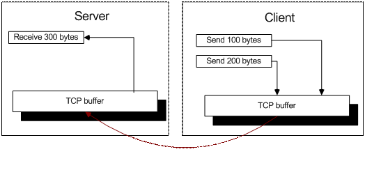
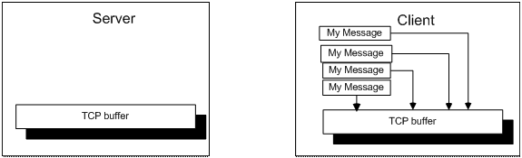
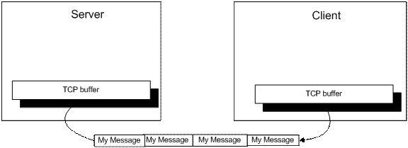
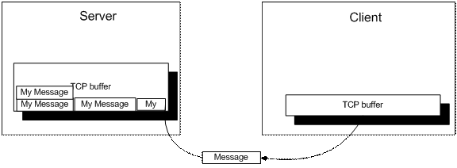
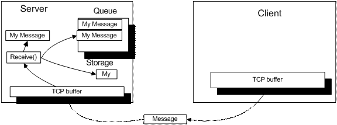
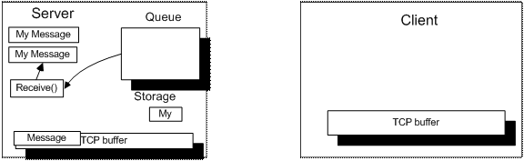
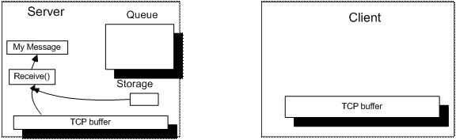

## TCP/IP socket 消息边界问题解决方案

### 引言

网络编程新手最大的痛点之一就是直接通过 TCP 连接处理面向（基于）消息的通讯。基于 TCP 实现网络通讯最重要的一点是切记 TCP 并不关心消息边界。本文演示如何解决这个问题。

### 未受保护的 TCP 消息边界示例

网络编程新手在初步了解 TCP 编程的强大之后，迫不及待去创建一个 C/S 应用，希望利用 TCP socket 实现两台设备间通过网络传递消息。然而，意识不到基于流的协议如 TCP 协议，固有的消息边界问题。开发者只是在客户端编写一组 `Send()` 方法，并在服务端编写一组相对应的 `Receive()` 方法。

这种方式最严重的缺陷是你无法保证每个 `Send()` 方法发送的数据都可以被每个 `Receive()` 方法正确完整的接收到。

所有 `Receive()` 方法读取的数据并不是直接从网络读取。而是从系统（译注：操作系统）内部的 TCP 缓冲区中读取。系统从网络上获取 TCP 数据包，并按照顺序加入到 TCP 缓冲区中。当 `Receive` 方法调用时，它将会读取所有 TCP 缓冲中的有效数据，而非仅仅第一个完整的数据包。

 > 译注：
 >
 > 实际使用时，“读取所有 TCP 缓冲中的有效数据”一般是编程语言底层的实现，实际的 `Receive()`  API 使用时，方法可以接受诸如消息长度、超时设置等。

### 解决 TCP 消息问题

区分 TCP 消息的一般方法：

 - 总是发送固定长度的消息。
 - 消息中带入消息长度。
 - 引入分隔标记来区分消息。

最简单但是最低效的方式是使用固定长度的消息协议。通过保证所有的消息都有固定的长度，TCP 接收程序可以毫无疑问的知道完整的消息是否从远端设备传输完毕。

另一种改进方式是引入分隔标记。通过一个（译注：或多个）终止符声明每个消息的结尾。应用时，从 socket 获取消息的时候，逐个检查数据中的字符是否匹配分隔标记字符，从而确定一条完整的消息。

这篇文章讨论的是引入消息长度的解决方案。

有许多在消息中包含长度的方法。最简单的方式是创建一个字符型的长度，并加在消息的前面。比如，“My message”有 10 个字节长，则将字符串值 10 放在消息前面。实际传输的消息将变成：

	000010My Message

消息前的“000010”表示消息中实际有多少字节的内容。接收程序先读取前 6 个字节，解析后，可以立即知道其后再读取多少字节才能形成一个完整的消息。

客户端程序生成一组消息，并将消息放到 TCP 缓冲区中，然后发给服务端。

TCP 驱动依次发送所有消息给目标设备。

服务端驱动接收消息并放入系统缓冲区中。系统缓冲区可能没有足够大的缓冲区容纳所有消息，所以它仅包含可以容纳到缓冲区中的消息，或者消息的一部分。

程序从系统缓冲区读取底层字节数据，然后解析。每个消息带一个消息头，消息头中有长度字段，指示消息的起始和结束边界。所有的完整消息首先放到队列中。如果解析器发现系统缓冲区有不完整的消息，则放到一个特殊存储中暂存。然后它最先返回给程序。

每次调用 `Receive()` 方法，从队列中检查是否有完整消息，有则返回。

如果队列为空，程序从系统缓冲区中继续读取消息，同样的接收尽可能多的消息字节。并且将暂存区中的内容加到新接收的消息的前面，然后解析。

示例应用基于取自网络的 `Socket` 类。遗憾的是，我无法提供 `Socket` 类的源码信息。

### 权限

本文没有明确的许可证。但是文章字体（？）或下载文件中可能包含许可证信息。如有疑问，通过文章下的讨论板联系作者。

**原文：**[Solution for TCP/IP client socket message boundary problem](https://www.codeproject.com/Articles/11922/Solution-for-TCP-IP-client-socket-message-boundary)

### 译注

 - 四年前偶然看到的一篇文章，当时我已处理过一个消息边界问题，效果还不错。如果我先看到了这篇文章，那我的思路将会清晰很多，所以一直想翻译记录下来，结果拖到了今天。:(
 - 原文附带示例代码，需要登陆后下载。