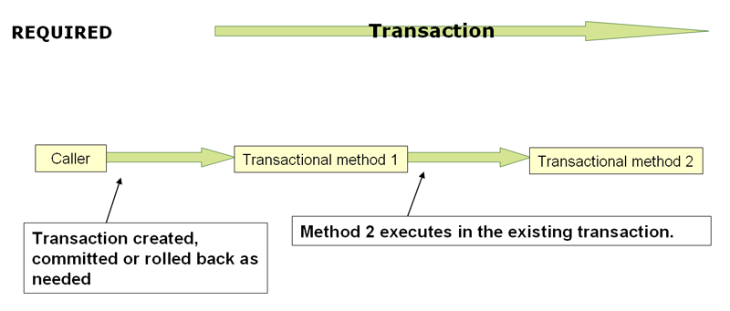

##### 
12. 事务管理

##### 
Part IV. 数据存取

----------------------------------------

### 12. 事务管理

### 12.1 Spring 事务管理简介

强大、全面的事务支持是使用 Spring 框架的一个很重要因素。Spring 为事务管理提供了一致的抽象，具有以下优势：

 - 为不同规范的事务 API 比如 Java Tranaction API(JTA), JDBC, Hibernate, Java Persistence API(JPA) 及 Java Data Objects(JDO) 提供一致的编程模型。
 - 支持[声明式事务管理](#transaction-declarative)。
 - 相比于复杂的事务 API 如 JTA 有较为简单的 API 支持[编程式](#transaction-programmatic)事务管理。
 - 与 Spring 数据存取抽象完美整合。

以下小节讲述了 Spring 框架的事务价值和技术。（本章同样包括最佳编程实践、与应用服务器整合、常见问题解决方案方面的讨论。）

 - [Spring 框架事务支持模型的优势](#transaction-motivation)，描述了，*为什么*你应该使用 Spring 事务抽象而非 EJB 容器-管理级事务(EJB Container-Managed Transactions，CMT) 或是通过其他专有事务 API 驱动本地事务比如 Hibernate 的事务 API。
 - [理解 Spring 事务抽象](#transaction-strategies)，概述核心类及描述如何从不同数据源配置和获取 `DataSource` 实例。
 - [利用事务同步资源](#tx-resource-synchronization)，描述应用代码如何保证正确的资源创建、重用及清理。
 - [声明式事务管理](#transaction-declarative)，描述对声明式事务管理的支持。
 - [编程式事务管理](#transaction-programmatic)，覆盖对编程式（即，显式的代码）事务支持。

### 12.2 Spring 事务支持模型的优势

传统而言，Java EE 开发人员有两种方式进行事务管理：*全局(global)*或*本地(local)* 事务，这两种方式都存在很大的局限性。全局和本地的事务管理概念将在以下两小节回顾，然后是讨论 Spring 事务管理支持是如何解决全局和本地事务模型的局限性。

#### 12.2.1 全局事务

全局事务使你能跟多种事务源打交道，典型如关系型数据库和消息队列。应用服务器通过 JTA 管理全局事务，而 JTA 是相当笨重的 API(部分原因是它的异常(exception)模型)。而且，一个 JTA `UserTransaction` 通常需要从 JNDI 获取，这意味着你*必须同时使用* JNDI。显然，全局事务的使用将会限制任何潜在的代码重用，因为 JTA 通常只在应用服务器中能得到（译注：指 API 由容器提供，如 WebLogic，WebSphere）。

早先，使用全局事务的首选方式是通过 EJB *CMT(Container Managed Transaction)* ：CMT 是一种**声明式事务管理**(区分自**编程式事务管理**)。EJB CMT 移除了与事务相关联的 JNDI 查找，尽管 EJB 本身的使用仍需要从 JNDI 中查找。它移除了大部分通过编写 Java 代码控制事务的必要性，但并非全部。CMT 的显著缺点是它绑定（耦合）到 JTA 及应用服务器环境。而且，只有按照实现 EJB 规范实现业务逻辑时 CMT 才可用，至少也得基于 EJB 事务实现的门面（译注：Make Better?）。EJB 的负面效果太过严重，因此它不是一个很有吸引力的方案，特别是在面对声明式事务管理这种更优的替代方案时。

#### 12.2.2 本地事务

本地事务是跟资源相关的，比如与 JDBC 连接相关联的事务。本地事务使用可能很简便，但也有显著的缺陷：它们无法跨多种事务资源。比如，通过 JDBC 连接管理事务的代码无法在一个全局 JTA 事务中运行。因为事务管理中没有涉及到应用服务器，因而它无法帮你保证正确的跨多种资源。(这没有任何价值，因为大部分的应用程序只使用单一的事务源。)另外一个不利面是本地事务是侵入到编程模型中的。

#### 12.2.3 Spring 一致性编程模型

Spring 解决了全局和本地事务的缺陷。它使开发人员*在任何环境下*(译注：环境指 Global, Local, JTA, CMT)使用*一致的*编程模型*。你一次编写你的代码，就能够利用不同环境事务管理策略的优势。Spring 提供了声明式和编程式事务管理。大多数用户选择声明式事务管理，它也是大部分场景下较为推荐的方式。

通过编程式事务管理，开发人员直接利用运行在底层事务之上的 Spring 事务抽象。通过首选的声明式模型，开发人员只需编写很少或是不需要编写代码即可关联到事务管理，因而可以不依赖于 Spring 事务 API 或任何其他事务 API。

 > ###### 你需要应用服务器支持事务管理吗？
 > **
暂未翻译
**

### 12.3 理解 Spring 事务抽象

理解 Spring 事务抽象的关键是*事务策略*概念。事务策略定义在 `org.springframework.transaction.PlatformTransactionManager` 接口：

	public interface PlatformTransactionManager {

		TransactionStatus getTransaction(TransactionDefinition definition) throws TransactionException;

		void commit(TransactionStatus status) throws TransactionException;

		void rollback(TransactionStatus status) throws TransactionException;

	}

`PlatformTransactionManager` 是一个服务提供接口(SPI)，尽管你可以通过[编程方式](#transaction-programmatic-ptm)在应用代码中使用它。因为 `PlatformTransactionManager` 是一个*接口*，所以它可以很容易的被模拟或是存根(译注：WHAT?)，如果需要的话。它没有被绑定到任何查找策略如 JNDI。`PlatformTransactionManager` 的实现被定义成 Spring IoC 容器中的一个普通对象(或组件)。这个优点也使得 Spring 框架的事务抽象非常有用，即使你需要 JTA。事务代码更容易被测试相比于直接使用 JTA。

按照 Spring 的哲学，被 `PlatformTransactionManager` 接口的任何方法抛出的`TransactionException` 是*未检的*(即，继承自 `java.lang.RuntimeException` 类)。底层的事务失败几乎是致命的。只有极少数情况，应用代码可以真正从一次事务失败中恢复。当然，开发人员也可以选择捕获并处理 `TransactionException`。关键在于并不*强制*开发人员这么做。

`getTransaction(..)` 方法返回一个 `TransactionStatus` 对象，依赖于一个 `TransactionDefinition` 参数。返回值 `TransactionStatus` 可以表示一个全新事务，也可以表示一个已存在于当前调用栈中的匹配的事务。后一种场景的含义是，在 JavaEE 事务上下文中，`TransactionStatus` 是关联到一个执行*线程*的。（译注：NOT UNDERSTAND!）

`TransactionDefinition` 接口定义了：

 - *Isolaion*： 隔离性定义当前事务同其他事务的隔离级别。如，本事务可以看到其他事务还未提交的更改吗？
- *Propagation*： 一般，一个事务域中的代码只会在事务中执行。但是，你可以选择一个事务方法在一个已存在事务上下文中执行。如，代码可以继续在一个已存在事务中执行(常见情形)；或者挂起已存在事务后创建一个新的。*Spring 提供了类似于 EJB CMT 的所有的事务传播选项*。 参阅 [12.5.7, “事务传播”](#tx-propagation)，查看 Spring 事务传播的语义。
- *Timeout*： 超时之前事务执行的时间，超时之后将会由事务底层实现自动回滚。
- *Read-only status*： 只读事务中代码只进行数据读取而无修改。只读事务会是一些场景中非常有用的一种优化，比如当你在使用 Hibernate.

这些设置选项都映射到标准概念。如果需要的话，参阅(refer to)其他详细描述事务隔离级别及其他核心事物概念的资料。理解这些概念是使用 Spring 及任何其他事务管理方案所不可或缺的。

`TransactionStatus` 接口提供了事务代码控制事务执行和查询事务状态的简便方法。这些概念应该很熟悉了，因为它们都是通用、标准的事务 API:

	public interface TransactionStatus extends SavepointManager {
	
		boolean isNewTransaction();
	
		boolean hasSavepoint();
	
		void setRollbackOnly();
	
		boolean isRollbackOnly();
	
		void flush();
	
		boolean isCompleted();
	
	}

无论你使用 Spring 声明式还是编程式事务管理，都必须正确定义 `PlatformTransactionManager`。一般，你应该通过依赖注入来定义这个实现。

`PlatformTransactionManager` 的不同实现一般都需要知道它们所执行的环境：JDBC、JTA、Hibernate 等等。下面的例子展示了你应该如何定义一个本地 `PlatformTransactionManager` 实现。(这个例子基于纯 JDBC。)

你首先定义一个 JDBC `DataSource`

	<bean id="dataSource" class="org.apache.commons.dbcp.BasicDataSource" destroy-method="close">
		<property name="driverClassName" value="${jdbc.driverClassName}" />
		<property name="url" value="${jdbc.url}" />
		<property name="username" value="${jdbc.username}" />
		<property name="password" value="${jdbc.password}" />
	</bean>

相关联的 `PlatformTransactionManager` bean 需要一个 `DataSource` 的引用。如下所示：

	<bean id="txManager" class="org.springframework.jdbc.datasource.DataSourceTransactionManager">
		<property name="dataSource" ref="dataSource" />
	</bean>

如果你使用 Java EE 容器的 JTA，那么你需要一个通过 JNDI 获取的 `DataSource`，配合 Spring 的 `JtaTransactionManager` 。如下所示是 JTA 和 JNDI 查找的配置：

	<?xml version="1.0" encoding="UTF-8"?>
	<beans xmlns="http://www.springframework.org/schema/beans"
		xmlns:xsi="http://www.w3.org/2001/XMLSchema-instance"
		xmlns:jee="http://www.springframework.org/schema/jee"
		xsi:schemaLocation="
		http://www.springframework.org/schema/beans 
		http://www.springframework.org/schema/beans/spring-beans-3.0.xsd
		http://www.springframework.org/schema/jee 
		http://www.springframework.org/schema/jee/spring-jee-3.0.xsd">

		<jee:jndi-lookup id="dataSource" jndi-name="jdbc/jpetstore"/> 

		<bean id="txManager" class="org.springframework.transaction.jta.JtaTransactionManager" />
  
		<!-- other <bean/> definitions here -->

	</beans>

`JtaTransactionManager` 并不需要知道 `DataSource` 或是任何其他特定的数据源的细节，因为它使用的是容器全局事务管理结构。

 > **Note**
 > 
 > 上面 `DataSource` 的定义使用 `jee` 命名空间的 `<jndi-lookup/>` 标记。更多关于基于 schema 进行配置(schema-based configuration)，参见[第 34 章，XML Schema-based configuration](xsd-config.html)，更多关于 `<jee/>` 标记的信息参见[第 34.2.3 小节，“jee schema”](xsd-config.html#xsd-config-body-schemas-jee)小节。

你同样可以方便的使用 Hibernate 的本地事务，如下面例子所示。你需要定义一个 Hibernate `LocalSessionFactoryBean`，然后你的应用代码从中取到 Hibernate `Session` 实例。

`DataSource` 组件的定义与之前的 JDBC 例子中相似。下面例子中没有列出 `DataSource` 组件的定义。

 > **Note**
 > 
 > 如果 `DataSouce` 是通过 JNDI 查找到并被 JavaEE 容器管理，用于非 JTA 事务管理器。那么，它是非事务（non-transactional）的，因为 Spring 框架将会去进行事务管理，而非 JavaEE 容器。

此时 `txManager` 组件定义成 `HibernateTransactionManager` 类型。跟 `DataSourceTransactionManager` 一样，需配置一个 `DataSource` 的引用，`HibernateTransactionManager` 同时还需要一个 `SessionFactory` 引用。

	<bean id="sessionFactory" class="org.springframework.orm.hibernate3.LocalSessionFactoryBean">
		<property name="dataSource" ref="dataSource" />
		<property name="mappingResources">
			<list>
				<value>org/springframework/samples/petclinic/hibernate/petclinic.hbm.xml</value>
			</list>
		</property>
		<property name="hibernateProperties">
			<value>
				hibernate.dialect=${hibernate.dialect}
			</value>
		</property>
	</bean>

	<bean id="txManager" class="org.springframework.orm.hibernate3.HibernateTransactionManager">
		<property name="sessionFactory" ref="sessionFactory" />
	</bean>

如果你打算使用 Hibernate 或是 Java EE 容器管理的 JTA 事务，那么你可以同样简单应用 `JtaTransactionManager`，像之前 JDBC 的例子所做的一样。

	<bean id="txManager" class="org.springframework.transaction.jta.JtaTransactionManager"/>

 > **Note**
 > 
 > 如果你使用 JTA，那么对事务管理器的定义应该是一样的，不管你使用各种数据存取技术，比如 JDBC，Hibernate JPA 或是任何其他的支持技术。这是因为 JTA 是全局事务，能够支持任何事务源。

所有这些场景，应用代码都无需改变。你只需要通过更改配置就能改变事务管理方式，哪怕是改变本地事务到全局事务，或相反。

### 12.4 通过事务同步资源

现在你应该清楚如何创建不同的事务管理器了，以及它们是如何绑定到需要被事务同步保护的资源(比如，`DataSourceTransactionManager` 绑定 JDBC `DataSource`，`HibernateTransactionManager` 绑定 Hibernate `SessionFactory` 等等)。本节描述应用代码如何直接或间接使用持久化 API 比如 JDBC，Hibernate 或是 JDO，确保这些资源的正确创建、重用及清理。本节同样讨论了事务同步是如何被相关的 `PlatformTransactionManager` 触发的(可选)。

#### 12.4.1 高层次的同步方式

首选方式就是使用 Spring 基于持久化 API 的高层次模板或是使用本地 ORM 框架的事务工厂对象 API 或是管理本地资源的代理工厂。这些事务感知方案在内部处理资源的创建、重用、清理，资源的事务同步和异常处理。从而用户的数据存取代码并不再需要处理这些工作，就可以将工作重点聚焦在样板化的持久逻辑代码之外。一般情况下，你使用本地 ORM API 或是通过使用 `JdbcTemplate` 以*模板*方式访问 JDBC。这些解决方案在本参考文档的随后章节讲述。

#### 12.4.2 低层次的同步方式

许多类如 `DataSourceUtils` (方便 JDBC 使用)，`EntityManagerFactoryUtils` (方便 JPA 使用)，`SessionFactoryUtils` (方便 Hibernate 使用)，`PersistenceManagerFactoryUtils` (方便 JDO 使用)，等都存在于很低的层次。当你想让应用代码直接使用本地持久化 API 进行处理时，通过使用这些类可以保证你正确得到 Spring 框架所管理的实例。事务是(可选)同步的，处理过程中发生的异常将被映射到一致的 API 上。

比如，使用 JDBC 的场景，与传统使用 JDBC 调用 `DataSource` 的 `getConnection()` 方法不同，你应该使用 Spring 的 `org.springframework.jdbc.datasource.DataSourceUtils`，如下所示：

	Connection conn = DataSourceUtils.getConnection(dataSource);

如果一个现有的事务已经有一个连接对象同步(关联)到它，那个连接对象将被返回、重用。否则这个方法调用触发器创建一个新的连接对象，然后同步到(可选地)任何现有事务，并在同一事务中后续可再利用。如前所述，任何 `SQLException` 都被包装成 Spring 的 `CannotGetJdbcConnectionException` ，它是 Spring 不受检异常(unchecked DataAccessExceptions)中的一个。这种方式会提供更多的信息相比于直接从 `SQLException` 中所得到的，并且保证了跨数据库甚至是夸不同持久技术的可移植性。

当你不使用 Spring 的事务管理(事务同步是可选的)时，这种方式同样有效。所以无论你是否使用 Spring 事务管理机制，你都可以使用它。

当然，一旦你使用了 Spring 的 JDBC 支持，JPA 支持或是 Hibernate 支持，你一般也倾向于不使用 `DataSourceUtils` 或是其他的辅助类，因为你更愿意使用 Spring 的直接、抽象 API。比如，如果你使用 Spring `JdbcTemplate` 或是 `jdbc.object` 包来简化 JDBC 应用，正确获取连接的行为发生在幕后，你不需要编写任何特殊、额外的代码。

#### 12.4.3 TransactionAwareDataSourceProxy

最基础层次有一个 `TransactionAwareDataSourceProxy` 类。它是一个为特定 `DataSource` 对象提供的代理类，用于包装 `DataSource` 对象，为其添加 Spring 事务管理支持。从这个方面讲，它十分类似于 JavaEE 容器提供的事务性 JDNI `DataSource`。

几乎没必要来描述对这个类的使用，除非代码的调用必须通过传递一个标准 JDBC `DataSource` 接口的实现。这种场景下，`TransactionAwareDataSourceProxy` 类才能用，但是耦合了 Spring 的事务管理。因而，建议你最好是使用更高层次的抽象来编写代码。

### 12.5 声明式事务管理

 > **Note**
 >
 > 大部分 Spring 框架的用户选择使用声明式事务管理。因为，这种方式跟应用代码耦合很小，并跟轻量级容器的*非侵入性*目标一致。

Spring 的声明式事务管理基于 Spring 面向切面编程(AOP)，尽管，Spring 自带的事务切面代码会以样板化的方式使用，但并不需要理解 AOP 的概念就可以有效使用这些代码。

Spring 的声明式事务管理类似于 EJB CMT，你可以在方法级别上单独定义事务行为(或不定义)。如果需要，可以在一个事务上下文中调用 `setRollbackOnly()`。两中事务管理的区别是：

 - 与 EJB CMT 绑定到 JTA 不同，Spring 声明式事务管理可以在任何环境中使用。只需要通过调整配置文件，它就可以利用 JTA 事务或是本地 JDBC，JPA，Hibernate，JDO。
 - 你可以将 Spring 声明式事务管理应用到任何类，而非仅仅特殊的类，如 EJB 那样。
 - Spring 提供了声明式的[*回滚规则*](#transaction-declarative-rolling-back) ，而 EJB 则没有这种特性。Spring 同时提供了编程式和声明式回滚规则。
 - Spring 允许你通过使用 AOP 定制事务行为。比如，你可以在事务回滚后插入定制的逻辑代码。你也可以随意添加 advice，就跟事务 advice 一样。而使用 EJB CMT，你无法参与容器的事务管理，只能调用 `setRollbackOnly()`。
 - Spring 不像高端应用服务器那样支持远程调用的事务传播。如果你需要这个特性，那么我们推荐你使用 EJB。但是，请在使用这个特性之前考虑清楚，因为一般不会想让一个事务传播跨越远程调用。

 > **TransactionProxyFactoryBean 在哪？** 
 >
 > Spring 2.0 及以上版本声明式事务管理配置与之前版本不同。主要区别是不在需要配置 `TransactionProxyFactoryBean`。
 > Spring 2.0 之前的配置方式仍是 100% 正确的。以后，考虑使用 `<tx:tags/>` 作为更简洁定义 `TransactionProxyFactoryBean` 的方式。

回滚的概念很重要：你可以声明哪些异常应该自动触发回滚。你可以在配置文件中译声明方式指定，而非 Java 代码中。所以，尽管你仍可以调用 `TransactionStatus` 对象的 `setRollbackOnly()` 方法来使当前事务回滚，但大多数情况下你可以声明一个规则，`MyApplicationException` 异常必须触发回滚。这个选项的显著优势是业务逻辑对象不必依赖事务基本架构。比如，业务逻辑对象不必导入 Spring 事务 API 或其他 Spring  API（译注：就可以通过编译，但运行仍需要依赖）。

尽管 EJB 容器在*系统异常（system exception）*（通常是运行时异常（runtime exception））的默认行为是自动回滚，但 EJB CMT 并不自动回滚发生*应用程序异常*（更确切的说，受检异常，除了（译注：原词 other than ）`java.rmi.RemoteException`）的事务。Spring 声明式事务管理的默认行为遵循 EJB 约定（不受检异常才能自动触发回滚），通常这种方式很有用。

#### 12.5.1 理解 Spring 声明式事务管理的实现

简单告诉你用 `@Transactional` 注解你的类，添加 `@EnableTransactionManagement` 到配置中，然后就希望你理解它是如何工作的，是毫无意义的。本节从事务相关的问题出发，解释 Spring 声明式事务管理的内部工作机制。

关于 Spring 声明式事务管理最重要的概念是它是通过[AOP 代理](aop.html#aop-understanding-aop-proxies)实现的。事务 advice 是由 *metadata*（当前有 XML 或 注解两种方式进行声明）驱动。AOP 和事务元数据的组合产生 AOP 代理，搭配使用 `TransactionInterceptor` 与恰当的 `PlatformTransactionManager` 实现，驱动*方法调用前后*的事务行为。

 > Spring AOP 在[第 9 章](aop.html)涉及。

概念上，调用一个事务代理的方法，如下：

**图 12.1**

#### 12.5.2 声明式事务管理示例

考虑下面的接口和它的实现。这个例子使用 `Foo` 和 `Bar` 类，这样你可以将重点关注在事务的使用而非特殊的域模型（domain model）。为了达到这个例子的目的，`DefaultFooService` 类的每个实现方法中都抛出 `UnsupportedOperationException` 异常是很必要的。你可以看到由于 `UnsupportedOperationException` 实例的创建，事务会进行创建和回滚。

	// the service interface that we want to make transactional
	// 希望进行事务管理的服务接口
	
	package x.y.service;
	
	public interface FooService {
	
		Foo getFoo(String fooName);
	
		Foo getFoo(String fooName, String barName);
	
		void insertFoo(Foo foo);
	
		void updateFoo(Foo foo);
	
	}

上述接口的一个实现：

	//an implementation of the above interface
	
	package x.y.service;
	
	public class DefaultFooService implements FooService {
	
		public Foo getFoo(String fooName) {
			throw new UnsupportedOperationException();
		}
	
		public Foo getFoo(String fooName, String barName) {
			throw new UnsupportedOperationException();
		}
	
		public void insertFoo(Foo foo) {
			throw new UnsupportedOperationException();
		}
	
		public void updateFoo(Foo foo) {
			throw new UnsupportedOperationException();
		}
	
	}

假定 `FooService` 接口的前两个方法，`getFoo(String)` 和 `getFoo(String, String)`，必须在只读语义的事务中执行，另外的两个方法 `insertFoo(Foo)` 和 `updateFoo(Foo)` 必须在读写事务中执行。下面的配置会在接下来段落中进行解释。

	<!-- from the file 'context.xml' -->
	<?xml version="1.0" encoding="UTF-8"?>
	<beans xmlns="http://www.springframework.org/schema/beans"
		xmlns:xsi="http://www.w3.org/2001/XMLSchema-instance" xmlns:aop="http://www.springframework.org/schema/aop"
		xmlns:tx="http://www.springframework.org/schema/tx"
		xsi:schemaLocation="
	        http://www.springframework.org/schema/beans
	        http://www.springframework.org/schema/beans/spring-beans.xsd
	        http://www.springframework.org/schema/tx
	        http://www.springframework.org/schema/tx/spring-tx.xsd
	        http://www.springframework.org/schema/aop
	        http://www.springframework.org/schema/aop/spring-aop.xsd">
	
		<!-- this is the service object that we want to make transactional -->
		<bean id="fooService" class="x.y.service.DefaultFooService" />
	
		<!-- the transactional advice (what 'happens'; see the <aop:advisor/> bean below) -->
		<tx:advice id="txAdvice" transaction-manager="txManager">
			<!-- the transactional semantics... -->
			<tx:attributes>
				<!-- all methods starting with 'get' are read-only -->
				<tx:method name="get*" read-only="true" />
				<!-- other methods use the default transaction settings (see below) -->
				<tx:method name="*" />
			</tx:attributes>
		</tx:advice>
	
		<!-- ensure that the above transactional advice runs for any execution of 
			an operation defined by the FooService interface -->
		<aop:config>
			<aop:pointcut id="fooServiceOperation"
				expression="execution(* x.y.service.FooService.*(..))" />
			<aop:advisor advice-ref="txAdvice" pointcut-ref="fooServiceOperation" />
		</aop:config>
	
		<!-- don't forget the DataSource -->
		<bean id="dataSource" class="org.apache.commons.dbcp.BasicDataSource"
			destroy-method="close">
			<property name="driverClassName" value="oracle.jdbc.driver.OracleDriver" />
			<property name="url" value="jdbc:oracle:thin:@rj-t42:1521:elvis" />
			<property name="username" value="scott" />
			<property name="password" value="tiger" />
		</bean>
	
		<!-- similarly, don't forget the PlatformTransactionManager -->
		<bean id="txManager"
			class="org.springframework.jdbc.datasource.DataSourceTransactionManager">
			<property name="dataSource" ref="dataSource" />
		</bean>
	
		<!-- other <bean/> definitions here -->
	
	</beans>

查看上面的配置，你想要为一个 service 对象实例 `fooService` 添加事务支持。事务语义的添加通过定义 `<tx:advice/>` 来封装。上面配置中 `<tx:advice/>` 的定义表示 “*所有以 `get` 作为前缀的方法将在只读事务中执行，其他所有方法将在默认的事务语义中执行*”。`<tx:advice/>` 的 `transaction-manager` 属性设置为一个 `PlatformTransactionManager` 组件的引用（id 或 name），这里是 `txManager` 组件，用以*驱动*事务。

 > **注意**
 > 
 > 如果你想注入的 `PlatformTransactionManager` 组件的引用名为 `transactionManager`，那么可以省略事务 advice（`<tx:advice/>`） 的 `transaction-manager` 属性。而如果是  `transactionManager` 以外的其他引用名（译注：比如这里是 `txManager`），你都必须要显式设置 `transaction-manager` 属性，像前面例子中所做的那样。
 
定义 `<aop:config/>` 使 `<tx:advice/>` 定义的事务 advice 在程序正确的切点（points）上执行。首先你定义匹配 `FooService` 接口中方法执行的切面（pointcut）（`fooServiceOperation`），然后通过 advisor 关联切面和 `<tx:advice/>`。这意味着，`fooServiceOperation` 的方法执行时，由 `<tx:advice/>` 定义的 advice 也将会执行。

`<aop:pointcut/>` 元素定义的表达式为 AspectJ 切点表达式；参见[第 9 章 Spring 面向切面编程](aop.html)，查看更多 Spring 切面表达式的细节。

一项常规需求是，是将事务支持加入整个 service 层。最好、最简单的方式是改写切面表达式来匹配所有 service 层的操作。比如：

	<aop:config>
		<aop:pointcut id="fooServiceMethods" expression="execution(* x.y.service.*.*(..))" />
		<aop:advisor advice-ref="txAdvice" pointcut-ref="fooServiceMethods" />
	</aop:config>

 > 这个例子中，假设你所有的 service 接口都定义在 `x.y.service` 包下，参见[第 9 章 Spring 面向切面编程](aop.html)，查看更多 Spring 细节。

现在，我们已经分析过了上面的配置，但你可能会问自己，“额，写是写好了，但是这些配置到底干了什么啊？”。

上面的配置用于在 `fooService` 组件前后创建事务代理。事务代理按照事务 advice 中设置配置，当调用代理对象的方法时，就将会进行开始、挂起，标记为只读事务等行为，这些行为取决于关联到方法上的事务配置。下面的程序利用上面的配置运行：

	public final class Boot {
	
		public static void main(final String[] args) throws Exception {
			ApplicationContext ctx = new ClassPathXmlApplicationContext("context.xml", Boot.class);
			FooService fooService = (FooService) ctx.getBean("fooService");
			fooService.insertFoo(new Foo());
		}
	}

运行上面的程序将会产生类似于下面的输出。（为了清晰，只截取了部分 Log4J 输出及 DefaultFooService 的 insertFoo(..) 方法抛出的 UnsupportedOperationException 异常堆栈）

	<!-- the Spring container is starting up... -->
	[AspectJInvocationContextExposingAdvisorAutoProxyCreator] - Creating implicit proxy for bean fooService with 0 common interceptors and 1 specific interceptors
	
	<!-- the DefaultFooService is actually proxied -->
	[JdkDynamicAopProxy] - Creating JDK dynamic proxy for [x.y.service.DefaultFooService]
	
	<!-- ... the insertFoo(..) method is now being invoked on the proxy -->
	[TransactionInterceptor] - Getting transaction for x.y.service.FooService.insertFoo
	
	<!-- the transactional advice kicks in here... -->
	[DataSourceTransactionManager] - Creating new transaction with name [x.y.service.FooService.insertFoo]
	[DataSourceTransactionManager] - Acquired Connection [org.apache.commons.dbcp.PoolableConnection@a53de4] for JDBC transaction
	
	<!-- the insertFoo(..) method from DefaultFooService throws an exception... -->
	[RuleBasedTransactionAttribute] - Applying rules to determine whether transaction should rollback on java.lang.UnsupportedOperationException
	[TransactionInterceptor] - Invoking rollback for transaction on x.y.service.FooService.insertFoo due to throwable [java.lang.UnsupportedOperationException]
	
	<!-- and the transaction is rolled back (by default, RuntimeException instances cause rollback) -->
	[DataSourceTransactionManager] - Rolling back JDBC transaction on Connection [org.apache.commons.dbcp.PoolableConnection@a53de4]
	[DataSourceTransactionManager] - Releasing JDBC Connection after transaction
	[DataSourceUtils] - Returning JDBC Connection to DataSource
	
	Exception in thread "main" java.lang.UnsupportedOperationException at x.y.service.DefaultFooService.insertFoo(DefaultFooService.java:14)
	<!-- AOP infrastructure stack trace elements removed for clarity -->
	at $Proxy0.insertFoo(Unknown Source)
	at Boot.main(Boot.java:11)

#### 12.5.3 回滚声明式事务

上一小节介绍了如何在你的应用程序中，以声明的形式为类指定事务配置，特别是 service 层的类。这一小节描述你如何以声明的形式控制事务回滚。

指示 Spring 事务框架工作的推荐方式是通过在当前事务上下文正在执行的代码中抛出异常（`Exception`）来回滚事务。由于异常会在调用栈中向上冒泡，Spring 事务框架将会捕获任何未处理（译注：unhandled，没有经过 try {...} catch(...) {...}）的异常（`Exception`），然后决定是否标记事务进行回滚。

默认配置下，Spring 事务框架*仅仅*在代码运行时（runtime）抛出了不受检异常，也就是说，抛出的异常是 `RuntimeException` 的子类实例时，才标记事务回滚。（`Error`s，默认，同样会导致回滚）。而受检异常则默认*不会*导致回滚。

你可以配置指定类型的异常（`Exception`）才会导致回滚，包括受检异常。下面的 XML 片段演示如何为受检的，特定应用的异常（`Exception`）配置回滚。

	<tx:advice id="txAdvice" transaction-manager="txManager">
		<tx:attributes>
			<tx:method name="get*" read-only="true" rollback-for="NoProductInStockException" />
			<tx:method name="*" />
		</tx:attributes>
	</tx:advice>

如果你*不想*事务在异常抛出的时候回滚，可以声明*不触发回滚的规则*。下面的例子告诉 Spring 事务框架提交相关的事务即使发生了未处理异常 `InstrumentNotFoundException`。

	<tx:advice id="txAdvice">
		<tx:attributes>
			<tx:method name="updateStock" no-rollback-for="InstrumentNotFoundException" />
			<tx:method name="*" />
		</tx:attributes>
	</tx:advice>

当 Spring 事务框架捕获到异常后，查询配置的回滚规则以决定是否触发回滚，*权重最高（strongest）*匹配规则将会获胜（译注：决定是否回滚）。所以在下面的配置示例中，除了 `InstrumentNotFoundException` 之外的所有异常将会回滚方法相关的事务。

	<tx:advice id="txAdvice">
		<tx:attributes>
			<tx:method name="*" rollback-for="Throwable" no-rollback-for="InstrumentNotFoundException" />
		</tx:attributes>
	</tx:advice>

你也可以通过*编程方式*实现一个必要的回滚。尽管很简单，但这种处理方式是侵入性的，并使你的代码跟 Spring 事务框架紧密耦合：

	public void resolvePosition() {
		try {
			// some business logic...
		} catch (NoProductInStockException ex) {
			// trigger rollback programmatically
			TransactionAspectSupport.currentTransactionStatus().setRollbackOnly();
		}
	}

在所有可能的情况下，强烈建议你使用声明式的事务管理方式。编程式的回滚只用在你必须使用的时候，但它的使用将破坏程序基于简洁 POJO 架构的实现。

#### 12.5.4 为不同组件配置不同的事务语义

考虑一个场景，你有一组 service 层对象，你想为它们应用完全不同的事务规则。你可以通过定义有不同 `pointcut` 和 `advice-ref` 属性的一系列`<aop:advisor/>` 元素来实现。

为了便于比较，首先假设你的所有 server 层对象都在 `x.y.service` 包下。为了使所有 `x.y.service` 包（或子包）下类名以 `Service` 结尾的类实例组件都有默认的事务配置，你需要这么写： 

	<?xml version="1.0" encoding="UTF-8"?>
	<beans xmlns="http://www.springframework.org/schema/beans"
		xmlns:xsi="http://www.w3.org/2001/XMLSchema-instance"
		xmlns:aop="http://www.springframework.org/schema/aop"
		xmlns:tx="http://www.springframework.org/schema/tx"
		xsi:schemaLocation="
	        http://www.springframework.org/schema/beans
	        http://www.springframework.org/schema/beans/spring-beans.xsd
	        http://www.springframework.org/schema/tx
	        http://www.springframework.org/schema/tx/spring-tx.xsd
	        http://www.springframework.org/schema/aop
	        http://www.springframework.org/schema/aop/spring-aop.xsd">
	
		<aop:config>
	
			<aop:pointcut id="serviceOperation" expression="execution(* x.y.service..*Service.*(..))" />
	
			<aop:advisor pointcut-ref="serviceOperation" advice-ref="txAdvice" />
	
		</aop:config>
	
		<!-- these two beans will be transactional... -->
		<bean id="fooService" class="x.y.service.DefaultFooService" />
		<bean id="barService" class="x.y.service.extras.SimpleBarService" />
	
		<!-- ... and these two beans won't -->
		<bean id="anotherService" class="org.xyz.SomeService" /> <!-- (not in the right package) -->
		<bean id="barManager" class="x.y.service.SimpleBarManager" /> <!-- (doesn't end in 'Service') -->
	
		<tx:advice id="txAdvice">
			<tx:attributes>
				<tx:method name="get*" read-only="true" />
				<tx:method name="*" />
			</tx:attributes>
		</tx:advice>
	
		<!-- other transaction infrastructure beans such as a PlatformTransactionManager omitted... -->
	
	</beans>

下面这个例子展示了如何为两个不同的组件配置截然不同的事务规则。

	<?xml version="1.0" encoding="UTF-8"?>
	<beans xmlns="http://www.springframework.org/schema/beans"
		xmlns:xsi="http://www.w3.org/2001/XMLSchema-instance"
		xmlns:aop="http://www.springframework.org/schema/aop"
		xmlns:tx="http://www.springframework.org/schema/tx"
		xsi:schemaLocation="
	        http://www.springframework.org/schema/beans
	        http://www.springframework.org/schema/beans/spring-beans.xsd
	        http://www.springframework.org/schema/tx
	        http://www.springframework.org/schema/tx/spring-tx.xsd
	        http://www.springframework.org/schema/aop
	        http://www.springframework.org/schema/aop/spring-aop.xsd">
	
		<aop:config>
	
			<aop:pointcut id="defaultServiceOperation" expression="execution(* x.y.service.*Service.*(..))" />
	
			<aop:pointcut id="noTxServiceOperation" expression="execution(* x.y.service.ddl.DefaultDdlManager.*(..))" />
	
			<aop:advisor pointcut-ref="defaultServiceOperation" advice-ref="defaultTxAdvice" />
	
			<aop:advisor pointcut-ref="noTxServiceOperation" advice-ref="noTxAdvice" />
	
		</aop:config>
	
		<!-- this bean will be transactional (see the 'defaultServiceOperation' pointcut) -->
		<bean id="fooService" class="x.y.service.DefaultFooService" />
	
		<!-- this bean will also be transactional, but with totally different transactional settings -->
		<bean id="anotherFooService" class="x.y.service.ddl.DefaultDdlManager" />
	
		<tx:advice id="defaultTxAdvice">
			<tx:attributes>
				<tx:method name="get*" read-only="true" />
				<tx:method name="*" />
			</tx:attributes>
		</tx:advice>
	
		<tx:advice id="noTxAdvice">
			<tx:attributes>
				<tx:method name="*" propagation="NEVER" />
			</tx:attributes>
		</tx:advice>
	
		<!-- other transaction infrastructure beans such as a PlatformTransactionManager omitted... -->
	
	</beans>

#### 12.5.5 <tx:advice/> 设置项

本小节，总结通过 `<tx:advice/>` 可以设置的不同事务类型。默认 `<tx:advice/>` 设置项为：

 - [传播设置](#tx-propagation) 为 `REQUIRED`。
 - 隔离等级为 `DEFAULT`。
 - 读/写事务。
 - 事务超时时间默认为相关联的事务系统的默认超时时间；或永不超时，如果不支持超时设置。
 - 所有的 `RuntimeException` 都将触发回滚，所有受检异常则不会。

你可以修改这些默认设置，`<tx:advice/>` 标签下 `<tx:attributes>` 标签的 `<tx:method/>` 子标签的默认属性总结如下：

**表 12.1，<tx:method/> 选项设置**

<table>
  <tr><th>属性</th><th>必须？</th><th>默认</th><th>描述</th></tr>
  <tr><td><code>name</code></td><td>Yes</td><td></td><td>事务属性关联到的方法名称。通配符（*）用于关联同样的事务属性设置到一组方法上；如，<code>get*</code>，<code>handle*</code>，<code>on*Event</code>，等等。</td></tr>
  <tr><td><code>propagation</code></td><td>No</td><td>REQUIRED</td><td>事务传播行为。</td></tr>
  <tr><td><code>isolation</code></td><td>No</td><td>DEFAULT</td><td>事务隔离级别。</td></tr>
  <tr><td><code>timeout</code></td><td>No</td><td>-1</td><td>事务超时时间设置（秒为单位）。</td></tr>
  <tr><td><code>read-only</code></td><td>No</td><td>false</td><td>是否设置为只读事务？</td></tr>
  <tr><td><code>rollback-for</code></td><td>No</td><td></td><td>触发回滚的<code>Exception(s)</code>；以逗号隔开。如，<code>com.foo.MyBusinessException,ServletException</code>。</td></tr>
  <tr><td><code>no-rollback-for</code></td><td>No</td><td></td><td><em>不会</em>触发回滚的<code>Exception(s)</code>；以逗号隔开。如，<code>com.foo.MyBusinessException,ServletException</code>。</td></tr>
</table>

#### 12.5.6 使用 @Transactional

除了基于 XML 的声明式配置方式进行事务管理，你可以使用基于注解的方式。声明式事务管理语义直接加在 Java 源代码中，这样声明更加贴近相关的代码。不用过度担心耦合，因为要在事务中使用的代码总是以那种方式部署。

最简单的方式是使用 `@Transactional` 注解，它在下面的例子中进行演示，并在接下来的文章中进行解释。考虑下面的类定义：

	// the service class that we want to make transactional
	@Transactional
	public class DefaultFooService implements FooService {
	
		Foo getFoo(String fooName);
	
		Foo getFoo(String fooName, String barName);
	
		void insertFoo(Foo foo);
	
		void updateFoo(Foo foo);
	}

当上面的 POJO 定义作为 Spring IoC 容器中一个 bean，这个 bean 实例可以被事务支持，只需通过添加*一行* XML 配置代码：

	<!-- from the file context.xml -->
	<?xml version="1.0" encoding="UTF-8"?>
	<beans xmlns="http://www.springframework.org/schema/beans"
		xmlns:xsi="http://www.w3.org/2001/XMLSchema-instance"
		xmlns:aop="http://www.springframework.org/schema/aop"
		xmlns:tx="http://www.springframework.org/schema/tx"
		xsi:schemaLocation="
		http://www.springframework.org/schema/beans
		http://www.springframework.org/schema/beans/spring-beans.xsd
		http://www.springframework.org/schema/tx
		http://www.springframework.org/schema/tx/spring-tx.xsd
		http://www.springframework.org/schema/aop
		http://www.springframework.org/schema/aop/spring-aop.xsd">
	
		<!-- this is the service object that we want to make transactional -->
		<!-- 这是我们需要进行事务支持的 service 对象 -->
		<bean id="fooService" class="x.y.service.DefaultFooService"/>
	
		<!-- enable the configuration of transactional behavior based on annotations -->
		<!-- 开启基于注解配置事务行为 -->
		<tx:annotation-driven transaction-manager="txManager"/><!-- a PlatformTransactionManager is still required -->
		<bean id="txManager" class="org.springframework.jdbc.datasource.DataSourceTransactionManager">
			<!-- (this dependency is defined somewhere else) -->
			<property name="dataSource" ref="dataSource"/>
		</bean>
	
		<!-- other <bean/> definitions here -->
	
	</beans>

 > **Tip**
 >
 > 你可以忽略 `<tx:annotation-driven/>` 标记的 `transaction-manager` 属性，如果你想织入的 `PlatformTransactionManager` bean 名称是 `transactionManager`。如果你想依赖注入的 `PlatformTransactionManager` bean 是其他名称，那么你必须显式使用 `transaction-manager` 属性，如前面例子中所示。

 > **Note**
 >
 > `@EnableTransactionManagement` 注解提供了等效的支持，如果你使用基于 Java 的配置。简单添加这个注解到 `@Configuration` 类。更多细节参见 JavaDoc。

 > **方法可视性和 @Transactional**
 >
 > 当使用代理时，你应该只应用 @Transactional 注解到*公共可视的*方法上。如果你注解 `@Transactional` 到 protected，private，或包一级可视（package-visible）方法上，不会引起任何错误，但是注解的方法不会继承配置的事务设置。考虑使用 AspectJ（下面），如果你需要注解非公共的方法。

你可以将 `@Transactional` 注解加在接口定义，接口的方法，类定义，或类上的*公共*方法。然而，`@Transactional` 注解 mere presence 还不足于激活事务行为。`@Transactional` 注解只是简单元数据，它可以被运行时框架了解，激活 `@Transactional` 及可以为相应的 bean 用作元数据配置事务行为。前面的例子中，`<tx:annotation-driven/>` 元素*开启*事务行为。

 > **Tip**
 >
 > Spring 推荐你应用 `@Transactional` 到具体类（和具体类的方法），而非注解到接口上。你当然可以放置 `@Transactional` 注解到接口（或接口方法上），但这只在你使用基于接口的代理时才有用。Java 注解*不继承接口*意味着，你正使用基于类的代理（`proxy-target-class="true"`）或基于织入的方面（`mode="aspectj"`），然后事务设置将会了解到代理和织入框架，对象将被包装仅事务代理中，这可能*很糟*。

 > **Note**
 >
 > 代理模式（默认）下，只有外部方法通过代理调用被解释。这意味着自调用，效果上，一个目标对象上的方法调用另外的方法，将不会导致运行时实际的事务行为，即使这个被调用方法被标记为 `@Transactional`。

考虑使用 AspectJ 模式（参见下表中的模式属性），如果你希望自调用也由事务进行包装。这种场景下，首先不会是一个代理；相反，代理类将被织入（即，字节码将被修改）为了开启 `@Transactional` 到运行时行为到任何方法上。（译注：ERROR!）

**表 12.2. 注解驱动的事务设置**

<table>
  <tr><th>XML 属性</th><th>注解属性</th><th>默认</th><th>描述</th></tr>
  <tr><td><code>transaction-manager</code></td><td>N/A（参见 <code>TransactionManagementConfigurer</code> JavaDoc）</td><td>transactionManager</td><td>事务管理器的名称。只当事务管理器的名称不是 <code>transactionManager</code> 时才需要，如上例中所示。</td></tr>
  <tr><td><code>mode</code></td><td><code>mode</code></td><td>proxy</td><td>默认模式“代理”处理注解的 bean 成 Spring AOP 框架的代理（如下代理语义，如前面描述，应用到方法调用只通过代理）。可选模式是“aspectj”，织入相关的类成 Spring 的 AspectJ 事务方面，修改目标类的字节码应用任何种类的方法调用。AspectJ 织入需要 Spring-aspects.jar 在类路径中，无论是装载时织入（或编译时织入）。（细节参见<a href="#">Spring 配置小节</a>，如何设置装载时织入）</td></tr>
  <tr><td><code>proxy-target-class</code></td><td><code>proxyTargetClass</code></td><td>false</td><td>只应用与代理模式。控制为 <code>@Transactional</code> 注解的类创建哪种类型的事务代理。如果 <code>proxy-target-class</code> 设置成 <code>true</code>，将创建基于类的代理。如果 <code>proxy-target-class</code> 设置成 <code>false</code>，或忽略这个属性设置，将创建基于标准 JDK 接口的代理。（不同代理类型的细节区别，参见 [9.6 小节，“代理机制”]。）</td></tr>
  <tr><td><code>order</code></td><td><code>order</code></td><td>Ordered.LOWEST_PRECEDENCE</td><td>定义应用到 <code>@Transactional</code> 注解的 bean 的事务 advice 的优先级。（更多关于 AOP advice 的优先级信息，参见<a href="#">“Advice 优先级”小节</a>。）如果不声明，则由 AOP 子系统决定 advice 优先级。
</td></tr>
</table>

 > **Note**
 >
 > `proxy-target-class` 属性控制为 `@Transactional` 注解的类创建那种类型的事务代理。如果 `proxy-target-class` 设置成 `true`，将创建基于类的代理。如果 `proxy-target-class` 设置成 `false`，或忽略这个属性设置，将创建基于标准 JDK 接口的代理。（不同代理类型的细节区别，参见 [9.6 小节，“代理机制”]。）

 > **Note**
 >
 > `@EnableTransactionManagement` 和 `<tx:annotation-driven/>` 只在定义它们的 context 中查找 `@Transactional` 注解的 bean。这意味着，如果你将注解驱动加在用于 `DispatcherServlet` 的 `WebApplicationContext` 中，它将只检查 controller 中的 `@Transactional` bean，而不包括 service 层中。更多信息参见 [17.2 小节，“DispatcherServlet”]()。

最确切的位置优先级最高，当为方法解析事务设置时。在下面的例子中，默认的 `DefaultFooService` 类在类级别设置成 read-only 事务，但是 `updateFoo(Foo)` 方法上的 `@Transactional` 注解的优先级将高于它。

	@Transactional(readOnly = true)
	public class DefaultFooService implements FooService {
	
		public Foo getFoo(String fooName) {
			// do something
		}
	
		// these settings have precedence for this method
		@Transactional(readOnly = false, propagation = Propagation.REQUIRES_NEW)
		public void updateFoo(Foo foo) {
			// do something
		}
	}

#####  @Transactional 设置

`@Transactional` 注解是一个元数据声明接口，类，或方法必须具有事务语义；比如，“*调用此方法时启动一个全新的 read-only 事务，挂起现在所有的存在事务*”。默认的 `@Transactional` 设置如下：

 - 传播设置：`PROPAGATION_REQUIRED`
 - 隔离级别：`ISOLATION_DEFAULT`
 - 读写事务
 - 事务过期时间默认采用底层事务系统所设，或没有过期时间，如果不支持的话
 - 所有的 `RuntimeException` 触发回滚，任何受检 `Exception` 也不会。

**表 12.3. @**

<table>
  <tr><th>属性</th><th>类型</th><th>描述</th><tr>
  <tr><td><code><a href="#tx-multiple-tx-mgrs-with-attransactional">value</a></code></td><td>String</td><td>可选标识符声明所用事务管理器。</td><tr>
  <tr><td><code><a href="#tx-propagation">propagation</a></code></td><td>enum：<code>Propagation</code></td><td>可选传播设置。</td><tr>
  <tr><td><code>isolation</code></td><td>enum：<code>Isolation</code></td><td>可选隔离级别。</td><tr>
  <tr><td><code>readOnly</code></td><td>boolean</td><td>读/写事务 vs 只读事务</td><tr>
  <tr><td><code>timeout</code></td><td>int（秒为单位）</td><td>事务超时时间</td><tr>
  <tr><td><code>rollbackFor</code></td><td><code>Class</code> 对象数组，必须继承自 <code>Throwable</code>。</td><td>*必须*导致回滚的异常类设置，以数组形式。</td><tr>
  <tr><td><code>rollbackForClassName</code></td><td>类名（字符串值）数组。类必须继承自 <code>Throwable</code>。</td><td>*必须*导致回滚的异常类名设置，以数组形式。</td><tr>
  <tr><td><code>noRrollbackFor</code></td><td><code>Class</code> 对象数组，必须继承自 <code>Throwable</code>。</td><td>*必须不会*导致回滚的异常类设置，以数组形式。</td><tr>
  <tr><td><code>noRollbackForClassName</code></td><td>类名（字符串值）数组。类必须继承自 <code>Throwable</code>。</td><td>*必须不会*导致回滚的异常类名设置，以数组形式。</td><tr>
</table>

目前，你还不能显式地控制事务名称，*名称*指事务名称，可以在事务监视器中进行显式看到，如果有的话（如，WebLogic 的事务监视器），及日志中输出。对于声明式事务而言，事务名称是全限定类名 + “.” + 应用事务 advice 的方法名。比如，如果 `BusinessService` 类的 `handlePayment(..)` 方法启动一个事务，事务名称将会是：`com.foo.BusinessService.handlePayment`。

#####  多事务管理器与 @Transactional

大多数 Spring 应用只需要单一事务管理器，但是有时你可能需要在一个应用中有多个相互独立的事务管理器。`@Transactional` 注解的 `value` 属性可以用于声明可选的 `PlatformTransactionManager` 标识。标识可以是事务管理器的 bean name 或 qualifier 值。比如使用下面的标识记号，下面的 Java 代码

	public class TransactionalService {
	
		@Transactional("order")
		public void setSomething(String name) { ... }
	
		@Transactional("account")
		public void doSomething() { ... }
	}

可以跟下面的事务管理器 bean 声明进行整合：

	<tx:annotation-driven />

	<bean id="transactionManager1" class="org.springframework.jdbc.datasource.DataSourceTransactionManager">
		...
		<qualifier value="order" />
	</bean>

	<bean id="transactionManager2" class="org.springframework.jdbc.datasource.DataSourceTransactionManager">
		...
		<qualifier value="account" />
	</bean>

此时，`TransactionalService` 的两个方法将会运行在独立的事务管理器下，由“order”和“account”标识进行区分。默认 `<tx:annotation-driven>` 目标 bean `transactionManager` 将仍被使用，如果没有找到特定声明的 `PlatformTransactionManager`。

####  定制快捷

如果你在意重复应用同样的 `@Transactional` 注解到许多不同方法上，那么 [Spring 的元注解支持]() 允许你定义自己的快捷注解。比如，定义如下注解

	@Target({ElementType.METHOD, ElementType.TYPE})
	@Retention(RetentionPolicy.RUNTIME)
	@Transactional("order")
	public @interface OrderTx {
	}
	
	@Target({ElementType.METHOD, ElementType.TYPE})
	@Retention(RetentionPolicy.RUNTIME)
	@Transactional("account")
	public @interface AccountTx {
	}注解

允许你按照如下方式编写前面的例子

	public class TransactionalService {
	
		@OrderTx
		public void setSomething(String name) { ... }
	
		@AccountTx
		public void doSomething() { ... }
	}

#### 12.5.7 事务传播

本小节，描述 Spring 事务传播的语义。但请注意，本节并不是事务传播的合适教程，而只介绍 Spring 中事务传播语义的细节。

基于 Spring 管理的事务支持，请注意物理事务和逻辑事务的不同，及传播设置如何应用产生这种不同。

###### Required

**图 12.2**

PROPAGATION\_REQUIRED

如果传播属性设置为 `PROPAGATION_REQUIRED`。每一个应用了这个设置的方法调用时，都将创建一个*逻辑*事务执行范围。每一个这样的逻辑事务都可以决定自己的 rollback-only 状态，一个外部事务逻辑上跟内部事务是独立的。当然，作为 `PROPAGATION_REQUIRED` 的标准行为，所有这些事务范围都将会映射到同一个物理事务上。所以一个内部事务的 rollback-only 标记将会影响外部事务的实际提交（这也正是你期望的）。

然而，有一种情况下，内部事务设置成 rollback-only，外部事务还未决定自己的回滚状态，那么回滚（隐藏被内部事务触发）将是不可预料的。此时，一个关联的 `UnexpectedRollbackException` 异常将会被抛出。这正是所*期望*的行为，当确实没有提交时，事务调用者将不会被误导为已经完成提交。所以，如果内部事务（外部调用者未知）隐藏标记了一个事务为 rollback-only，外部调用者仍可以调用提交行为。调用后，外部调用者将收到 `UnexpectedRollbackException`，表示应该进行回滚而非提交。

###### RequiresNew

**图 12.3**

PROPAGATION\_REQUIRES\_NEW

`PROPAGATION_REQUIRES_NEW` 跟 `PROPAGATION_REQUIRED` 相比，为每一个关联到的事务执行使用一个*完全*独立的事务。这种情况下，底层的物理事务是不同的，因为可以独立提交或回滚。此时外部事务将不会被内部事务的回滚状态所影响。

###### Nested

`PROPAGATION_NESTED` 使用拥有多个可以回滚到的保存点（savepoint）的*单一*物理事务。这种部分回滚允许内部事务在*自己的范围内*触发回滚，外部的事务仍能继续物理事务，而不管已经回滚过的操作。这个设置的经典用法是映射到 JDBC 保存点，所以仅仅在 JDBC 支持的事务中能用。参见 Spring `DataSourceTransactionManager`。

#### 12.5.8 事务操作 advise （译注：没有成功演示此处例子）

假设你想要*同时*执行事务*和*一些基本 advice 逻辑。如何在 `<tx:annotation-driven/>` 中达到这个目的呢？

当你调用 `updateFoo(Foo)` 的时候，你希望看到下面的行为：

 - 已配置的分析切面（Profiling aspect）启动执行。
 - 事务 advice 执行。
 - 被代理对象的的方法（method）执行。
 - 事务提交。
 - 分析切面报告事务方法执行的确切持续时间。

 > 本小节不会讲述的 AOP 的具体细节（除非是跟事务相关）。参见[第 9 章，Spring 面向切面编程](aop.html)，查看更加全面的 AOP 配置。

下面的代码演示了上面讨论的分析切面。advice 的顺序由 `Ordered` 接口控制。更多关于 advice 顺序的细节，参见 [“Advice 顺序”小节](#aop-ataspectj-advice-ordering)。

	package x.y;
	
	import org.aspectj.lang.ProceedingJoinPoint;
	import org.springframework.util.StopWatch;
	import org.springframework.core.Ordered;
	
	public class SimpleProfiler implements Ordered {
	
		private int order;
	
		// allows us to control the ordering of advice
		public int getOrder() {
			return this.order;
		}
	
		public void setOrder(int order) {
			this.order = order;
		}
	
		// this method is the around advice
		public Object profile(ProceedingJoinPoint call) throws Throwable {
			Object returnValue;
			StopWatch clock = new StopWatch(getClass().getName());
			try {
				clock.start(call.toShortString());
				returnValue = call.proceed();
			} finally {
				clock.stop();
				System.out.println(clock.prettyPrint());
			}
			return returnValue;
		}
	}

配置文件

	<?xml version="1.0" encoding="UTF-8"?>
	<beans xmlns="http://www.springframework.org/schema/beans"
		xmlns:xsi="http://www.w3.org/2001/XMLSchema-instance"
		xmlns:aop="http://www.springframework.org/schema/aop"
		xmlns:tx="http://www.springframework.org/schema/tx"
		xsi:schemaLocation="
	        http://www.springframework.org/schema/beans
	        http://www.springframework.org/schema/beans/spring-beans.xsd
	        http://www.springframework.org/schema/tx
	        http://www.springframework.org/schema/tx/spring-tx.xsd
	        http://www.springframework.org/schema/aop
	        http://www.springframework.org/schema/aop/spring-aop.xsd">
	
		<bean id="fooService" class="x.y.service.DefaultFooService" />
	
		<!-- this is the aspect -->
		<bean id="profiler" class="x.y.SimpleProfiler">
			<!-- execute before the transactional advice (hence the lower order number) -->
			<property name="order" value="1" />
		</bean>
	
		<tx:annotation-driven transaction-manager="txManager" order="200" />
	
		<aop:config>
			<!-- this advice will execute around the transactional advice -->
			<aop:aspect id="profilingAspect" ref="profiler">
				<aop:pointcut id="serviceMethodWithReturnValue" expression="execution(!void x.y..*Service.*(..))" />
				<aop:around method="profile" pointcut-ref="serviceMethodWithReturnValue" />
			</aop:aspect>
		</aop:config>
	
		<bean id="dataSource" class="org.apache.commons.dbcp.BasicDataSource" destroy-method="close">
			<property name="driverClassName" value="oracle.jdbc.driver.OracleDriver" />
			<property name="url" value="jdbc:oracle:thin:@rj-t42:1521:elvis" />
			<property name="username" value="scott" />
			<property name="password" value="tiger" />
		</bean>
	
		<bean id="txManager" class="org.springframework.jdbc.datasource.DataSourceTransactionManager">
			<property name="dataSource" ref="dataSource" />
		</bean>
	
	</beans>

上面配置的结果是，按照切面*配置的顺序*，`fooService` 将同时有普通切面和事务切面关联到它。按照这种方式，你可以配置任意数量的其他切面。

下面例子演示的效果跟上述（使用 @Transactional 配置）一致，但是使用纯 XML 方式声明。

	<?xml version="1.0" encoding="UTF-8"?>
	<beans xmlns="http://www.springframework.org/schema/beans"
		xmlns:xsi="http://www.w3.org/2001/XMLSchema-instance"
		xmlns:aop="http://www.springframework.org/schema/aop"
		xmlns:tx="http://www.springframework.org/schema/tx"
		xsi:schemaLocation="
	        http://www.springframework.org/schema/beans
	        http://www.springframework.org/schema/beans/spring-beans.xsd
	        http://www.springframework.org/schema/tx
	        http://www.springframework.org/schema/tx/spring-tx.xsd
	        http://www.springframework.org/schema/aop
	        http://www.springframework.org/schema/aop/spring-aop.xsd">
	
		<bean id="fooService" class="x.y.service.DefaultFooService" />
	
		<!-- the profiling advice -->
		<bean id="profiler" class="x.y.SimpleProfiler">
			<!-- execute before the transactional advice (hence the lower order number) -->
			<property name="order" value="1" />
		</bean>
	
		<aop:config>
			<aop:pointcut id="entryPointMethod" expression="execution(* x.y..*Service.*(..))" />
			<!-- will execute after the profiling advice (c.f. the order attribute) -->
	
			<aop:advisor advice-ref="txAdvice" pointcut-ref="entryPointMethod" order="2" />
			<!-- order value is higher than the profiling aspect -->
	
			<aop:aspect id="profilingAspect" ref="profiler">
				<aop:pointcut id="serviceMethodWithReturnValue" expression="execution(!void x.y..*Service.*(..))" />
				<aop:around method="profile" pointcut-ref="serviceMethodWithReturnValue" />
			</aop:aspect>
	
		</aop:config>
	
		<tx:advice id="txAdvice" transaction-manager="txManager">
			<tx:attributes>
				<tx:method name="get*" read-only="true" />
				<tx:method name="*" />
			</tx:attributes>
		</tx:advice>
	
		<!-- other <bean/> definitions such as a DataSource and a PlatformTransactionManager here -->
	
	</beans>

上面配置的结果是，按照切面*配置的顺序*，`fooService` 将同时有普通切面和事务切面关联到它。如果你想要切面在事务 advice *开始之后*，在事务 advice *离开之前*执行，那么你只需要替换普通切面 bean 的 `order` 属性，让它高于事务 advice 的顺序值。

#### 12.5.9 搭配 AspectJ 使用 @Transactional

也可以在 Spring 容器之外通过 AspectJ 方面使用 Spring 框架的 `@Transactional` 支持。这么做的话，你必须用 `@Transactional` 注解你的类，然后你通过 `org.springframework.transaction.aspectj.AnnotationTransactionAspect` 连接（织入）你的应用，定义在 `spring-aspects.jar` 文件中。方面必须连同事务管理器一起配置。你当然可以使用 Spring 框架的 IoC 容器来维护依赖注入方面。最简单的方式配置事务管理方面是使用 `<tx:annotation-driven/>` 元素，并将 `mode` 属性设置为 `aspectj`，在 [12.5.6 小节，“使用 @Transactional”]()。因为我们的焦点是在 Spring 容器之外运行应用，我们将为你展示如果以编程方式实现上述效果。

 > **Note**
 >
 > 继续之前，你可能想先阅读 [12.5.6 小节，“使用 @Transactional”]()和[第 9 章，Spring 面向切面编程]()。

	// construct an appropriate transaction manager
	DataSourceTransactionManager txManager = new DataSourceTransactionManager(getDataSource());

	// configure the AnnotationTransactionAspect to use it; this must be done before executing any transactional methods
	AnnotationTransactionAspect.aspectOf().setTransactionManager(txManager);

 > **Note**
 >
 > 当使用这个切面时，你必须注解*实现*类（及/或那个类中的方法），*而非*那个类实现的接口（如果有的话）。AspectJ 遵循 Java 规则，接口上的注解*不会被继承*。

类上的 `@Transactional` 注解为其所有方法声明默认的事务语义。

类方法上的 `@Transactional` 注解覆盖默认类上的事务语义。任何方法可以被注解，无论方法具有何种可见性。

通过 `AnnotationTransactionAspect` 织入你的应用，你必须通过 AspectJ 构建你的应用（参见 [AspectJ 开发指南](http://www.eclipse.org/aspectj/doc/released/devguide/index.html)）或使装载时织入。参见 [9.8.4 小节，“Spring 框架中通过 AspectJ 实现织入”]()关于通过 AspectJ 实现装载时织入的讨论。

### 12.6 编程式事务管理

Spring 框架提供了两种编程式事务管理的方式：

 - 使用 `TransactionTemplate`。
 - 直接使用一种 `PlatformTransactionManager` 实现。

Spring 开发组一般推荐使用 `TransactionTemplate` 进行编程式事务管理。第二种方式类似于使用 JTA `UserTransaction` API，尽管在异常处理上少了一些麻烦。

#### 12.6.1 使用 TransactionTemplate

使用 `TransactionTemplate` 类似于使用其他的 Spring *模板（template）* 如 `JdbcTemplate`。它采用回调方式，避免应用程序代码所必须的样板化的创建和释放事务资源的代码，这样可以只按业务需要编写代码，所编写的代码也仅仅是开发人员想要实现的（业务逻辑）。

 > 正如下面你将看到的，使用 `TransactionTemplate` 将会使你的代码耦合到 Spring 事务架构 和 API。编程式事务管理是否合适你的开发工作，是你必须衡量的事情。

应用程序代码需要在事务上下文中执行，这将会显式使用 `TransactionTemplate`，参见下面。你作为开发人员，编写 `TransactionCallback` 实现（通常实现为内部类），包含你必需在事务上下文中执行的代码。然后，你需要传递你定制的 `TransactionCallback` 实例到 `TransactionTemplate` 所暴露 `execute(..)` 方法。

	public class SimpleService implements Service {
	
		// single TransactionTemplate shared amongst all methods in this instance
		private final TransactionTemplate transactionTemplate;
	
		// use constructor-injection to supply the PlatformTransactionManager
		public SimpleService(PlatformTransactionManager transactionManager) {
			Assert.notNull(transactionManager,
					"The 'transactionManager' argument must not be null.");
			this.transactionTemplate = new TransactionTemplate(transactionManager);
		}
	
		public Object someServiceMethod() {
			return transactionTemplate.execute(new TransactionCallback() {
				// the code in this method executes in a transactional context
				public Object doInTransaction(TransactionStatus status) {
					updateOperation1();
					return resultOfUpdateOperation2();
				}
			});
		}
	}

如果没有返回值，使用 `TransactionCallbackWithoutResult` 类的匿名实现，如下：

	transactionTemplate.execute(new TransactionCallbackWithoutResult() {
		protected void doInTransactionWithoutResult(TransactionStatus status) {
			updateOperation1();
			updateOperation2();
		}
	});

在回调中的代码可以通过提供的 `TransactionStatus` 对象的 `setRollbackOnly()` 回滚事务。

	transactionTemplate.execute(new TransactionCallbackWithoutResult() {
		protected void doInTransactionWithoutResult(TransactionStatus status) {
			try {
				updateOperation1();
				updateOperation2();
			} catch (SomeBusinessExeption ex) {
				status.setRollbackOnly();
			}
		}
	});

##### 声明事务设置

你可以以编程方式或配置文件方式为 `TransactionTemplate` 指定事务设置选项如传播方式，隔离级别，超时时间，等其他的选项。`TransactionTemplate` 实例默认拥有[默认事务设置](#transaction-declarative-txadvice-settings)。下面的代码展示了以编程方式为一个 `TransactionTemplate` 定制事务设置选项：

	public class SimpleService implements Service {
	
		private final TransactionTemplate transactionTemplate;
	
		public SimpleService(PlatformTransactionManager transactionManager) {
			Assert.notNull(transactionManager, "The 'transactionManager' argument must not be null.");
			this.transactionTemplate = new TransactionTemplate(transactionManager);
	
			// the transaction settings can be set here explicitly if so desired
			this.transactionTemplate.setIsolationLevel(TransactionDefinition.ISOLATION_READ_UNCOMMITTED);
			this.transactionTemplate.setTimeout(30); // 30 seconds
			// and so forth...
		}
	}

下面的例子通过 Spring XML 配置定义 `TransactionTemplate` 的事务选项。`sharedTransactionTemplate` 组件可以被注入到多个需要它的 sevice 对象中。

	<bean id="sharedTransactionTemplate"
		class="org.springframework.transaction.support.TransactionTemplate">
		<property name="isolationLevelName" value="ISOLATION_READ_UNCOMMITTED" />
		<property name="timeout" value="30" />
	</bean>

最后，`TransactionTemplate` 类的实例是线程安全的，它不会保存任何会话状态。但是，`TransactionTemplate` 实例*会*保存配置状态，所以当一组类共用一个 `TransactionTemplate` 实例时，如果一个类需要一个不同设置的 `TransactionTemplate`（如，一个不同的隔离等级），那么需要创建两个独立的 `TransactionTemplate` 实例。

#### 12.6.2 使用 PlatformTransactionManager

你也可以直接使用 `org.springframework.transaction.PlatformTransactionManager` 来管理事务。只需传递 `PlatformTransactionManager` 的实现到你的 bean。然后，通过使用 `TransactionDefinition` 和 `TransactionStatus` 对象，你可以开始，回滚和提交事务。

	DefaultTransactionDefinition def = new DefaultTransactionDefinition();
	// explicitly setting the transaction name is something that can only be done programmatically
	def.setName("SomeTxName");
	def.setPropagationBehavior(TransactionDefinition.PROPAGATION_REQUIRED);

	TransactionStatus status = txManager.getTransaction(def);
	try {
		// execute your business logic here
	}
	catch (MyException ex) {
		txManager.rollback(status);
		throw ex;
	}
	txManager.commit(status);

### 12.7 在编程式和声明式事务管理之间进行选择

当你只需要的很少的事务操作时，编程式事务管理通常是不错的选择。比如，如果你有一个 web 应用只在特定更新操作时才需要事务保证，你可能就不需要利用 Spring 或其他技术设置事务代理。这种场景下，使用 `TransactionTemplate` *可能*会是不错的方式。显式设置事务名称也是只在编程式事务管理中才能支持的操作。

另一方面，如果你的应用有多个事务操作，声明式事务管理通常更有价值。它使事务管理独立出业务逻辑之外，而且并不难配置。当使用 Spring 框架时，相比于 EJB CMT，声明式事务管理的配置大大减少了。

### 12.8 应用与特定服务器（server-specific）合

Spring 的事务抽象一般是服务器无关的。此外，Spring 的 `JtaTransactionManager` 类，有一个可选行是为 JTA `UserTransaction` 和 `TransactionManager` 对象通过 JNDI 查找资源，为后者（`TransactionManager`）自动检测位置，这种行为可能随服务器不同而有差异。准入 JTA `JtaTransactionManager` 可以增强事务语义，特别是对事务挂起的支持。参见 `JtaTransactionManager` 查看更多细节。

Spring 的 `JtaTransactionManager` 是运行 Java EE 应用服务器的标准选择，并已知支持所有主流服务器。高级功能如事务挂起在很多服务器上可以使用—包括 GlassFish，JBoss，和 Geronimo—且完全不需要额外的特殊配置。至于，全功能的事务挂起支持和更强的功能整合，Spring 为 WebLogic Server 和 WebSphere 提供了特定的适配接口。这些适配接口将在下面小节中讨论。

*标准情况下，包括 WebLogic Server 和 WebSphere 在内，考虑使用便利的 `<tx:jta-transaction-manager/>` 配置元素。*配置之后，这个元素自动检测关联的服务器类型然后选择适合于这个平台的最佳的事务管理器。这意味着你不需要显式配置特定于服务器的适配器类（如下所讨论的那些），而将由 Spring 自动选择，并将标准 `JtaTransactionManager` 作为回调。

#### 12.8.1 IBM WebSphere

WebSphere 6.1.0.9 及以上版本，推荐的 Spring JTA 事务管理器是 `WebSphereUowTransactionManager`。这个特殊的适配器类利用 IMB 的 `UOWManager` API，可在WebSphere 6.0.2.19 及以上和 6.1.0.9 及以上版本中获得。利用这个适配器类，Spring 驱动的事务挂起（挂起/唤醒由 `PROPAGATION_REQUIRES_NEW` 启动）由 IBM WebSphere 驱动。

#### 12.8.2 Oracle WebLogic Server

WebLogic Server 9.0 及以上版本，你可以使用 `WebLogicJtaTransactionManager` 替代 Spring 提供的 `JtaTransactionManager` 类。这个特殊的 WebLogic 特定的 `JtaTransactionManager` 子类全功能支持 Spring 事务定义，在 WebLogic 管理的事务环境中，更超越了标准 JTA 语义：特性包括设置事务名，每个事务特定隔离级别，所有情况下都能正确恢复事务执行。

### 12.9 常见问题的解决方案

#### 12.9.1 为特定数据源（DataSource）使用了错误的事务管理器

基于你对事务技术和需求的选择使用*正确*的 `PlatformTransactionManager` 实现。为了使用方便，Spring 框架只提供了一个直接轻便的抽象。如果你正使用全局事务，你*必须*使用 `org.springframework.transaction.jta.JtaTransactionManager` 类（或它的[应用服务器特定的子类](#transaction-application-server-integration)）用于支持所有的事务操作。否则，事务框架将表现为基于资源的本地事务如容器 `DataSource` 实例。这样的本地事务没有意义，一个好的应用服务器会将它们解析成错误。

### 12.10 更多资料

更多关于 Spring 框架的事务支持的信息：

 - [Spring 分布式事务实现，需或不需要 XA 支持](http://www.javaworld.com/article/2077963/open-source-tools/distributed-transactions-in-spring--with-and-without-xa.html)，是一篇 JavaWorld 上文章，由 Spring 组的 David Syer 撰写，指导你通过 7 种方式在 Spring 应用中建立分布式事务支持，3 种需要 XA 支持，4 种不需要。
 - [Java 事务设计策略](http://www.infoq.com/minibooks/JTDS)，是一本由 [InfoQ](http://www.infoq.com/) 提供的书，里面讲述了 Java 中很经典的事务设计策略。它同样提供了循序渐进的例子，指导如何在 Spring 框架和 EJB3 中配置和使用事务。
