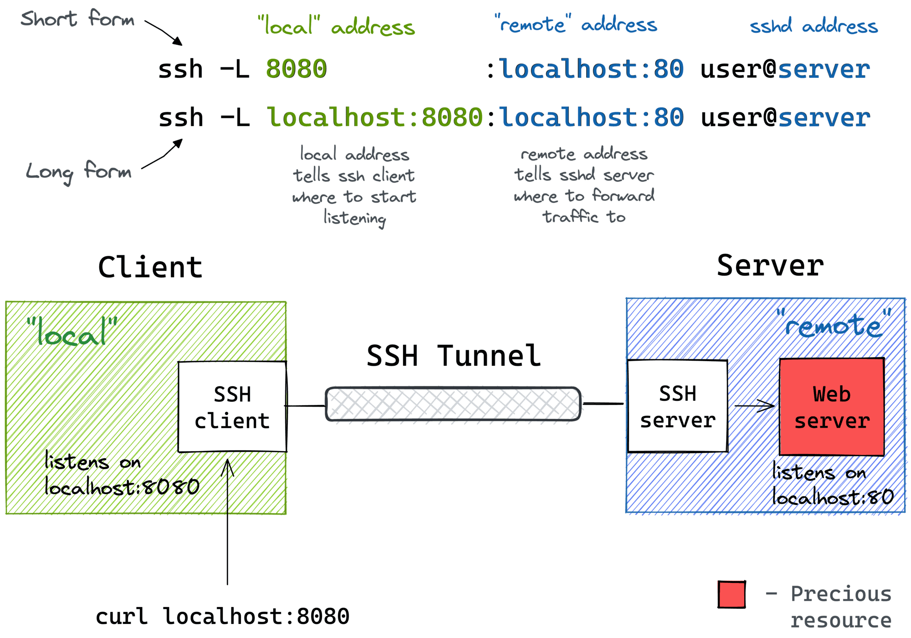
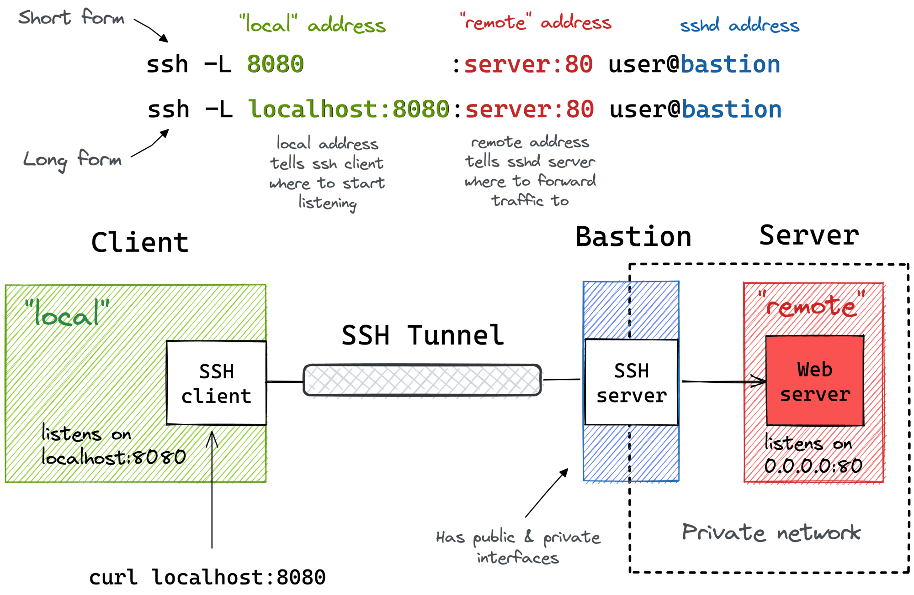
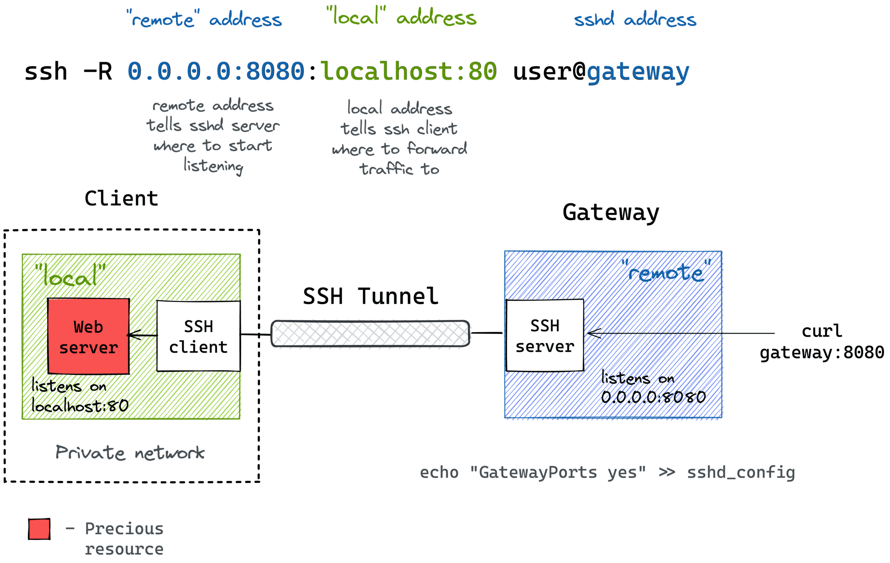
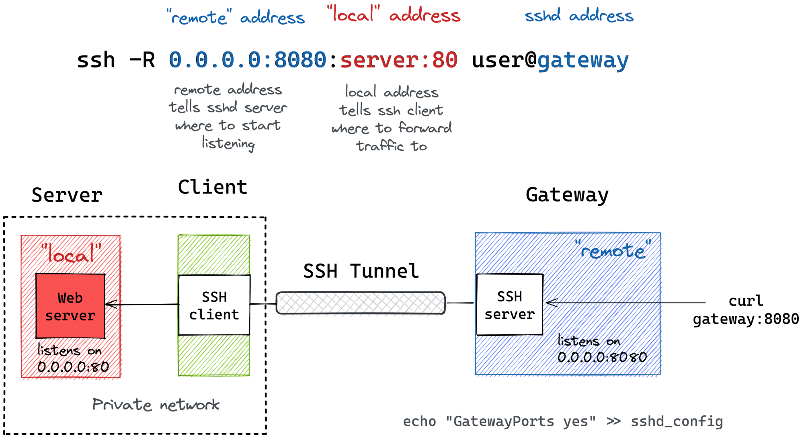

## SSH Tunnel 技术可视化指南

SSH 是[又一个](https://iximiuz.com/en/posts/linux-pty-what-powers-docker-attach-functionality/)古老的使用非常广泛的技术。从长远来看，学习一些 SSH 技巧很可能比掌握一打注定会在下个季度弃用的云原生工具更有价值。

SSH 技术中我最喜欢的一个部分是 SSH Tunnel（译注：SSH 隧道，专有名词，不翻译）。只要一行简单的标准命令，就可以实现：

 - 通过面向互联网的 EC2 实例访问内部 VPC 终端节点。
 - 从主机浏览器中打开开发虚拟机的一个 loalhost 端口。
 - 暴露任何在家或是私网环境中的本地服务器，实现外部访问。
 - 等等。。。

但是，尽管我天天使用 SSH Tunnel，但总是需要一点时间才能写出正确的命令。比如，这是一个本地隧道还是远程隧道？应该使用哪些参数（command flags）？应该写成“本地端口:远程端口”还是反过来“远程端口:本地端口”？所以，我决定把使用方式总结一下，这也是这篇文章中的操作实验和可视化备忘录的来源。

### 前置条件

SSH Tunnel 是用于通过网络连接主机的，所以下面的每一个实验都涉及多个“主机”。不过，我懒得启动完整的实例，特别是当可以使用容器的时候。这就是为什么我最终只使用了一个带有 Docker 的 vagrant 虚拟机。

理论上，任何只要装了 Docker Engine 的 Linux 虚拟机都可以跑下面的示例。不过 Docker Desktop 不可以，因为下面的示例都需要通过 IP 来访问容器。

或者，可以使用 Lima（QEMU + nerdctl + containerd + BuildKit）完成实验，但不要忘记首先使用 limactl shell bash。

每个示例都需要先在主机上生成密钥对，然后挂载到容器里面来简化访问。如果没有，可以先通过 `ssh-keygen` 在主机上生成一个。

**重要：**这里容器中的 SSH 进程仅用于教育目的 - 通过容器来模拟具有 SSH 客户端和服务端的服务器。注意，实际环境中的容器拥有 SSH 很好是一个好主意。

### 本地端口转发

从我最长使用的一个命令开始。经常，你只可以通过一个公共 IP SSH 到一台机器，这台机器上可能有一个服务监听着 localhost 或是私有地址上的端口。我迫切需要从外部访问这个端口。一些典型的例子：

 - 在笔记本电脑上通过 UI 客户端访问数据库（MySQL, Postgres, Redis, 等等）。
 - 通过你的浏览器访问只暴露在私有网络中的 web 应用。
 - 在笔记本电脑上访问没有在对外地址上暴露的容器内部端口。

所有上面的场景可以通过一条简单的 ssh 命令实现：

```bash
ssh -L [local_addr:]local_port:remote_addr:remote_port [user@]sshd_addr
```

`-L` 标记表示我们在启动本地端口转发。实际意思就是：

 - 在你的机器上，SSH 客户端开始监听 `local_port`（比如，监听 `localhost` 的端口，取决于 [`GatewayPorts`](https://linux.die.net/man/5/sshd_config#GatewayPorts) 的设置，译注：`GatewayPorts` 默认为 `no`，表示只允许做本机上的端口转发。）
 - 任何到这个本地端口的流量将会被转发到你 SSH 到的机器的 `remote_addr:remote_port`。

图示如下：



 > **专业提示：**使用 ssh -f -N -L 在后台运行端口转发会话。

##### 实验 1：使用 SSH Tunnel 进行本地端口转发

这个实验演示上面的图示。首先，需要准备一个服务器 — 一台运行着 SSH 进程和监听 `127.0.0.1:80` 的简单 web 应用：

```bash
$ docker buildx build -t server:latest -<<'EOD'
# syntax=docker/dockerfile:1
FROM alpine:3

# Install the dependencies:
RUN apk add --no-cache openssh-server curl python3
RUN mkdir /root/.ssh && chmod 0700 /root/.ssh && ssh-keygen -A

# Prepare the entrypoint that starts the daemons:
COPY --chmod=755 <<'EOF' /entrypoint.sh
#!/bin/sh
set -euo pipefail

for file in /tmp/ssh/*.pub; do
  cat ${file} >> /root/.ssh/authorized_keys
done
chmod 600 /root/.ssh/authorized_keys

# Minimal config for the SSH server:
sed -i '/AllowTcpForwarding/d' /etc/ssh/sshd_config
sed -i '/PermitOpen/d' /etc/ssh/sshd_config
/usr/sbin/sshd -e -D &

python3 -m http.server --bind 127.0.0.1 ${PORT} &

sleep infinity
EOF

# Run it:
CMD ["/entrypoint.sh"]
EOD
```

 > 译注：这个 heredocs 形式的 Dockerfile，我本地没有直接运行成功，会报错，可能是 BuildKit 支持的关系。拆解成等效的 Dockerfile 如下：
 >
 > ```bash
 > # 启用 BuildKit
 > export DOCKER_BUILDKIT=1
 >
 > # 安装 sshd 和 python3 等必要软件
 > tee Dockerfile <<-'EOD'
 > # syntax=docker/dockerfile:1
 > FROM alpine:3
 >
 > # Install the dependencies:
 > RUN apk add --no-cache openssh-server curl python3
 > RUN mkdir /root/.ssh && chmod 0700 /root/.ssh && ssh-keygen -A
 >
 > # Prepare the entrypoint that starts the daemons:
 > COPY --chmod=755 entrypoint.sh /entrypoint.sh
 >
 > # Run it:
 > CMD ["/entrypoint.sh"]
 > EOD
 >
 > # 启动 sshd 和一个简单的 web 应用
 > tee entrypoint.sh <<-'EOF'
 > #!/bin/sh
 > set -euo pipefail
 >
 > for file in /tmp/ssh/*.pub; do
 >     cat ${file} >> /root/.ssh/authorized_keys
 > done
 > chmod 600 /root/.ssh/authorized_keys
 >
 > # Minimal config for the SSH server:
 > sed -i '/AllowTcpForwarding/d' /etc/ssh/sshd_config
 > sed -i '/PermitOpen/d' /etc/ssh/sshd_config
 > /usr/sbin/sshd -e -D &
 >
 > python3 -m http.server --bind 127.0.0.1 ${PORT} &
 >
 > sleep infinity
 > EOF
 >
 > # 用 Dockerfile 构建
 > docker build -t server:latest .
 > ```

用 `server:latest` 镜像启动 `server` 容器，并记录它的 IP 地址：

```bash
$ docker run -d --rm \
   -e PORT=80 \
   -v $HOME/.ssh:/tmp/ssh \
   --name server \
   server:latest
$ SERVER_IP=$(
  docker inspect \
    -f '{{range.NetworkSettings.Networks}}{{.IPAddress}}{{end}}' \
  server
)
```

因为这个 web 应用监听在 `localhost`，所以无法在服务器外部进行访问（比如，从这个示例的 host 上）：

```bash
$ curl ${SERVER_IP}
curl: (7) Failed to connect to 172.17.0.2 port 80: Connection refused
```

但是在 `server` 容器内部，可以正常访问：

```bash
$ ssh -o StrictHostKeyChecking=no root@${SERVER_IP}
Welcome to Alpine!
...
3ce1ab391fa3:~# curl localhost
<!DOCTYPE HTML PUBLIC "-//W3C//DTD HTML 4.01//EN" "http://www.w3.org/TR/html4/strict.dtd">
<html>
<head>
...
```

 > 译注：这里有点小问题，我必须先进入 server 容器，为 root 用户设置密码，才可以 ssh 进入，**下面的实验也是如此**。WHY?

**魔法就在这**：通过本地端口转发，绑定 `server` 容器的 `80` 端口到 host 上的 `localhost:8080`：

```bash
$ ssh -o StrictHostKeyChecking=no -f -N -L 8080:localhost:80 root@${SERVER_IP}
```

现在你可以通过 host 上的本地端口来访问未暴露的 web 服务。

```bash
$ curl localhost:8080
<!DOCTYPE HTML PUBLIC "-//W3C//DTD HTML 4.01//EN" "http://www.w3.org/TR/html4/strict.dtd">
<html>
<head>
...
```

更详细的书写方式（更明确和灵活）方式 — 使用 `local_addr:local_port:remote_addr:remote_port` 方式：

```bash
$ ssh -o StrictHostKeyChecking=no -f -N -L \
  localhost:8080:localhost:80 \
  root@${SERVER_IP}
```

### 通过[堡垒机](https://en.wikipedia.org/wiki/Bastion_host)进行本地端口转发

一开始可能不太直观，`ssh -L` 命令允许转发本地端口到*任意远端机器*上的端口，而并不是单单在 SSH 服务器上。注意 `remote_addr` 和 `sshd_addr` 可能相同或不相同：

```bash
ssh -L [local_addr:]local_port:remote_addr:remote_port [user@]sshd_addr
```

不确定在这里使用术语*[堡垒机](https://en.wikipedia.org/wiki/Bastion_host)*是否合理，下图就是我所想的这种场景：



我经常通过这种方式来访问只能通过*堡垒机*访问的端点（比如，使用 EC2 实例的私有或公共地址来连接部署在 VPC 内部的 OpenSearch 集群）。

##### 实验 2：通过[堡垒机](https://en.wikipedia.org/wiki/Bastion_host)进行本地端口转发

同样的，这个实验演示上面的图示。首先，需要准备一个堡垒机 — 一台只运行着 SSH 进程的机器：

```bash
$ docker buildx build -t bastion:latest -<<'EOD'
# syntax=docker/dockerfile:1
FROM alpine:3

# Install the dependencies:
RUN apk add --no-cache openssh-server
RUN mkdir /root/.ssh && chmod 0700 /root/.ssh && ssh-keygen -A

# Prepare the entrypoint that starts the SSH daemon:
COPY --chmod=755 <<'EOF' /entrypoint.sh
#!/bin/sh
set -euo pipefail

for file in /tmp/ssh/*.pub; do
  cat ${file} >> /root/.ssh/authorized_keys
done
chmod 600 /root/.ssh/authorized_keys

# Minimal config for the SSH server:
sed -i '/AllowTcpForwarding/d' /etc/ssh/sshd_config
sed -i '/PermitOpen/d' /etc/ssh/sshd_config
/usr/sbin/sshd -e -D &

sleep infinity
EOF

# Run it:
CMD ["/entrypoint.sh"]
EOD
```
 > 译注：同样的拆解成等效的 Dockerfile，如下：
 >
 > ```bash
 > # 启用 BuildKit
 > export DOCKER_BUILDKIT=1
 >
 > # 只安装 ssh server 即可
 > tee Dockerfile <<-'EOD'
 > # syntax=docker/dockerfile:1
 > FROM alpine:3
 >
 > # Install the dependencies:
 > RUN apk add --no-cache openssh-server
 > RUN mkdir /root/.ssh && chmod 0700 /root/.ssh && ssh-keygen -A
 >
 > # Prepare the entrypoint that starts the daemons:
 > COPY --chmod=755 entrypoint.sh /entrypoint.sh
 >
 > # Run it:
 > CMD ["/entrypoint.sh"]
 > EOD
 >
 > # 启动 sshd 和一个简单的 web 应用
 > tee entrypoint.sh <<-'EOF'
 > #!/bin/sh
 > set -euo pipefail
 >
 > for file in /tmp/ssh/*.pub; do
 >     cat ${file} >> /root/.ssh/authorized_keys
 > done
 > chmod 600 /root/.ssh/authorized_keys
 >
 > # Minimal config for the SSH server:
 > sed -i '/AllowTcpForwarding/d' /etc/ssh/sshd_config
 > sed -i '/PermitOpen/d' /etc/ssh/sshd_config
 > /usr/sbin/sshd -e -D &
 >
 > sleep infinity
 > EOF
 >
 > # 用 Dockerfile 构建
 > docker build -t bastion:latest .
 > ```

用 `bastion:latest` 镜像启动 `bastion` 容器作为堡垒机，并记录它的 IP 地址：

```bash
# 译者添加，演示网络隔离
$ docker network create bastion-net
$ docker run -d --rm \
   -v $HOME/.ssh:/tmp/ssh \
   --network bastion-net \
   --name bastion \
   bastion:latest
$ BASTION_IP=$(
  docker inspect \
    -f '{{range.NetworkSettings.Networks}}{{.IPAddress}}{{end}}' \
  bastion
)
```

现在，在一台新的内部独立机器启动 web 服务：

```bash
$ docker run -d --rm \
    --name server \
    --network bastion-net \
    python:3-alpine \
    python3 -m http.server 80

$ SERVER_IP=$(
  docker inspect \
    -f '{{range.NetworkSettings.Networks}}{{.IPAddress}}{{end}}' \
  server
)
```

 > 译注：启动 bastion 容器和 server 容器的 docker 命令中的 `--network bastion-net` 是译者添加的，可以更好的演示网络隔离的意图。在 host 上直接 `curl ${SERVER_IP}` 时还是可以通的，在其他的 docker network 内**默认**则不可通了。

让我们假设由于某些原因从 host 上直接 `curl ${SERVER_IP}` 不可达（比如，无法从 host 路由到 IP 地址）。所以，我们需要开始做端口转发：

```bash
$ ssh -o StrictHostKeyChecking=no -f -N -L 8080:${SERVER_IP}:80 root@${BASTION_IP}
```

**注意，上面的命令中 `SERVER_IP` 和 `BASTION_IP` 具有不同的值。**

检查转发是否有用：

```bash
$ curl localhost:8080
<!DOCTYPE HTML PUBLIC "-//W3C//DTD HTML 4.01//EN" "http://www.w3.org/TR/html4/strict.dtd">
<html>
<head>
...
```

### 远端端口转发

另一种常见（但相反）的场景是你想暂时向外部互联网公开本地服务。当然，为此，你需要一个*对外的入口网关服务器*。不要担心！任何带有 SSH 守护进程的对外服务器都可以用作这样的网关：

```bash
ssh -R [remote_addr:]remote_port:local_addr:local_port [user@]gateway_addr
```

上面的命令看起来并不比它的 `ssh -L` 对应的命令复杂。但是有个坑...

**默认情况下，上面的 SSH Tunnel 只允许使用网关的本地地址（localhost）作为 `remote_addr`。**换句话说，你的本地端口只可以在网关服务器内部访问，这很可能不是你真正需要的。比如，我想用网关的公网地址作为远端地址来暴露我的本地服务到互联网。为了做到这个，SSH 服务器需要配置 [`GatewayPorts yes`](https://linux.die.net/man/5/sshd_config#GatewayPorts)。

远端端口转发可以用于：

 - 暴露你笔记本电脑上的还处于开发中的服务到互联网，以为了做一次演示。
 - 嗯... 我能想到一些其他更深奥的场景，但是我怀疑也不一定值得分享。很想知道其他人会用远端端口转发来做什么！

远端端口转发的图示如下：



 > **专业提示：**使用 ssh -f -N -L 在后台运行端口转发会话。

##### 实验 3：通过 SSH Tunnel 进行远端端口转发

这个实验演示上面的图示。首先，需要准备一个开发机 — 一台只运行着 SSH 客户端和本地 web 服务器的机器：

```bash
$ docker buildx build -t devel:latest -<<'EOD'
# syntax=docker/dockerfile:1
FROM alpine:3

# Install dependencies:
RUN apk add --no-cache openssh-client curl python3
RUN mkdir /root/.ssh && chmod 0700 /root/.ssh

# Prepare the entrypoint that starts the web service:
COPY --chmod=755 <<'EOF' /entrypoint.sh
#!/bin/sh
set -euo pipefail

cp /tmp/ssh/* /root/.ssh
chmod 600 /root/.ssh/*

python3 -m http.server --bind 127.0.0.1 ${PORT} &

sleep infinity
EOF

# Run it:
CMD ["/entrypoint.sh"]
EOD
```

 > 译注：拆解成等效的 Dockerfile 如下：
 >
 > ```bash
 > # 启用 BuildKit
 > export DOCKER_BUILDKIT=1
 >
 > # 安装 ssh client 和 python3 等必要软件
 > tee Dockerfile <<-'EOD'
 > # syntax=docker/dockerfile:1
 > FROM alpine:3
 >
 > # Install the dependencies:
 > RUN apk add --no-cache openssh-client curl python3
 > RUN mkdir /root/.ssh && chmod 0700 /root/.ssh
 >
 > # Prepare the entrypoint that starts the daemons:
 > COPY --chmod=755 entrypoint.sh /entrypoint.sh
 >
 > # Run it:
 > CMD ["/entrypoint.sh"]
 > EOD
 >
 > # 启动一个简单的 web 应用
 > tee entrypoint.sh <<-'EOF'
 > #!/bin/sh
 > set -euo pipefail
 >
 > cp /tmp/ssh/* /root/.ssh
 > chmod 600 /root/.ssh/*
 >   
 > python3 -m http.server --bind 127.0.0.1 ${PORT} &
 >
 > sleep infinity
 > EOF
 >
 > # 用 Dockerfile 构建
 > docker build -t devel:latest .
 > ```

启动一台开发机：

```bash
$ docker run -d --rm \
    -e PORT=80 \
    -v $HOME/.ssh:/tmp/ssh \
    --name devel \
    devel:latest
```

准备一台网关服务器 — 一台在 `sshd_config` 设置了 `GatewayPorts yes` 的简单 SSH 服务器：

```bash
$ docker buildx build -t gateway:latest -<<'EOD'
# syntax=docker/dockerfile:1
FROM alpine:3

# Install the dependencies:
RUN apk add --no-cache openssh-server
RUN mkdir /root/.ssh && chmod 0700 /root/.ssh && ssh-keygen -A

# Prepare the entrypoint that starts the SSH server:
COPY --chmod=755 <<'EOF' /entrypoint.sh
#!/bin/sh
set -euo pipefail

for file in /tmp/ssh/*.pub; do
  cat ${file} >> /root/.ssh/authorized_keys
done
chmod 600 /root/.ssh/authorized_keys

sed -i '/AllowTcpForwarding/d' /etc/ssh/sshd_config
sed -i '/PermitOpen/d' /etc/ssh/sshd_config
sed -i '/GatewayPorts/d' /etc/ssh/sshd_config
echo 'GatewayPorts yes' >> /etc/ssh/sshd_config

/usr/sbin/sshd -e -D &

sleep infinity
EOF

# Run it:
CMD ["/entrypoint.sh"]
EOD
```

 > 译注：拆解成等效的 Dockerfile 如下：
 >
 > ```bash
 > # 启用 BuildKit
 > export DOCKER_BUILDKIT=1
 >
 > # 安装 ssh server
 > tee Dockerfile <<-'EOD'
 > # syntax=docker/dockerfile:1
 > FROM alpine:3
 >
 > # Install the dependencies:
 > RUN apk add --no-cache openssh-server
 > RUN mkdir /root/.ssh && chmod 0700 /root/.ssh && ssh-keygen -A
 >
 > # Prepare the entrypoint that starts the SSH server:
 > COPY --chmod=755 entrypoint.sh /entrypoint.sh
 >
 > # Run it:
 > CMD ["/entrypoint.sh"]
 > EOD
 >
 > # 启动一个简单的 web 应用
 > tee entrypoint.sh <<-'EOF'
 > #!/bin/sh
 > set -euo pipefail
 >
 > for file in /tmp/ssh/*.pub; do
 >     cat ${file} >> /root/.ssh/authorized_keys
 > done
 > chmod 600 /root/.ssh/authorized_keys
 >
 > sed -i '/AllowTcpForwarding/d' /etc/ssh/sshd_config
 > sed -i '/PermitOpen/d' /etc/ssh/sshd_config
 > sed -i '/GatewayPorts/d' /etc/ssh/sshd_config
 > echo 'GatewayPorts yes' >> /etc/ssh/sshd_config
 >
 > /usr/sbin/sshd -e -D &
 >
 > sleep infinity
 > EOF
 >
 > # 用 Dockerfile 构建
 > docker build -t gateway:latest .
 > ```

用 `gateway:latest` 镜像启动网关服务器，并记录它的 IP 地址：

```bash
$ docker run -d --rm \
    -v $HOME/.ssh:/tmp/ssh \
    --name gateway \
    gateway:latest

$ GATEWAY_IP=$(
  docker inspect \
    -f '{{range.NetworkSettings.Networks}}{{.IPAddress}}{{end}}' \
  gateway
)
```

现在，**在开发机内部开始远端端口转发**：

```bash
$ docker exec -it -e GATEWAY_IP=${GATEWAY_IP} devel sh
/ $# ssh -o StrictHostKeyChecking=no -f -N -R 0.0.0.0:8080:localhost:80 root@${GATEWAY_IP}
/ $# exit  # or detach with ctrl-p, ctrl-q
```

现在，验证开发机的本地端口已经通过网关的对外地址（和端口 8080）暴露出去了（从 host 上验证）：

```bash
$ curl ${GATEWAY_IP}:8080
<!DOCTYPE HTML PUBLIC "-//W3C//DTD HTML 4.01//EN" "http://www.w3.org/TR/html4/strict.dtd">
<html>
<head>
...
```

### 在家庭网络或私有网络环境中进行远端端口转发

很像本地端口转发，远端端口转发也有自己的*堡垒机*模式。不同的是，安装了 SSH 客户端的机器扮演了堡垒机的角色。也就是，可以通过网关暴露你的笔记本电脑可以访问的在家庭网络或私有网络中的机器的端口到外部世界：

```bash
ssh -R [remote_addr:]remote_port:local_addr:local_port [user@]gateway_addr
```

命令看起来很像简单的远端 SSH Tunnel，但是 `local_addr:local_port` 变成了在家庭网络或私有网络中的设备的地址。以下是它在图表上的表达方式：



一般我把我的笔记本电脑作为轻量级客户端使用，实际开发的东西都在我的家庭服务器上。当我需要把服务从家庭服务器上暴露到公共互联网时，我就靠这样的端口转发实现。网关唯一能访问的只有我的轻量级笔记本电脑。

##### 实验 4：在家庭网络或私有网络环境中进行远端端口转发

同样，这个实验演示上面的图示。首先，我们需要准备一个“轻量级开发机”：

```bash
$ docker buildx build -t devel:latest -<<'EOD'
# syntax=docker/dockerfile:1
FROM alpine:3

# Install the dependencies:
RUN apk add --no-cache openssh-client
RUN mkdir /root/.ssh && chmod 0700 /root/.ssh

# This time we run nothing (at first):
COPY --chmod=755 <<'EOF' /entrypoint.sh
#!/bin/sh
set -euo pipefail

cp /tmp/ssh/* /root/.ssh
chmod 600 /root/.ssh/*

sleep infinity
EOF

# Run it:
CMD ["/entrypoint.sh"]
EOD
```

 > 译注：拆解成等效的 Dockerfile 如下：
 >
 > ```bash
 > # 启用 BuildKit
 > export DOCKER_BUILDKIT=1
 >
 > # 安装 ssh client 和 python3 等必要软件
 > tee Dockerfile <<-'EOD'
 > # syntax=docker/dockerfile:1
 > FROM alpine:3
 >
 > # Install the dependencies:
 > RUN apk add --no-cache openssh-client
 > RUN mkdir /root/.ssh && chmod 0700 /root/.ssh
 >
 > # Prepare the entrypoint that starts the SSH server:
 > COPY --chmod=755 entrypoint.sh /entrypoint.sh
 >
 > # Run it:
 > CMD ["/entrypoint.sh"]
 > EOD
 >
 > # 启动一个简单的 web 应用
 > tee entrypoint.sh <<-'EOF'
 > #!/bin/sh
 > set -euo pipefail
 >
 > cp /tmp/ssh/* /root/.ssh
 > chmod 600 /root/.ssh/*
 >
 > sleep infinity
 > EOF
 >
 > # 用 Dockerfile 构建
 > docker build -t devel:latest .
 > ```

启动“开发机”：

```bash
$ docker run -d --rm \
    -v $HOME/.ssh:/tmp/ssh \
    --name devel \
    devel:latest
```

启动一个单独的开发服务器（和开发电脑在同一个网络环境）并记录它的 IP 地址：

```bash
$ docker run -d --rm \
    --name server \
    python:3-alpine \
    python3 -m http.server 80

$ SERVER_IP=$(
  docker inspect -f '{{range.NetworkSettings.Networks}}{{.IPAddress}}{{end}}' \
  server
)
```

准备网关服务器：

```bash
$ docker buildx build -t gateway:latest -<<'EOD'
# syntax=docker/dockerfile:1
FROM alpine:3

# Install the dependencies:
RUN apk add --no-cache openssh-server
RUN mkdir /root/.ssh && chmod 0700 /root/.ssh && ssh-keygen -A

# Prepare the entrypoint that starts the SSH daemon:
COPY --chmod=755 <<'EOF' /entrypoint.sh
#!/bin/sh
set -euo pipefail

for file in /tmp/ssh/*.pub; do
  cat ${file} >> /root/.ssh/authorized_keys
done
chmod 600 /root/.ssh/authorized_keys

sed -i '/AllowTcpForwarding/d' /etc/ssh/sshd_config
sed -i '/PermitOpen/d' /etc/ssh/sshd_config
sed -i '/GatewayPorts/d' /etc/ssh/sshd_config
echo 'GatewayPorts yes' >> /etc/ssh/sshd_config

/usr/sbin/sshd -e -D &

sleep infinity
EOF

# Run it:
CMD ["/entrypoint.sh"]
EOD
```

 > 译注：拆解成等效的 Dockerfile 如下：
 >
 > ```bash
 > # 启用 BuildKit
 > export DOCKER_BUILDKIT=1
 >
 > # 安装 ssh server
 > tee Dockerfile <<-'EOD'
 > # syntax=docker/dockerfile:1
 > FROM alpine:3
 >
 > # Install the dependencies:
 > RUN apk add --no-cache openssh-server
 > RUN mkdir /root/.ssh && chmod 0700 /root/.ssh && ssh-keygen -A
 >
 > # Prepare the entrypoint that starts the SSH daemon:
 > COPY --chmod=755 entrypoint.sh /entrypoint.sh
 >
 > # Run it:
 > CMD ["/entrypoint.sh"]
 > EOD
 >
 > # 启动一个简单的 web 应用
 > tee entrypoint.sh <<-'EOF'
 > #!/bin/sh
 > set -euo pipefail
 >
 > for file in /tmp/ssh/*.pub; do
 >     cat ${file} >> /root/.ssh/authorized_keys
 > done
 > chmod 600 /root/.ssh/authorized_keys
 >
 > sed -i '/AllowTcpForwarding/d' /etc/ssh/sshd_config
 > sed -i '/PermitOpen/d' /etc/ssh/sshd_config
 > sed -i '/GatewayPorts/d' /etc/ssh/sshd_config
 > echo 'GatewayPorts yes' >> /etc/ssh/sshd_config
 >
 > /usr/sbin/sshd -e -D &
 >
 > sleep infinity
 > EOF
 >
 > # 用 Dockerfile 构建
 > docker build -t gateway:latest .
 > ```

启动它并记录 IP：

```bash
$ docker run -d --rm \
    -v $HOME/.ssh:/tmp/ssh \
    --name gateway \
    gateway:latest

$ GATEWAY_IP=$(
  docker inspect \
    -f '{{range.NetworkSettings.Networks}}{{.IPAddress}}{{end}}' \
  gateway
)
```

现在，**从“开发机”内部开始启动远端端口转发 SERVER 到 GATEWAY**：

```bash
$ docker exec -it -e GATEWAY_IP=${GATEWAY_IP} -e SERVER_IP=${SERVER_IP} devel sh
/ $# ssh -o StrictHostKeyChecking=no -f -N -R 0.0.0.0:8080:${SERVER_IP}:80 root@${GATEWAY_IP}
/ $# exit  # or detach with ctrl-p, ctrl-q
```

最后，验证开发服务器可以通过网关的对外地址（从 host 上）进行访问：

```bash
$ curl ${GATEWAY_IP}:8080
<!DOCTYPE HTML>
<html lang="en">
<head>
...
```

### 总结

在完成所有这些实验和图示之后，我意识到：

 - 词 **"local"** 可以是 **“ssh 客户端机器”**或这台机器可以访问的上游主机。
 - 词 **"remote"** 可以是 **“ssh 服务端机器（sshd）”**或这台机器可以访问的上游主机。
 - 本地端口转发（`ssh -L`）意味着是 ssh 客户端开始监听一个新端口。
 - 远端端口转发（`ssh -R`）意味着是 ssh 服务端开始监听一个额外端口（即除了 sshd 端口之外）。
 - 有助记忆的一个点是，"ssh **-L** local:remote" 和 "ssh **-R** local:remote" 总是在左边打开一个新端口。

### 代替结论

希望上面的的东西可以帮你成为 SSH Tunnel 大师。如果你发现网络主题很有趣，但感觉大部分材料都是写给大胡子工程师的，单纯的开发人员并无法消化，下面这些文章你可能会觉着有用：

 - [Computer Networking Introduction: Ethernet and IP](https://iximiuz.com/en/posts/computer-networking-101/)
 - [Illustrated introduction to Linux iptables](https://iximiuz.com/en/posts/laymans-iptables-101/)
 - [Bridge vs. Switch: What I Learned From a Data Center Tour](https://iximiuz.com/en/posts/bridge-vs-switch/)
 - [Container Networking Is Simple (not really)](https://iximiuz.com/en/posts/container-networking-is-simple/)

### 参考资源

 - [SSH Tunneling Explained](https://goteleport.com/blog/ssh-tunneling-explained/) by networking gurus from Teleport.
 - [SSH Tunneling: Examples, Command, Server Config](https://www.ssh.com/academy/ssh/tunneling-example) by SSH Academy.

--------

原文：[A Visual Guide to SSH Tunnels (with labs)](https://iximiuz.com/en/posts/ssh-tunnels/)
