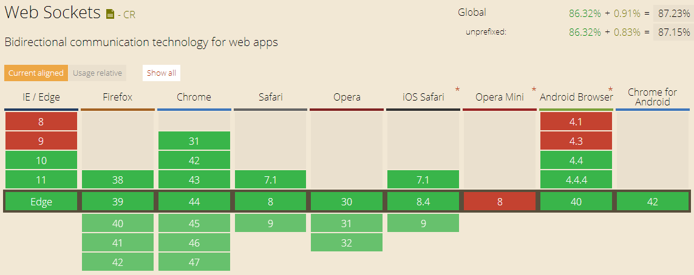

## 基于 JSR 356 Java WebSocket API 构建 WebSocket 应用

### 背景

HTTP 1.1 之前，每个发向服务器的请求表现为一个新的连接（connection），在这种连接中，数据只能单向传输，传输完毕后，即被关闭。1.1 引入 HTTP 持久化连接（[HTTP persistence connections](https://en.wikipedia.org/wiki/HTTP_persistent_connection)），允许 web 浏览器重用同一个连接获取文档、脚本、图片等等。当应用中遇到实时性较高的需求时，如，聊天室、后台报警推送等，传统的 HTTP 实现此类效果就会有诸多弊端。

传统方式一般有 3 种：轮训，长轮训，和流机制，三种机制原理说明见 [HTML5 Web Sockets: A Quantum Leap in Scalability for the Web](https://www.websocket.org/quantum.html)。

### WebSocket 简述

由于对于客户端和服务器端实时的双向通讯需求越来越多，终于引入了 WebSocket 协议。WebSocket 是基于 TCP 连接的异步、双向的消息实现。WebSocket 并非传统 HTTP 连接，但是需使用 HTTP 来启动一个 WebSocket 连接。WebSocket 最初只是作为 HTML5 规范的一部分用于简化实时 Web 应用开发和提升网络效率。不断发展完善后，成为独立的协议规范，包含两部分 [RFC 6455](http://tools.ietf.org/html/rfc6455) 和 [WebSocket JavaScript API](http://www.w3.org/TR/2011/WD-websockets-20110419/)。

#### 工作方式

WebSocket 协议需在 [HTTP 升级标识](https://en.wikipedia.org/wiki/HTTP/1.1_Upgrade_header#Use_with_WebSockets)中进行特定设置来将 HTTP 连接升级为 WebScoket 连接。（升级标识（Upgrade header），标识客户端需要将普通的 HTTP 连接升级为特定协议的连接，具体解释见 wiki。）一旦 WebSocket 连接建立后，便可以在客户端和服务器端进行双向的消息传递。

#### 优点

 1. 相比于传统的开发方式，如，轮训，WebSocket 更具效率。只需要更少的带宽，并能减少延迟。
 2. WebSocket 天生用于实时应用架构。
 3. WebSocket 不需要在点与点之间发送标准消息头。这能显著降低带宽。

### Java 中使用 WebSocket

#### JSR 356 Java WebSocket API

Java 中自然有 WebSocekt 的实现，而且种类很多，如 [tyrus](https://tyrus.java.net/)。随着时间推移，终于对 WebSocket API 进行了标准化，即 [JSR 356](http://jcp.org/en/jsr/detail?id=356) 标准。跟其他任何标准定义的初衷一样，它旨在为不同的 WebSocket Java 实现提供规范。基于 JSR 356，开发人员可以开发出独立于不同实现的 WebSocket 应用。这个标准同时提供了服务器端和客户端的 API，且客户端 API 和 服务器端 API 之间的差异很小。通过这些 API，开发人员可以同时在服务器端和客户端整合 WebSocket。WebSocket 协议的不同 Java 实现都应该兼容 JSR 356 API。JSR 356 也是 Java EE 7 标准的一部分，即，兼容 Java EE 7 的应用服务器将会依照 JSR 356 实现 WebSocket 协议。

对于纯 Java 实现客户端，可以使用 JSR 356 兼容的客户端 API 连接 WebSocket 服务器端。而对于 Web 应用，开发人员可以使用标准 [WebSocket JavaScript API](http://www.w3.org/TR/2011/WD-websockets-20110419/) 连接 WebSocket 服务器端。两者之间的区别仅仅在于连接到服务器端的方式（Java 和 JavaScript）不同。WebSocket 客户端在标准中称为 WebSocket endpoint，表示一个连接点。WebSocket 服务器端本质也是 WebSocket endpoint，只是可以被发布处于监听连接状态，等待客户端连入。WebSocket API 是纯事件驱动的，两端（server endpoint 和 client endpoint）都有事件回调监听器，*onOpen*，*onMessage*，*onError*，*onClose*，名称已经解释了它们的应用场景。

#### 示例代码部署、测试说明

构建工具为 Maven。

示例代码基于标准 JSR 356 编写，则需要依赖 JSR 356 API 库，pom.xml 中依赖库配置如下：

	<dependencies>

		... other dependencies ...

		<dependency>
			<groupId>javax.websocket</groupId>
			<artifactId>javax.websocket-api</artifactId>
			<version>1.0</version>
			<scope>provided</scope>
		</dependency>
	</dependencies>

实际运行代码时，需依赖于一种具体 JSR 356 实现。这里基于 Apache Tomcat 7.0.47（支持 WebSocket 的最低版本）中的实现。pom.xml 中添加 tomcat7 运行插件：

	<plugins>

		... other plugins ...

		<!--
			tomcat7 runtime plugin
			version 2.2: tomcat 7.0.47, support WebSocket
		-->
		<plugin>
			<groupId>org.apache.tomcat.maven</groupId>
			<artifactId>tomcat7-maven-plugin</artifactId>
			<version>2.2</version>
			<configuration>
				<path>/${appName}</path>
				<port>8084</port>
			</configuration>
		</plugin>
	</plugins>

客户端为 Web 浏览器，在 HTML 中使用 JavaScript WebSocket API 建立到 WebSocket 服务器端的连接，并发送和接收消息，JavaScript 中 WebSocket API 将不会在本文中具体描述，精简后的 HTML 示例（更多示例参看[官网](https://www.websocket.org/demos.html)）：

	<!DOCTYPE html>
	<meta charset="utf-8" />
	<title>WebSocket Echo Demo</title>
	
	<h2>WebSocket Echo Demo</h2>
	<input type="text" id="message" value="" />
	<input type="button" value="Send Message" onclick="doSend(document.getElementById('message').value)" />
	

另，Web 浏览器 WebSocket 支持情况如下，**绿色**表示支持（网上汇总很多，本文取自[http://caniuse.com/#feat=websockets](http://caniuse.com/#feat=websockets)）：

#### 编程模型

JSR 356 定义了两种模型来开发 WebSocket 应用，即，注解和编程注入：

 - 注解驱动：使用注解的 POJO，开发人员可以跟 WebSocket 生命周期的不同事件交互。
 - 接口驱动：开发人员需要实现 `javax.websocket.Endpoint` 接口及其方法跟生命周期事件交互。

#### 生命周期事件

典型的 WebSocket 声明周期事件如下：

 - 一端（客户端）发送一个带有标识头的 HTTP 请求初始化连接。
 - 另一端（服务器端）回复握手请求。
 - 连接成功建立。现在开始，连接对两端都是等效的。
 - 两端都可以实时发送和接收消息。
 - 任一端关闭连接。

大多数生命周期中事件可以映射到 Java 类方法，无论是通过注解驱动还是接口驱动方式。

#### 注解驱动方式

##### 建立连接

接受 WebSocket 请求的一端称之为服务器端，可以通过 `@ServerEndpoint` 注解 POJO。这个注解告诉容器注解的类应作为 WebSocket server endpoint 使用。`@ServerEndpoint` 注解所必须的 `value` 元素指定连到这个 endpoint 的 URL 路径。如：

	@ServerEndpoint("/anno/echo")
	public class AnnotationEchoEndpoint {

		@OnOpen
		public void onOpen(Session session) {
			System.out.println("New WebSocket linked in... Unique session: " + session + "#" + session.getId());
		}

	}

客户端的连接路径将会类似于 `ws://${host}:${port}/${context}/anno/echo`，**ws** 类似于 **http** 是特定前缀，表示一个 websocket URL。一旦连接建立，服务器端跟客户端的连接接将表现为一个唯一的 `javax.websocket.Session` 实例，`Session` 实例在连接未关闭期间一直存在。之后服务器写向客户端的任何内容都要通过 `Session` 完成。另外，由 `@OnOpen` 注解的“连接打开”方法也将被调用。这个注解的方法可以包含多个参数：

 - 一个 `@ServerEndpoint` POJO 只能包含一个 `@OnOpen` 方法。
 - 可选 `Session` 参数，表示创建的连接特定的 `Session` 实例。
 - `EndpointConfig` 参数，包含可能的 endpoint 配置信息。（见后续获取 `HttpSession` 的例子。）
 - 0 或多个由 `@PathParam` 注解的参数，表示 URL 中的路径参数，参数类型为基本类型（String，int，等），如下节所述。
 - 参数顺序不做要求，为了便于阅读和维护，倾向于先 `Session`，后 `EndpointConfig`（如果有），最后 0 或多个 `@PathParam` 参数（如果有）。

##### URL 中包含参数

在 URL 中带入参数是很常见的需求，WebSocket 并不支持类似于 HTTP 中 “?” 后加参数名和值的方式。而是，类似于 RESTful 的路径风格，在定义 URL 时包含路径变量，客户端建立连接时替换成具体值。如：

	@ServerEndpoint("/anno/echo/{toWho}")
	public class AnnotationEchoEndpoint {

		@OnOpen
		public void onOpen(Session session, @PathParam("toWho") String toWho) {
			System.out.println("New WebSocket linked in... Unique session: " +
					session + "#" + session.getId() + ". With param: " + toWho);
		}

	}

这种方式的参数传递更加简洁、直观。

##### 接收消息

当 WebSocket endpoint 接收到消息时，将会回调 `@OnMessage` 注解的方法：

 - 一个 `@ServerEndpoint` POJO 只能包含一个 `@OnMessage` 方法。
 - 可选 `Session` 参数，表示创建的连接特定的 `Session` 实例。
 - 0 或多个由 `@PathParam` 注解的参数，表示 URL 中的路径参数，参数类型为基本类型（String，int，等）。
 - 接受到的消息本身，消息类型可为基本类型（String, int, 等）或是任何其他配置了解码器的 Java 类型。

如果 `@OnMessage` 注解的方法返回为空（`void`），如：

	@OnMessage
	public void messageOnly(Session session, int message) {
		System.out.println(message);
	}

将会仅接收到客户端发送的消息，但不会发送任何消息给客户端（注：这里 `message` 定义为 `int` 类型，如果客户端发送的数据无法转为 `int` 将会引起异常）。如果，定义如下：

	@OnMessage
	public String getAndReturn(String message, @PathParam("toWho") String toWho) {
		return "Get message [" + message + "] from " + toWho;
	}

即，方法具有 `String` 返回值，将会将返回值作为消息发送回客户端。除此之外，还可以直接使用 `Session` 实例返回消息，当需要在其他的类或方法中返回消息时将会非常有用：

	RemoteEndpoint.Basic other = session.getBasicRemote();
	other.sendText("Get your message at " + System.currentTimeMillis());

注意，直接使用 `Session` 发送数据时，需要首先调用 `getBasicRemote()` 方法，方法返回值 `RemoteEndpoint` 表示 WebSocket 连接的一端（endpoint, peer）。通过 `RemoteEndpoint` 实例的不同 **send** 方法可以发送文本或其他类型的消息。

##### 连接关闭

当 WebSocket 连接处于关闭阶段，将会调用 `@OnClose` 注解的方法：

 - 一个 `@ServerEndpoint` POJO 只能包含一个 `@OnClose` 方法。
 - 可选 `Session` 参数，表示创建的连接特定的 `Session` 实例。注意，这个参数在 WebSocket 真正关闭后，即在 `@OnClose` 方法返回后，将无法再被使用。
 - `javax.websocket.CloseReason` 参数描述 WebSocket 关闭的原因，比如，正常关闭，协议错误，无法接受，等等，详细见 `CloseReason$CloseCodes`。
 - 0 或多个由 `@PathParam` 注解的参数，表示 URL 中的路径参数，参数类型为基本类型（String，int，等）。

如下所示的方法，将在连接关闭阶段调用：

	@OnClose
	public void onClose(CloseReason reason, @PathParam("toWho") String toWho) {
		System.out.println("Closing a WebSocket due to " + reason.getReasonPhrase());
	}

##### 异常处理

WebSocket 连接使用过程中，如果异常发生，将会调用 `@OnError` 注解的方法：

 - 一个 `@ServerEndpoint` POJO 只能包含一个 `@OnError` 方法。
 - 可选 `Session` 参数，表示创建的连接特定的 `Session` 实例。
 - 0 或多个由 `@PathParam` 注解的参数，表示 URL 中的路径参数，参数类型为基本类型（String，int，等）。
 - 表示异常的 `java.lang.Throwable` 参数。

如下所示的方法，将在异常发生时调用：

	@OnError
	public void onError(Throwable t) {
		System.out.println(t);
	}

#### 接口驱动方式

##### 声明周期方法

相比于注解驱动，接口驱动的方式稍具灵活性，因为编程方式侵入性更强，这意味着能够控制的地方更多。但是带来的更多是不便，比如方法定义需要符合接口中约束，编写很多一句注解就能表达的代码，等等。所以开发中，倾向于使用注解驱动。这里简述接口驱动的实现方式。使用接口驱动方式，开发人员需要继承 `javax.websocket.Endpoint` 类，并复写 `onOpen`，`onClose`，和 `onError` 生命周期方法。

	public class EchoEndpoint extends Endpoint {

		@Override
		public void onOpen(Session session, EndpointConfig config) { }

		public void onClose(Session session, CloseReason closeReason) { }

		public void onError(Session session, Throwable throwable) { }

	}

为了侦听消息，需要在 `onOpen` 方法实现中注册自定义实现的 `javax.websocket.MessageHandler`，如：

	public class EchoMessageHandler implements MessageHandler.Whole<String> {

		private final Session session;

		private EchoMessageHandler(Session session) {
			this.session = session;
		}

		public void onMessage(String message) {
			try {
				session.getBasicRemote().sendText(message + " " + System.currentTimeMillis());
			} catch (IOException e) {
				e.printStackTrace();
			}
		}

	}

	...
	public void onOpen(Session session, EndpointConfig config) {
		// 注册
		session.addMessageHandler(new EchoMessageHandler());
	}
	...

`MessageHandler` 是一个顶级接口。它内部定义两个子接口：`MessageHandler.Partial` 和 `MessageHandler.Whole`。`Partial` 的应用场景是当部分消息到达时就通知 `MessageHandler` 实现，而 `Whole` 接口则是在全部消息到达时才通知 `MessageHandler` 实现。

##### 注册到容器

接口驱动实现的 `Endpoint` 还需通知容器进行扫描，才能真正发布为 server endpoint。需要实现 `javax.websocket.server.ServerApplicationConfig` 接口，实现此接口的类，将会在容器启动前完成扫描和注册。如下所示，实现注解驱动中发布 `@ServerEndpoint` 类的效果：

	public class EndpointRegisterConfig implements ServerApplicationConfig {

		public Set<ServerEndpointConfig> getEndpointConfigs(Set<Class<? extends Endpoint>> endpointClasses) {
			System.out.println("Loading Programmatic Server Endpoints.");
			Set<ServerEndpointConfig> serverEndpoints = new HashSet<ServerEndpointConfig>();
			if (endpointClasses.contains(EchoEndpoint.class)) {
				serverEndpoints.add(
						ServerEndpointConfig.Builder.create(EchoEndpoint.class, "/anno/echo/{toWho}").build()
					);
				System.out.println("Loading Programmatic Endpoint: " + EchoEndpoint.class.getName());
			}
			return serverEndpoints;
		}

		/* Also can filter annotated Endpoint classes. */
		public Set<Class<?>> getAnnotatedEndpointClasses(Set<Class<?>> scanned) {
			return null;
		}

	}

注意，在注册时 URL 中仍包含路径变量。由于无法再使用 `@PathParam` 注解进行获取实际值，此时需基于 `onOpen` 方法的 `EndpointConfig config` 参数进行获取，示例如下：

	public void onOpen(Session session, EndpointConfig config) {
		System.out.println(session + " come... " + config.getUserProperties());
		Object o = config.getUserProperties().get("org.apache.tomcat.websocket.pojo.PojoEndpoint.pathParams");
		if (o != null) {
			@SuppressWarnings("unchecked")
			Map<String, String> pathParams = (HashMap<String, String>) o;
			String toWho = pathParams.get("toWho");
			System.out.println("Path param is " + toWho);
		}
		session.addMessageHandler(new EchoMessageHandler(session));
	}

在注解驱动的方式下，也可以通过 `EndpointConfig` 实例变量获取路径变量值，只是没有必要。

#### 连接配置信息

如上节所述，为了获取路径参数，需要使用 `EndpointConfig` 实例。这个实例表示对一个 `Endpoint` 的各项配置。它包含在握手过程中所需要的全部信息。对于服务端而言，一般使用具体子接口 `ServerEndpointConfig`，它只包含特定于服务器端的配置信息。特定的配置可以通过 `ServerEndpointConfig.Configurator` 定制，如假设我们需要获取 `HttpSession` 实例：

	public class GetHttpSessionConfigurator extends ServerEndpointConfig.Configurator {

		@Override
		public void modifyHandshake(ServerEndpointConfig config, HandshakeRequest request, HandshakeResponse response) {
			HttpSession httpSession = (HttpSession) request.getHttpSession();
			config.getUserProperties().put(HttpSession.class.getName(), httpSession);
		}

	}

我们将特定的配置加入到 `UserProperties` 中。从而，在后续连接真正建立的时候就可以获取到预设的配置信息，如：

	@ServerEndpoint(value = "/anno/echo/{toWho}", configurator = GetHttpSessionConfigurator.class)
	public class AnnotationEchoEndpoint {
	
		@OnOpen
		public void onOpen(Session session, @PathParam("toWho") String toWho, EndpointConfig config) {
			HttpSession httpSession = (HttpSession) config.getUserProperties().get(HttpSession.class.getName());
			System.out.println("Configured HttpSession: " + httpSession);
			System.out.println("New WebSocket linked in... Unique session: " +
					session + "#" + session.getId() + ". With param: " + toWho);
		}

		...

	}

#### 消息类型，消息编码和解码器

JSR 规范中，可以直接接受和发送 Java 对象消息而非仅仅基本类型的消息。一般而言，有三种类型的消息：

 - 纯文本消息。
 - 二进制（流）消息。
 - Pong 消息（[PongMessage](https://javaee-spec.java.net/nonav/javadocs/javax/websocket/PongMessage.html)），关于 WebSocket 连接本身的消息。

在接口驱动的编程模型中，每个 `Session` 实例至多可以为 3 种消息类型注册一个 `MessageHandler`。当使用注解驱动的编程模型时，每种不同类型的消息允许有一个 `@OnMessage` 注解的方法。注解方法中的参数类型取决于消息类型。`@OnMessage` 的 [Javadoc](https://javaee-spec.java.net/nonav/javadocs/javax/websocket/OnMessage.html) 已经清楚的说明了注解方法消息类型参数，下面内容引用自 Javadoc：

 > - 如果方法处理文本消息
 >
 > > - `String` 接收全部消息。
 > > - 全部消息转换为 Java 基本类型或其包装类。
 > > - `String` 和 boolean 对分别接收部分消息。
 > > - `java.io.Reader` 接收全部消息并用作阻塞流。
 > > - 特定对象类型参数，如果 endpoint 已配置文本解码器（[`Decoder.Text`](https://javaee-spec.java.net/nonav/javadocs/javax/websocket/Decoder.Text.html) 或 [`Decoder.TextStream`](http://javaee-spec.java.net/nonav/javadocs/javax/websocket/Decoder.TextStream.html)）。
 > 
 > - 如果方法处理二进制消息
 >
 > > - `byte[]` 或 `ByteBuffer` 接收全部消息。
 > > - `byte[]` 和 boolean 对，或 `ByteBuffer` 和 boolean 对分别接收部分消息。
 > > - `java.io.InputStream` 接收全部消息并用作阻塞流。
 > > - 特定对象类型参数，如果 endpoint 已配置二进制数据解码器（[`Decoder.Binary`](http://javaee-spec.java.net/nonav/javadocs/javax/websocket/Decoder.Binary.html) 或 [`Decoder.BinaryStream`](http://javaee-spec.java.net/nonav/javadocs/javax/websocket/Decoder.BinaryStream.html)）。
 >
 > - 如果方法处理 pong 消息：
 >
 > > - [PongMessage](http://javaee-spec.java.net/nonav/javadocs/javax/websocket/PongMessage.html) 处理 pong 消息。

通过基于文本或二进制流的解码器可以将消息解码成任何 Java 对象。这种文本或二进制流消息被发向另一端，在那一端消息可以再次被解码成 Java 对象 - 或由另外的 WebSocket 库解析。通常用 XML 或 JSON 传递 WebSocket 消息，编码器用于将 Java 对象封装成 XML 或 JSON，解码器则将 XML 或 JSON 还原成 Java 对象。

编码器需实现 `javax.websocket.Encoder` 接口，解码器需实现 `javax.websocket.Decoder` 接口。不过，endpoint 类需要确切知道定义的编码器和解码器类型。使用注解驱动方式，一组编码器和解码器可以配置在 `@ClientEndpoint` 和 `@ServerEndpoint` 注解中（**注**，尽管可以配置多个编码器和解码器，但是只会使用第一个，剩余部分将被忽略）。一个完整的基于文本的编解码示例如下：

	/* Target Object needs decode to and encode from. */
	public class Person {
	
		private String name;
	
		private int age;
	
		... getter and setter for name and age ...

	}

	/* current ServerEndpoint config */
	@ServerEndpoint( value = "/anno/echo/{toWho}", decoders = MessageDecoder.class, encoders = MessageEncoder.class )
	public class AnnotationEchoEndpoint {
	
		@OnMessage
		public void messageOnly(Session session, Person personMsg, @PathParam("toWho") String toWho) {
			System.out.println(System.currentTimeMillis() + ", " + personMsg);
			personMsg.setName(personMsg.getName() + " to " + toWho);
			personMsg.setAge(personMsg.getAge() + 10);
			try {
				session.getBasicRemote().sendObject(personMsg);
			} catch (IOException e) {
				e.printStackTrace();
			} catch (EncodeException e) {
				e.printStackTrace();
			}
		}

		...

	}

	/* Decoder for decoding Persion object. */
	public class MessageDecoder implements Decoder.Text<Person> {
	
		public boolean willDecode(String s) {
			/* Only when true returns, would call decode method. */
			return (s != null);
		}

		public Person decode(String s) {
			System.out.println("Incoming " + s);
			Person person = new Person();
			person.setName(s.substring(0, 5));
			person.setAge(Integer.parseInt(s.substring(5)));
			return person;
		}
	
		... other init() and destory() method ...

	}

	/* Encoder for encode Persion object to text. */
	public class MessageEncoder implements Encoder.Text<Person> {

		public String encode(Person object) throws EncodeException {
			StringBuilder sb = new StringBuilder();
			sb
				.append("{ \"name\": ").append(object.getName())
				.append(", \"age\": ").append(object.getAge())
				.append(" }");
			return sb.toString();
		}

		... other init() and destory() method ...

	}

注意 `@OnMessage` 注解的 `messageOnly()` 方法返回值为空，消息发向客户端需直接借助于 `Session` 实例。如果返回为 `Person` 类型，则会直接将方法结果发送给客户端，不需要编写 `Session` 返回的代码。无论哪种方式，都会调用 `MessageEncoder` 编码对象。

### 总结

基于 WebSocket 构建实时应用，相比于传统实现方式优点突出。在有 WebSocket 支持的场景下，没有必要再使用传统方式。Java 中关于 WebSocket 的规范为 JSR 356 标准，旨在为开发人员开发 Java WebSocket 应用提供标准。本文中的 Java 示例代码基于 JSR 356 标准编写，部署在 Apache Tomcat 7（7.0.47 以上版本）上运行。

### 参考

 - [JSR 356, Java API for WebSocket](http://www.oracle.com/technetwork/articles/java/jsr356-1937161.html)
 - [How to build Java WebSocket Applications Using the JSR 356 API](https://blog.openshift.com/how-to-build-java-websocket-applications-using-the-jsr-356-api/)
 - [HTML5 Web Sockets: A Quantum Leap in Scalability for the Web](https://www.websocket.org/quantum.html)
 - [Echo Test](https://www.websocket.org/echo.html)